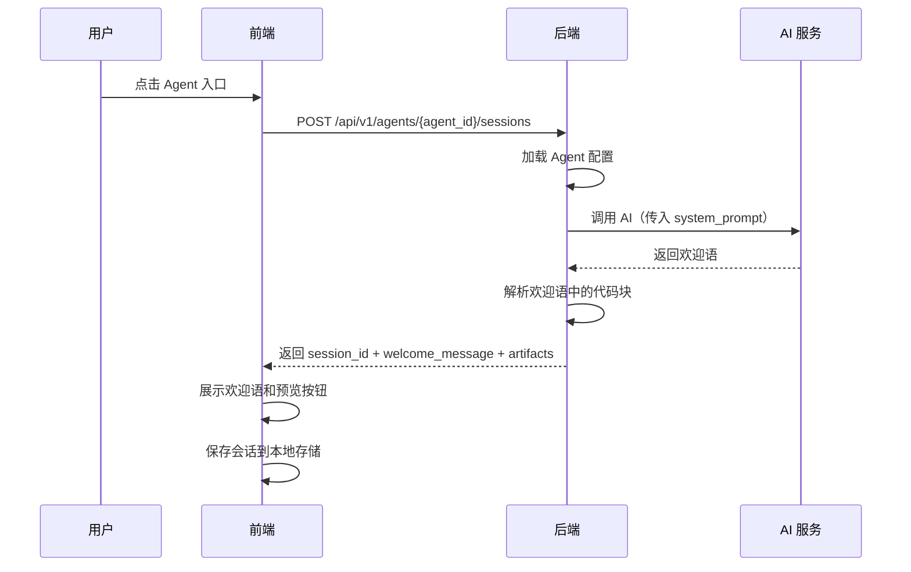
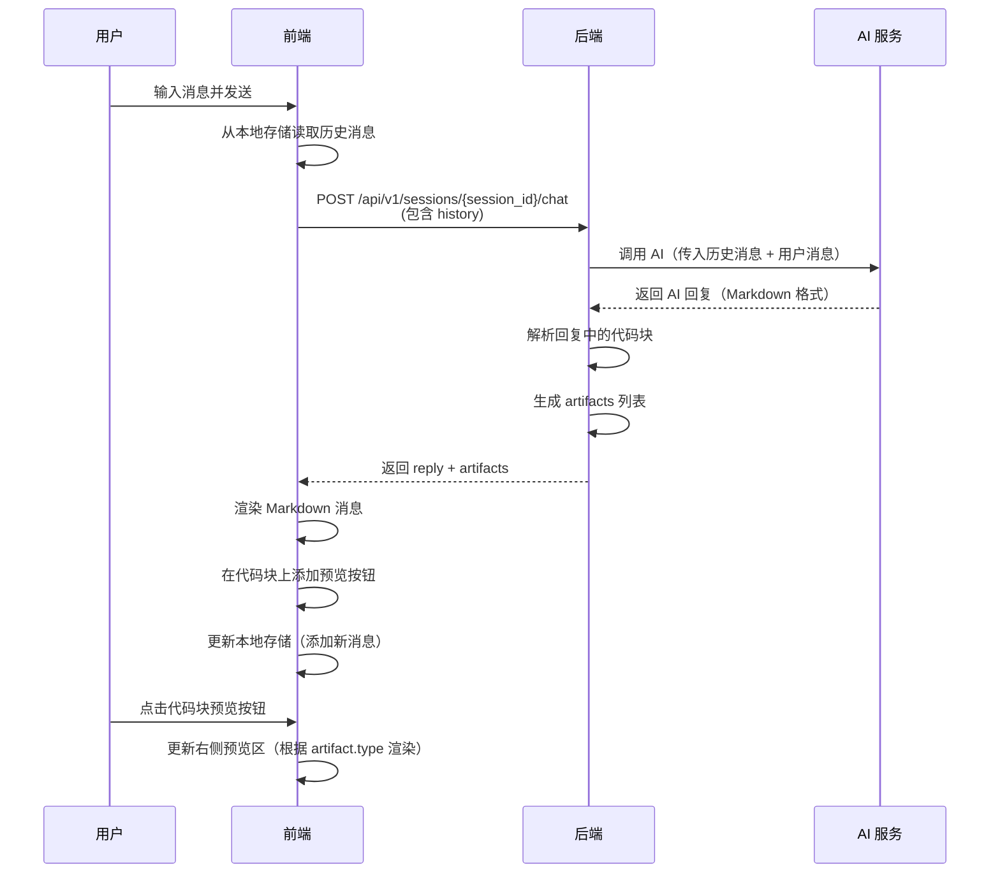

# 通用 Agent 交互协议 (API Interface)

> **设计哲学**: 插件化架构。后端提供宿主环境，业务逻辑由 Agent 配置（System Prompt）定义。

---

## 1. 基础信息
- **Base Path**: `/api/v1`
- **API 前缀**: 所有接口统一使用 `/api` 前缀
- **协议标准**: RESTful API，JSON 格式
- **认证方式**: MVP 阶段暂不需要认证

---

## 2. 核心接口清单

### 2.1 获取 Agent 列表
获取所有已配置的 Agent 列表，用于前端导航展示。

- **Endpoint**: `GET /api/v1/agents`
- **Description**: 返回所有已配置的 Agent 列表。
- **Response Structure**:
```python
class AgentListItem(BaseModel):
    agent_id: str = Field(..., description="Agent 唯一标识符")
    name: str = Field(..., description="功能名称")
    description: Optional[str] = Field(None, description="功能描述")
    icon: Optional[str] = Field(None, description="图标标识（可选）")

class AgentListResponse(BaseModel):
    agents: List[AgentListItem] = Field(..., description="Agent 列表")
```

**业务规则**：
- 只返回成功加载的 Agent，配置加载失败的 Agent 不包含在列表中
- 如果所有 Agent 配置都加载失败，返回空列表 `[]`

**Example Response**:
```json
{
  "agents": [
    {
      "agent_id": "prompt_wizard",
      "name": "AI 提示词向导",
      "description": "通过六步引导法，帮助您打造专家级提示词",
      "icon": null
    }
  ]
}
```

---

### 2.2 开启 Agent 会话
根据 Agent 唯一标识初始化一个交互环境，并自动触发 AI 生成欢迎语。

- **Endpoint**: `POST /api/v1/agents/{agent_id}/sessions`
- **Description**: 激活特定 Agent 并创建会话。系统会自动调用一次 AI（用户不可见），将 AI 生成的欢迎语作为第一条消息返回。
- **Path Parameters**:
  - `agent_id` (str, required): Agent 唯一标识符

- **Response Structure**:
```python
class SessionInitResponse(BaseModel):
    session_id: str = Field(..., description="会话 UUID")
    welcome_message: str = Field(..., description="AI 生成的欢迎语（第一条消息）")
    ui_config: UIConfig = Field(..., description="UI 配置，如是否开启预览、预览类型等")
    artifacts: List[Artifact] = Field(
        default_factory=list,
        description="欢迎语中可能包含的成果物（如代码块）"
    )

class UIConfig(BaseModel):
    show_preview: bool = Field(..., description="是否开启侧边预览栏")
    preview_types: List[str] = Field(
        default_factory=list,
        description="支持的预览类型（如 ['markdown', 'html', 'svg']）"
    )
```

**业务规则**：
- 会话创建后，系统自动调用 AI，传入 Agent 的 `system_prompt`，生成欢迎语
- 如果欢迎语中包含代码块，后端需要解析并返回 `artifacts` 列表
- 前端收到响应后，直接展示 `welcome_message` 和 `artifacts`，无需再次调用 AI
- 如果 Agent 不存在，返回 404 错误

**Example Response**:
```json
{
  "session_id": "550e8400-e29b-41d4-a716-446655440000",
  "welcome_message": "你好！我是你的提示词向导。请告诉我你想让 AI 帮你完成什么任务，我将引导你打造一个专家级的提示词。",
  "ui_config": {
    "show_preview": true,
    "preview_types": ["markdown", "html", "svg"]
  },
  "artifacts": []
}
```

---

### 2.3 通用对话交互
这是系统最核心的接口，负责透传消息并解析 AI 返回的结构化状态。

- **Endpoint**: `POST /api/v1/sessions/{session_id}/chat`
- **Description**: 发送用户消息，获取 AI 回复，并解析成果物。
- **Path Parameters**:
  - `session_id` (str, required): 会话 UUID

- **Request Body**:
```python
class Message(BaseModel):
    role: Literal["user", "assistant"] = Field(..., description="消息角色")
    content: str = Field(..., description="消息内容")

class ChatRequest(BaseModel):
    message: str = Field(..., description="用户输入的消息", min_length=1)
    history: Optional[List[Message]] = Field(
        None,
        description="历史消息列表（可选）。如果提供，后端使用该历史；如果不提供，后端从数据库读取（未来扩展）"
    )
```

**业务规则**：
- MVP 阶段：前端必须传递 `history`，后端仅透传给 AI 服务，不存储
- 未来扩展：前端可以不传递 `history`，后端从数据库读取会话历史
- 后端解析 `reply` 中的 Markdown 代码块，生成 `artifacts` 列表
- 前端展示 `reply` 的完整内容（支持 Markdown 渲染）
- 前端根据 `artifacts` 列表，在代码块上提供预览按钮
- 如果会话不存在，返回 404 错误

**响应方式**：
- **MVP 阶段**：一次性返回完整回复（简化实现，快速验证架构）
- **后续迭代**：可扩展支持流式响应（Server-Sent Events），提供实时打字效果

- **Response Structure**:
```python
class ChatResponse(BaseModel):
    reply: str = Field(..., description="AI 的文本回复内容（完整 Markdown 文本）")
    artifacts: List[Artifact] = Field(
        default_factory=list, 
        description="从回复中解析出的成果物列表（代码块内容）"
    )
```

**Example Request**:
```json
{
  "message": "我想让 AI 帮我写小红书美妆文案",
  "history": [
    {
      "role": "assistant",
      "content": "你好！我是你的提示词向导..."
    }
  ]
}
```

**Example Response**:
```json
{
  "reply": "好的，我来帮你打造一个专业的小红书美妆文案提示词。\n\n```markdown\n## [角色设定]\n你是一位拥有5年经验的小红书美妆文案专家...\n```\n\n让我们开始第一步：角色定义...",
  "artifacts": [
    {
      "type": "markdown",
      "content": "## [角色设定]\n你是一位拥有5年经验的小红书美妆文案专家...",
      "language": "markdown",
      "timestamp": "2026-01-01T10:00:00Z"
    }
  ]
}
```

---

## 3. 成果物解析协议 (Artifacts Protocol)

### 3.1 代码块识别规则
系统从 AI 的 Markdown 回复中识别代码块，只有代码块中的内容才被视为可预览的成果物。

**识别规则**：
- 标准 Markdown 代码块格式：`` ```language\ncontent\n``` ``
- 代码块的语言标识（language）决定成果物类型：
  - `markdown` → Markdown 文本预览
  - `html` → HTML 页面预览
  - `svg` → SVG 图形预览
  - `javascript` / `js` → JavaScript 代码预览
  - 其他语言 → 纯文本代码预览

**成果物数据结构**：
```python
class Artifact(BaseModel):
    type: str = Field(..., description="成果物类型，由代码块语言标识决定")
    content: str = Field(..., description="代码块中的原始内容")
    language: str = Field(..., description="代码块的语言标识（如 'markdown', 'html', 'svg'）")
    timestamp: datetime = Field(..., description="成果物生成时间")
```

### 3.2 成果物提取逻辑
- 后端解析 AI 回复的 Markdown 文本，提取所有代码块
- 每个代码块生成一个 `Artifact` 对象
- 如果 AI 回复中没有代码块，`artifacts` 列表为空
- 前端根据 `artifacts` 列表，在聊天窗口中为每个代码块提供预览按钮

---

## 4. 错误处理

### 4.1 标准错误响应
所有接口在发生错误时，应返回统一的错误格式：

```python
class ErrorResponse(BaseModel):
    error_code: str = Field(..., description="错误代码")
    error_message: str = Field(..., description="错误描述")
    details: Optional[dict] = Field(None, description="错误详情（可选）")
```

### 4.2 常见错误场景

**标准错误码**：
- `404 Not Found`: Agent 不存在、会话不存在
- `400 Bad Request`: 请求参数错误
- `500 Internal Server Error`: 服务器内部错误
- `503 Service Unavailable`: AI 服务暂时不可用

**具体错误处理**：

1. **AI 服务超时或不可用**
   - 状态码：`503 Service Unavailable`
   - 错误信息：`"AI 服务暂时不可用，请稍后重试"`
   - 处理方式：前端显示友好提示，提供重试按钮

2. **Agent 配置加载失败**
   - 状态码：`500 Internal Server Error`
   - 处理方式：启动时检测，加载失败的 Agent 不显示在 `GET /api/v1/agents` 列表中，记录错误日志
   - 用户影响：该 Agent 不可用，但其他 Agent 正常使用

3. **代码块解析失败**
   - 状态码：`200 OK`（不中断对话）
   - 处理方式：静默处理，`artifacts` 列表为空，对话正常继续
   - 用户影响：该消息不显示预览按钮，但不影响对话流程

---

## 5. 数据流设计

### 5.1 Agent 初始化流程


### 5.2 对话交互流程


---

**文档版本**: v1.0  
**最后更新**: 2026-01-01  
**设计依据**: 
- `docs/requirements/product_spec.md`
- `docs/requirements/ai_prompt_wizard_spec.md`
- `docs/requirements/ui_interaction_guide.md`
- `docs/requirements/acceptance_scenarios.md`

