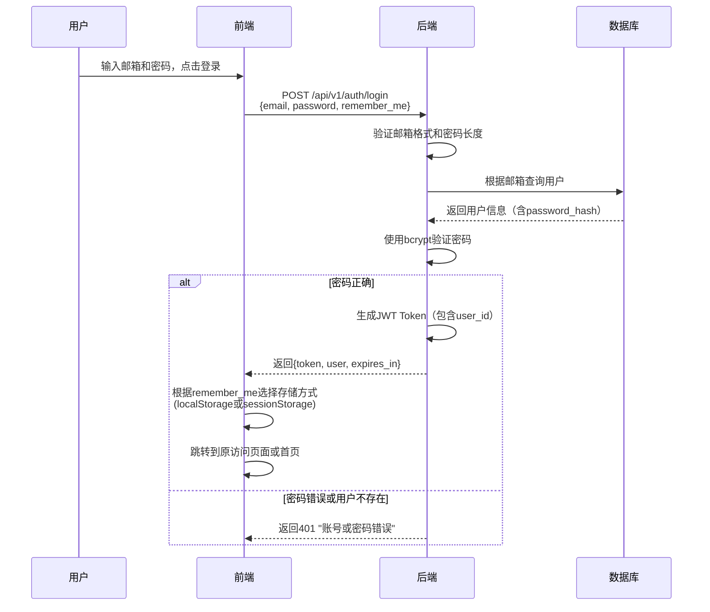
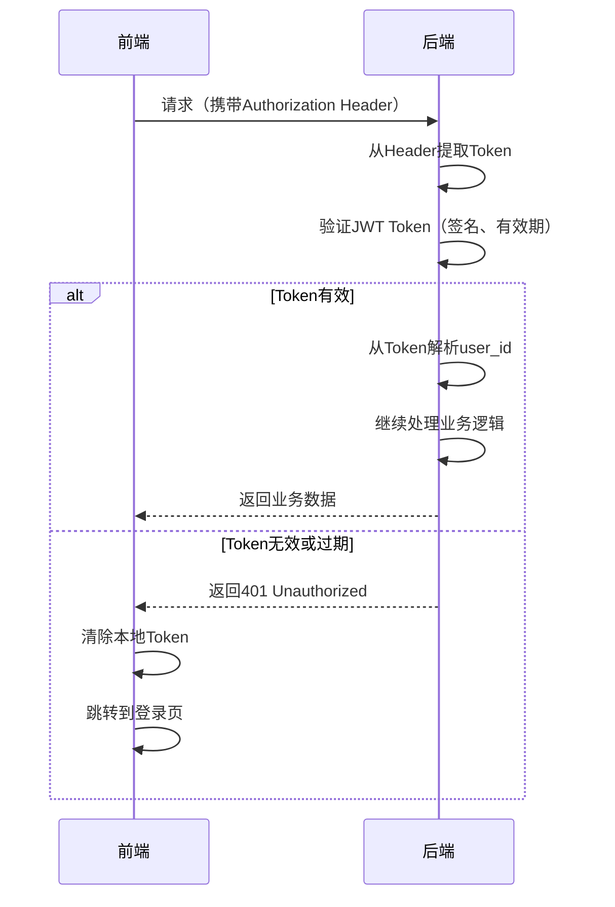
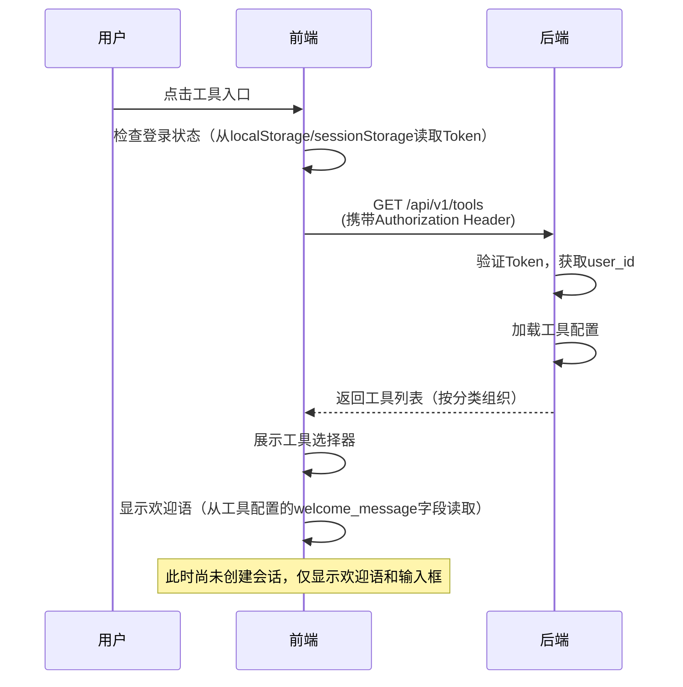
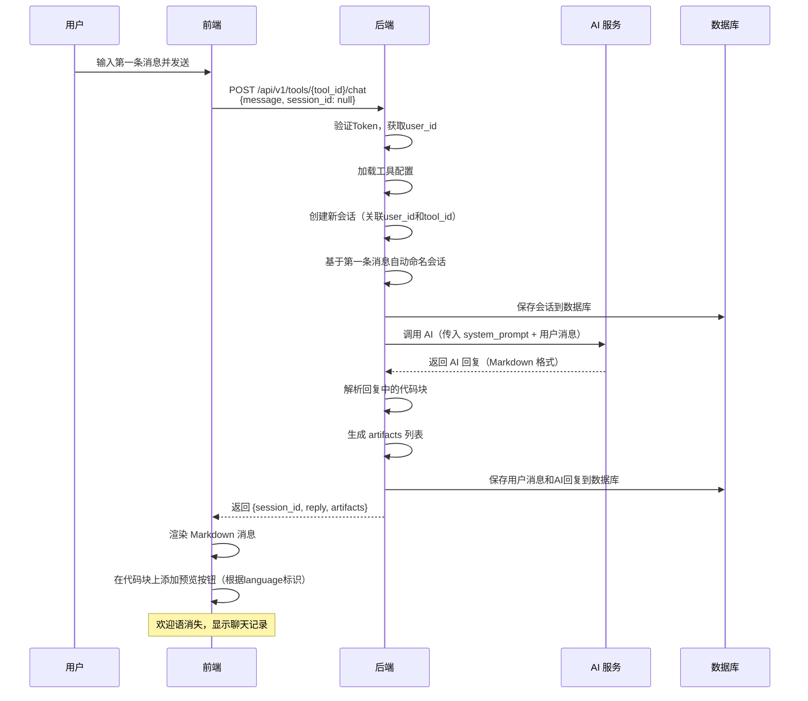
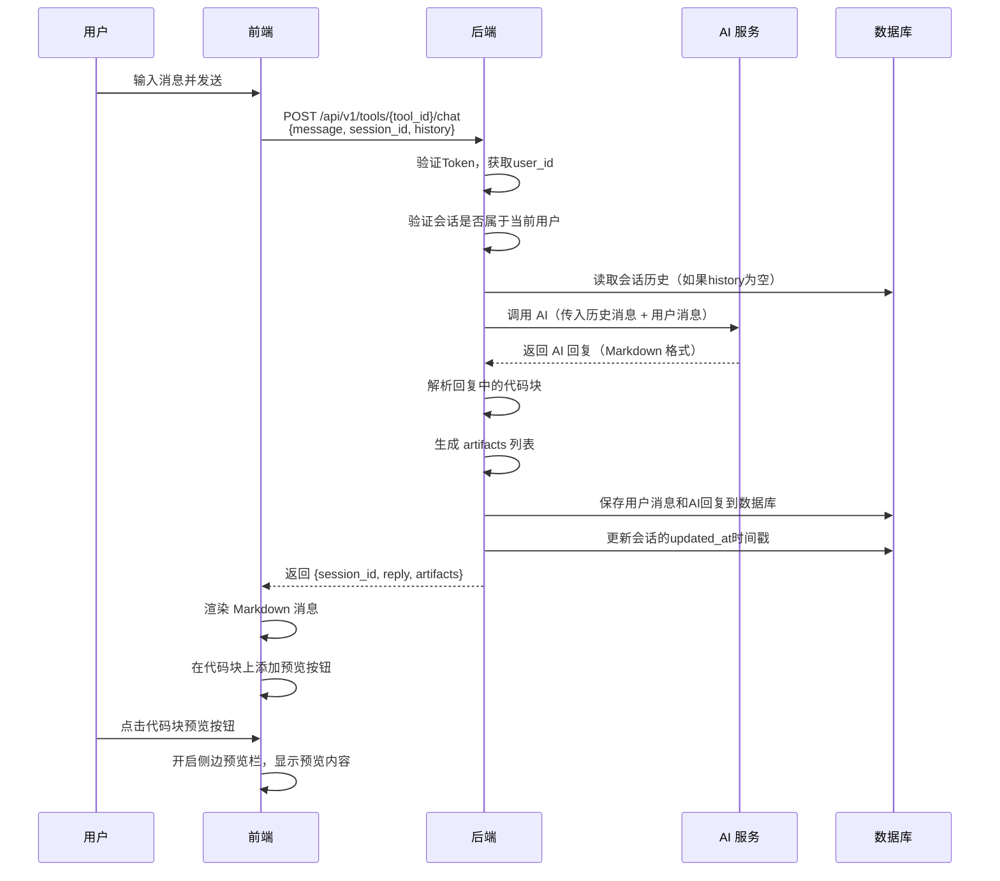
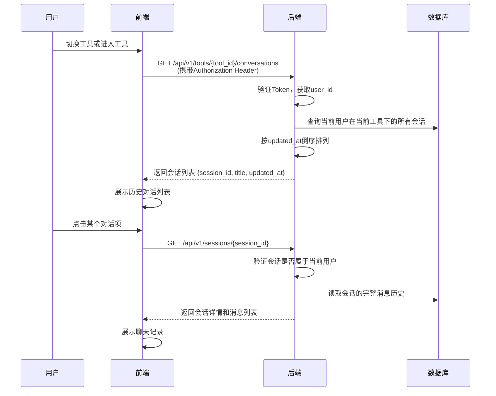
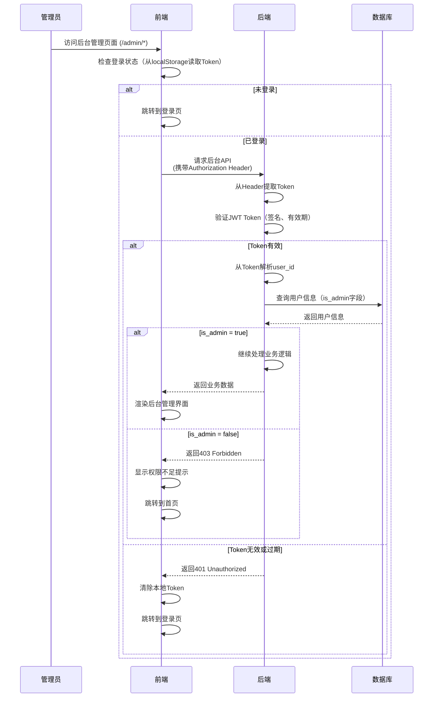
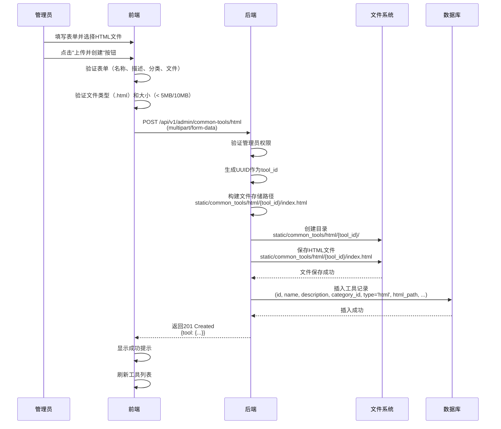
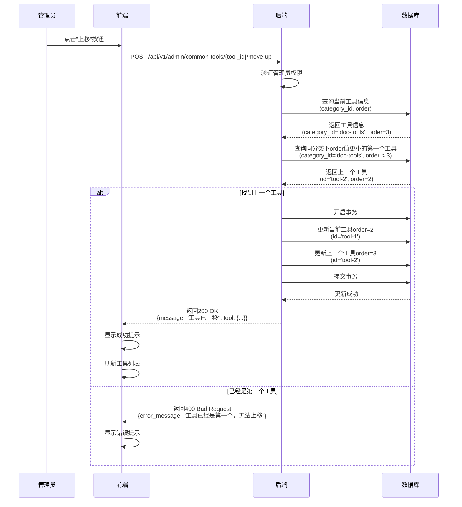
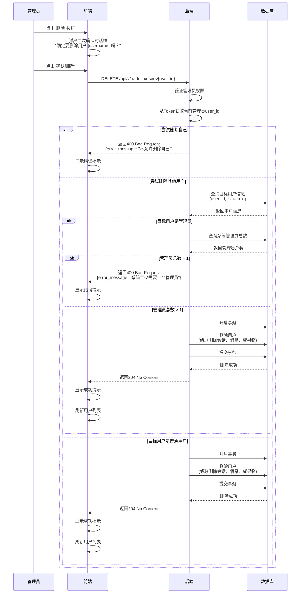

# 通用工具交互协议 (API Interface)

> **设计哲学**: 插件化架构。后端提供宿主环境，业务逻辑由工具配置（System Prompt）定义。

---

## 1. 基础信息
- **Base Path**: `/api/v1`
- **API 前缀**: 所有接口统一使用 `/api` 前缀
- **协议标准**: RESTful API，JSON 格式
- **认证方式**: JWT Token 认证（Bearer Token）
  - Token 通过 HTTP Header 传递：`Authorization: Bearer <token>`
  - Token 有效期：
    - 勾选"记住我"：7 天（604800 秒）
    - 未勾选"记住我"：24 小时（86400 秒）
  - Token Payload 结构：
    ```python
    {
      "user_id": str,  # 用户唯一标识（UUID）
      "exp": int,      # Token过期时间戳（Unix timestamp）
      "iat": int       # Token签发时间戳（Unix timestamp）
    }
    ```
  - Token 签名算法：HS256（使用后端配置的密钥）
  - 认证失败返回：`401 Unauthorized`

---

## 2. 用户认证接口

### 2.1 用户登录
用户通过用户名、邮箱或手机号和密码登录平台，获取访问 Token。

- **Endpoint**: `POST /api/v1/auth/login`
- **Description**: 验证用户账号（用户名、邮箱或手机号）和密码，返回 JWT Token 和用户信息。
- **认证要求**: 无需认证（公开接口）

- **Request Body**:
```python
class LoginRequest(BaseModel):
    account: str = Field(..., description="用户账号（用户名、邮箱或手机号）")
    password: str = Field(..., description="用户密码", min_length=6)
    remember_me: bool = Field(default=False, description="是否记住我（影响Token有效期）")
```

**账号格式说明**：
- **用户名格式**：1-50个字符，字母、数字、下划线、中文字符（如：zhangsan、张三）
- **邮箱格式**：`^[^@]+@[^@]+\.[^@]+$`（如：user@example.com）
- **手机号格式**：`^1[3-9]\d{9}$`（11位数字，以1开头，如：13800138000）
- 系统根据输入格式自动判断是用户名、邮箱还是手机号（优先级：手机号 > 邮箱 > 用户名）

- **Response Structure**:
```python
class LoginResponse(BaseModel):
    token: str = Field(..., description="JWT Token，用于后续请求的身份验证")
    user: UserInfo = Field(..., description="用户基本信息")
    expires_in: int = Field(..., description="Token有效期（秒），如：604800（7天）或86400（24小时）")

class UserInfo(BaseModel):
    user_id: str = Field(..., description="用户唯一标识（UUID）")
    username: str = Field(..., description="用户名（用于登录）")
    nickname: Optional[str] = Field(None, description="用户昵称（可选，用于显示，如未填写则使用用户名）")
    email: Optional[str] = Field(None, description="用户邮箱（可选，用于登录）")
    phone: Optional[str] = Field(None, description="用户手机号（可选，用于登录）")
    avatar: Optional[str] = Field(None, description="用户头像URL（可选，默认头像）")
```

**业务规则**：
- 账号格式验证：
  - 用户名格式：1-50个字符，字母、数字、下划线、中文字符
  - 邮箱格式：`^[^@]+@[^@]+\.[^@]+$`
  - 手机号格式：`^1[3-9]\d{9}$`
  - 系统根据输入格式自动判断是用户名、邮箱还是手机号（优先级：手机号 > 邮箱 > 用户名）
- 密码验证：最小长度6位
- 登录验证失败时，统一返回错误提示"账号或密码错误"（不区分具体错误原因，安全考虑）
- Token 有效期根据 `remember_me` 参数决定：
  - `remember_me=True`：7 天（604800 秒）
  - `remember_me=False`：24 小时（86400 秒）
- 密码使用 bcrypt 加密存储，验证时使用 bcrypt 比对

**Example Request** (用户名登录):
```json
{
  "account": "zhangsan",
  "password": "password123",
  "remember_me": true
}
```

**Example Request** (邮箱登录):
```json
{
  "account": "user@example.com",
  "password": "password123",
  "remember_me": true
}
```

**Example Request** (手机号登录):
```json
{
  "account": "13800138000",
  "password": "password123",
  "remember_me": true
}
```

**Example Response**:
```json
{
  "token": "eyJhbGciOiJIUzI1NiIsInR5cCI6IkpXVCJ9...",
  "user": {
    "user_id": "550e8400-e29b-41d4-a716-446655440000",
    "username": "张三",
    "email": "user@example.com",
    "phone": "13800138000",
    "avatar": null
  },
  "expires_in": 604800
}
```

**错误响应**：
- `400 Bad Request`: 账号格式错误（既不是用户名、邮箱也不是手机号）、密码长度不足
- `401 Unauthorized`: 账号或密码错误（统一提示，不区分具体错误）

---

### 2.2 获取当前用户信息
获取当前登录用户的基本信息。

- **Endpoint**: `GET /api/v1/auth/me`
- **Description**: 根据 Token 获取当前登录用户的信息。
- **认证要求**: 需要认证（Bearer Token）

- **Response Structure**:
```python
class UserInfoResponse(BaseModel):
    user: UserInfo = Field(..., description="用户基本信息")
```

**业务规则**：
- 从 JWT Token 中解析用户ID，查询用户信息
- 如果 Token 无效或过期，返回 `401 Unauthorized`
- 如果用户不存在，返回 `404 Not Found`

**Example Response**:
```json
{
  "user": {
    "user_id": "550e8400-e29b-41d4-a716-446655440000",
    "username": "张三",
    "email": "user@example.com",
    "avatar": null
  }
}
```

**错误响应**：
- `401 Unauthorized`: Token 无效或过期
- `404 Not Found`: 用户不存在

**前端使用说明**：
- 前端可以通过调用此接口验证 Token 是否有效
- 页面加载时，如果存在 Token，可以调用此接口验证登录状态
- 如果返回 `401`，说明 Token 已过期，前端应清除 Token 并跳转到登录页
- 如果返回 `200`，说明用户已登录，可以继续访问平台功能

---

### 2.3 退出登录（当前迭代说明）

**当前迭代处理方式**：
- 当前迭代不需要后端退出登录 API
- 前端直接清除 Token 存储（localStorage 或 sessionStorage）即可
- 清除后跳转到登录页

**后续迭代**：
- 后续迭代可添加 `POST /api/v1/auth/logout` 接口
- 用于服务端 Token 黑名单管理（如需要）

---

## 3. 临时用户管理接口

### 3.1 获取用户列表
获取所有用户列表（临时管理功能，内部使用）。

- **Endpoint**: `GET /api/v1/admin/users`
- **Description**: 返回所有用户列表，用于临时管理页面。
- **认证要求**: 需要认证（Bearer Token）

- **Query Parameters**:
  - `page` (int, optional): 页码，默认 1
  - `page_size` (int, optional): 每页数量，默认 20

- **Response Structure**:
```python
class UserListItem(BaseModel):
    user_id: str = Field(..., description="用户唯一标识（UUID）")
    username: str = Field(..., description="用户名")
    email: str = Field(..., description="用户邮箱")
    phone: Optional[str] = Field(None, description="用户手机号（可选）")
    avatar: Optional[str] = Field(None, description="用户头像URL")
    created_at: datetime = Field(..., description="用户创建时间")

class UserListResponse(BaseModel):
    users: List[UserListItem] = Field(..., description="用户列表")
    total: int = Field(..., description="用户总数")
    page: int = Field(..., description="当前页码")
    page_size: int = Field(..., description="每页数量")
```

**业务规则**：
- 需要登录后才能访问
- 当前迭代：所有登录用户都可以访问（后续迭代可添加权限控制）
- 按创建时间倒序排列

**Example Response**:
```json
{
  "users": [
    {
      "user_id": "550e8400-e29b-41d4-a716-446655440000",
      "username": "张三",
      "email": "user@example.com",
      "phone": "13800138000",
      "avatar": null,
      "created_at": "2026-01-02T10:00:00Z"
    }
  ],
  "total": 1,
  "page": 1,
  "page_size": 20
}
```

**错误响应**：
- `401 Unauthorized`: 未登录或 Token 无效

---

### 3.2 创建用户
创建新用户（临时管理功能，内部使用）。

- **Endpoint**: `POST /api/v1/admin/users`
- **Description**: 创建新用户，用于临时管理页面。
- **认证要求**: 需要认证（Bearer Token）

- **Request Body**:
```python
class CreateUserRequest(BaseModel):
    username: str = Field(..., description="用户名", min_length=1, max_length=50)
    email: str = Field(..., description="用户邮箱", regex=r'^[^@]+@[^@]+\.[^@]+$')
    password: str = Field(..., description="用户密码", min_length=6)
    avatar: Optional[str] = Field(None, description="用户头像URL（可选，默认使用系统默认头像）")
```

- **Response Structure**:
```python
class CreateUserResponse(BaseModel):
    user: UserInfo = Field(..., description="新创建的用户信息")
```

**业务规则**：
- 需要登录后才能访问
- 用户名必须唯一，如果已存在返回错误
- 邮箱必须唯一（如果提供），如果已存在返回错误
- 手机号必须唯一（如果提供），如果已存在返回错误
- 用户名、邮箱、手机号至少填写一个（用于登录）
- 密码使用 bcrypt 加密存储
- 如果未提供头像，使用系统默认头像
- 如果未提供昵称，使用用户名作为显示名称
- 用户ID使用UUID生成

**Example Request**:
```json
{
  "username": "lisi",
  "nickname": "李四",
  "email": "lisi@example.com",
  "phone": "13800138000",
  "password": "password123",
  "avatar": null
}
```

**Example Response**:
```json
{
  "user": {
    "user_id": "660e8400-e29b-41d4-a716-446655440001",
    "username": "李四",
    "email": "lisi@example.com",
    "avatar": null
  }
}
```

**错误响应**：
- `400 Bad Request`: 邮箱格式错误、密码长度不足、用户名格式错误
- `409 Conflict`: 邮箱已存在
- `401 Unauthorized`: 未登录或 Token 无效

---

## 4. 导航与工具相关接口（需要认证）

### 4.1 获取导航配置
获取顶部导航模块配置列表，用于前端渲染导航栏和配置路由。

- **Endpoint**: `GET /api/v1/navigation`
- **Description**: 返回所有导航模块配置，包括工具集模块和独立页面模块。
- **认证要求**: 需要认证（Bearer Token）

- **Response Structure**:
```python
class NavigationModule(BaseModel):
    module_id: str = Field(..., description="模块唯一标识符")
    name: str = Field(..., description="模块显示名称")
    type: Literal["toolset", "page"] = Field(..., description="模块类型：toolset（工具集）或 page（独立页面）")
    route_path: str = Field(..., description="前端路由路径")
    icon: Optional[str] = Field(None, description="图标标识")
    order: int = Field(..., description="显示顺序")
    config_source: Optional[str] = Field(None, description="工具配置目录路径（toolset类型专用）")
    page_component: Optional[str] = Field(None, description="页面组件名称（page类型专用）")

class NavigationResponse(BaseModel):
    modules: List[NavigationModule] = Field(..., description="导航模块列表")
```

**业务规则**：
- 按 `order` 字段升序排列
- 只返回配置正确的模块（验证通过的）
- `toolset` 类型模块必须有 `config_source` 字段
- `page` 类型模块必须有 `page_component` 字段

**Example Response**:
```json
{
  "modules": [
    {
      "module_id": "ai_tools",
      "name": "AI工具",
      "type": "toolset",
      "route_path": "/ai-tools",
      "config_source": "configs/tools/ai_tools/",
      "icon": "sparkles",
      "order": 1
    },
    {
      "module_id": "teaching_researcher",
      "name": "教研员",
      "type": "toolset",
      "route_path": "/teaching-researcher",
      "config_source": "configs/tools/teaching_researcher/",
      "icon": "user-group",
      "order": 2
    },
    {
      "module_id": "utility_tools",
      "name": "常用工具",
      "type": "page",
      "route_path": "/utility-tools",
      "page_component": "UtilityToolsPage",
      "icon": "wrench",
      "order": 3
    }
  ]
}
```

---

### 4.2 获取工具集的工具列表
获取指定工具集的所有工具列表，按分类组织，用于前端工具选择器展示。

- **Endpoint**: `GET /api/v1/toolsets/{toolset_id}/tools`
- **Description**: 返回指定工具集的所有工具列表，按分类组织。
- **认证要求**: 需要认证（Bearer Token）

- **Path Parameters**:
  - `toolset_id` (str, required): 工具集ID（与导航配置的 `module_id` 对应）

- **Response Structure**:
```python
class ToolListItem(BaseModel):
    tool_id: str = Field(..., description="工具唯一标识符")
    toolset_id: str = Field(..., description="所属工具集ID")
    name: str = Field(..., description="工具名称")
    description: Optional[str] = Field(None, description="工具描述")
    icon: Optional[str] = Field(None, description="图标标识（可选）")
    category: str = Field(..., description="分类名称")
    visible: bool = Field(True, description="是否在工具选择器中显示")
    type: Literal["normal", "placeholder"] = Field("normal", description="工具类型")
    order: int = Field(0, description="排序")

class CategoryGroup(BaseModel):
    name: str = Field(..., description="分类名称")
    icon: Optional[str] = Field(None, description="分类图标（可选）")
    tools: List[ToolListItem] = Field(..., description="该分类下的工具列表")

class ToolsetToolsResponse(BaseModel):
    toolset_id: str = Field(..., description="工具集ID")
    toolset_name: str = Field(..., description="工具集名称")
    categories: List[CategoryGroup] = Field(..., description="按分类组织的工具列表")
```

**业务规则**：
- 只返回该工具集下的工具（`toolset_id` 匹配）
- 只返回 `visible=true` 的工具
- 只返回成功加载的工具
- 按 `category` 字段聚合，生成分类结构
- 每个分类内的工具按 `order` 升序排列

**Example Response**:
```json
{
  "toolset_id": "teaching_researcher",
  "toolset_name": "教研员",
  "categories": [
    {
      "name": "语文",
      "icon": "book-open",
      "tools": [
        {
          "tool_id": "chinese_researcher_1",
          "toolset_id": "teaching_researcher",
          "name": "王老师 - 小学语文教研员",
          "description": "专注于小学语文阅读与写作教学",
          "icon": "book-open",
          "category": "语文",
          "visible": true,
          "type": "normal",
          "order": 1
        }
      ]
    },
    {
      "name": "数学",
      "icon": "calculator",
      "tools": [
        {
          "tool_id": "math_researcher_1",
          "toolset_id": "teaching_researcher",
          "name": "李老师 - 小学数学教研员",
          "description": "专注于小学数学思维培养",
          "icon": "calculator",
          "category": "数学",
          "visible": true,
          "type": "normal",
          "order": 1
        }
      ]
    }
  ]
}
```

**错误响应**：
- `404 Not Found`: 工具集不存在

---

### 4.3 获取所有工具列表（兼容接口）
获取所有已配置的工具列表，按分类组织。保留此接口用于向后兼容和某些需要获取所有工具的场景（如搜索、管理后台）。

- **Endpoint**: `GET /api/v1/tools`
- **Description**: 返回所有工具集的所有工具列表，按分类组织。
- **认证要求**: 需要认证（Bearer Token）

- **Response Structure**:
```python
class ToolListItem(BaseModel):
    tool_id: str = Field(..., description="工具唯一标识符")
    toolset_id: str = Field(..., description="所属工具集ID")  # 🆕 新增字段
    name: str = Field(..., description="工具名称")
    description: Optional[str] = Field(None, description="工具描述")
    icon: Optional[str] = Field(None, description="图标标识（可选）")
    category: str = Field(..., description="分类名称")
    visible: bool = Field(True, description="是否在工具选择器中显示")
    type: Literal["normal", "placeholder"] = Field("normal", description="工具类型")

class CategoryGroup(BaseModel):
    name: str = Field(..., description="分类名称")
    icon: Optional[str] = Field(None, description="分类图标（可选）")
    tools: List[ToolListItem] = Field(..., description="该分类下的工具列表")

class ToolListResponse(BaseModel):
    categories: List[CategoryGroup] = Field(..., description="按分类组织的工具列表")
```

**业务规则**：
- 只返回 `visible=true` 的工具
- 只返回成功加载的工具，配置加载失败的工具不包含在列表中
- 如果所有工具配置都加载失败，返回空列表 `[]`
- 工具按 `category` 字段聚合，生成分类结构
- 如果多个工具使用相同的 `category` 名称，自动归为一类

**Example Response**:
```json
{
  "categories": [
    {
      "name": "智能体",
      "icon": "command-line",
      "tools": [
        {
          "tool_id": "prompt_wizard",
      "name": "AI 提示词向导",
      "description": "通过六步引导法，帮助您打造专家级提示词",
          "icon": "command-line",
          "category": "智能体",
          "visible": true,
          "type": "normal"
        }
      ]
    }
  ]
}
```

---

### 4.4 通用对话交互
这是系统最核心的接口，负责发送用户消息，获取 AI 回复，并解析成果物。首次调用时自动创建会话。

- **Endpoint**: `POST /api/v1/tools/{tool_id}/chat`
- **Description**: 向指定工具发送消息，获取 AI 回复。如果 `session_id` 不存在，自动创建新会话。
- **Path Parameters**:
  - `tool_id` (str, required): 工具唯一标识符

- **Request Body**:
```python
class Message(BaseModel):
    role: Literal["user", "assistant"] = Field(..., description="消息角色")
    content: str = Field(..., description="消息内容")

class ChatRequest(BaseModel):
    message: str = Field(..., description="用户输入的消息", min_length=1)
    session_id: Optional[str] = Field(None, description="会话 UUID（可选）。如果有则继续会话，没有则创建新会话")
    history: Optional[List[Message]] = Field(
        None,
        description="历史消息列表（可选）。如果提供，后端使用该历史；如果不提供，后端从数据库读取"
    )
```

**认证要求**: 需要认证（Bearer Token）

**业务规则**：
- **会话创建时机**：用户发送第一条消息时，如果 `session_id` 不存在，自动创建新会话
- **会话命名**：会话创建时，基于第一条用户消息的前 N 个字符自动命名（具体长度由 UI 决定，保证美观）
- **历史消息处理**：
  - 如果提供 `history`，后端使用该历史消息
  - 如果不提供 `history`，后端从数据库读取会话历史
- **用户验证**：后端从 JWT Token 中获取用户ID，验证会话是否属于当前用户
- **成果物解析**：后端解析 `reply` 中的 Markdown 代码块，生成 `artifacts` 列表
- **预览按钮显示**：代码块的语言标识为 `markdown`、`html`、`svg` 时，前端自动显示预览按钮
- **错误处理**：
  - 如果工具不存在，返回 404 错误
- 如果会话不属于当前用户，返回 403 Forbidden
- 如果未认证，返回 401 错误

**响应方式**：
- **MVP 阶段**：一次性返回完整回复（简化实现，快速验证架构）
- **后续迭代**：可扩展支持流式响应（Server-Sent Events），提供实时打字效果

- **Response Structure**:
```python
class ChatResponse(BaseModel):
    session_id: str = Field(..., description="会话 UUID。首次调用返回新创建的session_id，后续调用返回原session_id")
    reply: str = Field(..., description="AI 的文本回复内容（完整 Markdown 文本）")
    artifacts: List[Artifact] = Field(
        default_factory=list, 
        description="从回复中解析出的成果物列表（代码块内容）"
    )
```

**Example Request** (首次调用，创建新会话):
```json
{
  "message": "我想让 AI 帮我写小红书美妆文案",
  "session_id": null
}
```

**Example Request** (后续调用，继续会话):
```json
{
  "message": "继续优化这个提示词",
  "session_id": "550e8400-e29b-41d4-a716-446655440000",
  "history": [
    {
      "role": "user",
      "content": "我想让 AI 帮我写小红书美妆文案"
    },
    {
      "role": "assistant",
      "content": "好的，我来帮你打造一个专业的小红书美妆文案提示词..."
    }
  ]
}
```

**Example Response**:
```json
{
  "session_id": "550e8400-e29b-41d4-a716-446655440000",
  "reply": "好的，我来帮你打造一个专业的小红书美妆文案提示词。\n\n```markdown\n## [角色设定]\n你是一位拥有5年经验的小红书美妆文案专家...\n```\n\n让我们开始第一步：角色定义...",
  "artifacts": [
    {
      "type": "markdown",
      "content": "## [角色设定]\n你是一位拥有5年经验的小红书美妆文案专家...",
      "language": "markdown",
      "timestamp": "2026-01-03T10:00:00Z"
    }
  ]
}
```

---

### 4.5 获取历史对话列表
获取当前用户在当前工具下的所有历史对话列表。

- **Endpoint**: `GET /api/v1/tools/{tool_id}/conversations`
- **Description**: 返回当前用户在当前工具下的所有历史对话列表，按更新时间倒序排列。
- **Path Parameters**:
  - `tool_id` (str, required): 工具唯一标识符
- **认证要求**: 需要认证（Bearer Token）

- **Response Structure**:
```python
class ConversationListItem(BaseModel):
    session_id: str = Field(..., description="会话 UUID")
    title: str = Field(..., description="会话标题")
    updated_at: datetime = Field(..., description="最后更新时间")

class ConversationListResponse(BaseModel):
    conversations: List[ConversationListItem] = Field(..., description="对话列表")
```

**业务规则**：
- 只返回当前用户在当前工具下的会话
- 按 `updated_at` 倒序排列（最新的在最前面）
- 如果用户在该工具下没有会话，返回空列表 `[]`

**Example Response**:
```json
{
  "conversations": [
    {
      "session_id": "550e8400-e29b-41d4-a716-446655440000",
      "title": "我想让 AI 帮我写小红书美妆文案",
      "updated_at": "2026-01-03T10:30:00Z"
    },
    {
      "session_id": "660e8400-e29b-41d4-a716-446655440001",
      "title": "如何优化提示词效果",
      "updated_at": "2026-01-03T09:00:00Z"
    }
  ]
}
```

**错误响应**：
- `401 Unauthorized`: 未登录或 Token 无效
- `404 Not Found`: 工具不存在

---

### 4.6 获取会话详情
获取指定会话的完整消息历史。

- **Endpoint**: `GET /api/v1/sessions/{session_id}`
- **Description**: 返回指定会话的完整消息历史，用于恢复会话。
- **Path Parameters**:
  - `session_id` (str, required): 会话 UUID
- **认证要求**: 需要认证（Bearer Token）

- **Response Structure**:
```python
class SessionDetailResponse(BaseModel):
    session_id: str = Field(..., description="会话 UUID")
    tool_id: str = Field(..., description="工具唯一标识符")
    title: str = Field(..., description="会话标题")
    created_at: datetime = Field(..., description="创建时间")
    updated_at: datetime = Field(..., description="最后更新时间")
    messages: List[Message] = Field(..., description="消息列表")
```

**业务规则**：
- 验证会话是否属于当前用户
- 如果会话不属于当前用户，返回 403 Forbidden
- 消息按 `created_at` 正序排列（最早的在最前面）

**Example Response**:
```json
{
  "session_id": "550e8400-e29b-41d4-a716-446655440000",
  "tool_id": "prompt_wizard",
  "title": "我想让 AI 帮我写小红书美妆文案",
  "created_at": "2026-01-03T10:00:00Z",
  "updated_at": "2026-01-03T10:30:00Z",
  "messages": [
    {
      "role": "user",
      "content": "我想让 AI 帮我写小红书美妆文案"
    },
    {
      "role": "assistant",
      "content": "好的，我来帮你打造一个专业的小红书美妆文案提示词..."
    }
  ]
}
```

**错误响应**：
- `401 Unauthorized`: 未登录或 Token 无效
- `403 Forbidden`: 会话不属于当前用户
- `404 Not Found`: 会话不存在

---

### 4.7 编辑会话标题
更新指定会话的标题。

- **Endpoint**: `PATCH /api/v1/sessions/{session_id}`
- **Description**: 更新指定会话的标题。
- **Path Parameters**:
  - `session_id` (str, required): 会话 UUID
- **认证要求**: 需要认证（Bearer Token）

- **Request Body**:
```python
class UpdateSessionRequest(BaseModel):
    title: str = Field(..., description="新的会话标题", min_length=1, max_length=200)
```

- **Response Structure**:
```python
class UpdateSessionResponse(BaseModel):
    session_id: str = Field(..., description="会话 UUID")
    title: str = Field(..., description="更新后的会话标题")
```

**业务规则**：
- 验证会话是否属于当前用户
- 如果会话不属于当前用户，返回 403 Forbidden
- 标题长度限制：1-200 个字符

**Example Request**:
```json
{
  "title": "优化后的提示词讨论"
}
```

**Example Response**:
```json
{
  "session_id": "550e8400-e29b-41d4-a716-446655440000",
  "title": "优化后的提示词讨论"
}
```

**错误响应**：
- `400 Bad Request`: 标题长度不符合要求
- `401 Unauthorized`: 未登录或 Token 无效
- `403 Forbidden`: 会话不属于当前用户
- `404 Not Found`: 会话不存在

---

### 4.8 删除会话
删除指定会话及其所有消息。

- **Endpoint**: `DELETE /api/v1/sessions/{session_id}`
- **Description**: 删除指定会话及其所有消息（级联删除）。
- **Path Parameters**:
  - `session_id` (str, required): 会话 UUID
- **认证要求**: 需要认证（Bearer Token）

**业务规则**：
- 验证会话是否属于当前用户
- 如果会话不属于当前用户，返回 403 Forbidden
- 删除会话时，级联删除该会话下的所有消息和成果物
- 删除操作不可恢复

**响应**：
- `204 No Content`: 删除成功

**错误响应**：
- `401 Unauthorized`: 未登录或 Token 无效
- `403 Forbidden`: 会话不属于当前用户
- `404 Not Found`: 会话不存在

---

## 5. 常用工具接口（需要认证）

### 5.1 获取工具分类列表
获取所有可见的工具分类及其下的工具列表。

- **Endpoint**: `GET /api/v1/common-tools/categories`
- **Description**: 返回所有工具分类，每个分类包含该分类下的工具列表。如果某个分类下没有可见工具，则不返回该分类。
- **认证要求**: 需要认证（Bearer Token）

- **Request**: 无请求参数

- **Response**: `200 OK`
```python
class CommonToolListItem(BaseModel):
    """工具列表项"""
    id: str = Field(..., description="工具ID")
    name: str = Field(..., description="工具名称")
    description: str = Field(..., description="工具描述")
    type: str = Field(..., description="工具类型：'built-in' 或 'html'")
    icon: Optional[str] = Field(None, description="图标标识")
    order: int = Field(..., description="排序顺序")

class ToolCategoryGroup(BaseModel):
    """工具分类组"""
    id: str = Field(..., description="分类ID")
    name: str = Field(..., description="分类名称")
    icon: Optional[str] = Field(None, description="分类图标")
    order: int = Field(..., description="分类排序")
    tools: List[CommonToolListItem] = Field(..., description="该分类下的工具列表")

class CommonToolCategoryResponse(BaseModel):
    """工具分类响应"""
    categories: List[ToolCategoryGroup] = Field(..., description="分类列表（按order排序）")
```

**响应示例**：
```json
{
  "categories": [
    {
      "id": "doc-tools",
      "name": "文档工具",
      "icon": "document-text",
      "order": 1,
      "tools": [
        {
          "id": "markdown-editor",
          "name": "Markdown编辑器",
          "description": "在线编辑Markdown文档，实时预览，支持导出Word/PDF",
          "type": "built-in",
          "icon": "document-text",
          "order": 1
        }
      ]
    },
    {
      "id": "data-tools",
      "name": "数据工具",
      "icon": "chart-bar",
      "order": 2,
      "tools": [
        {
          "id": "json-formatter",
          "name": "JSON格式化工具",
          "description": "格式化和验证JSON字符串，语法高亮显示",
          "type": "html",
          "icon": "code-bracket",
          "order": 2
        }
      ]
    }
  ]
}
```

**业务规则**：
- 只返回 `visible=true` 的工具
- 分类按 `order` 字段升序排序
- 每个分类下的工具按 `order` 字段升序排序
- 如果某个分类下没有可见工具，则不返回该分类
- 前端根据 `type` 字段决定跳转逻辑：
  - `type='built-in'`：跳转到 `/common-tools/tool/{id}`，前端根据 `id` 渲染对应的内置组件
  - `type='html'`：跳转到 `/common-tools/tool/{id}`，前端加载HTML文件并在沙箱中运行

**错误响应**：
- `401 Unauthorized`: 未登录或 Token 无效
- `200 OK` with `{"categories": []}`: 正常响应，但没有可见工具（所有工具不可见或数据库为空）

---

### 5.2 获取工具详情
获取单个工具的详细信息（包括HTML文件路径）。

- **Endpoint**: `GET /api/v1/common-tools/tools/{tool_id}`
- **Description**: 返回指定工具的详细信息，用于工具详情页展示。
- **认证要求**: 需要认证（Bearer Token）

- **Path Parameters**:
  - `tool_id` (string, required): 工具ID

- **Response**: `200 OK`
```python
class CommonToolDetail(BaseModel):
    """工具详情"""
    id: str = Field(..., description="工具ID")
    name: str = Field(..., description="工具名称")
    description: str = Field(..., description="工具描述")
    category_id: str = Field(..., description="所属分类ID")
    category_name: str = Field(..., description="所属分类名称")
    type: str = Field(..., description="工具类型：'built-in' 或 'html'")
    icon: Optional[str] = Field(None, description="图标标识")
    order: int = Field(..., description="排序顺序")
    html_url: Optional[str] = Field(None, description="HTML文件访问URL（仅type='html'时有值）")
    created_at: datetime = Field(..., description="创建时间")
```

**响应示例（内置工具）**：
```json
{
  "id": "markdown-editor",
  "name": "Markdown编辑器",
  "description": "在线编辑Markdown文档，实时预览，支持导出Word/PDF",
  "category_id": "doc-tools",
  "category_name": "文档工具",
  "type": "built-in",
  "icon": "document-text",
  "order": 1,
  "html_url": null,
  "created_at": "2026-01-09T10:00:00Z"
}
```

**响应示例（HTML工具）**：
```json
{
  "id": "json-formatter",
  "name": "JSON格式化工具",
  "description": "格式化和验证JSON字符串，语法高亮显示",
  "category_id": "data-tools",
  "category_name": "数据工具",
  "type": "html",
  "icon": "code-bracket",
  "order": 2,
  "html_url": "/static/common_tools/html/json-formatter/index.html",
  "created_at": "2026-01-09T10:00:00Z"
}
```

**错误响应**：
- `404 Not Found`: 工具不存在或不可见
```json
{
  "error_code": "TOOL_NOT_FOUND",
  "error_message": "工具不存在或已下线"
}
```

**业务规则**：
- 只能查询 `visible=true` 的工具
- `html_url` 由后端根据 `html_path` 生成完整的访问URL：
  - 数据库存储：`html_path = "common_tools/html/{tool_id}/index.html"`（相对于static目录）
  - 接口返回：`html_url = "/static/common_tools/html/{tool_id}/index.html"`（完整URL）
  - 转换规则：`html_url = "/static/" + html_path`
- 前端根据 `type` 字段决定渲染方式：
  - `type='built-in'`：渲染内置组件（如Markdown编辑器）
  - `type='html'`：使用iframe加载 `html_url`，并应用沙箱策略（`sandbox="allow-scripts"`）

---

## 6. 作品展示接口（需要认证）

### 6.1 获取作品分类列表
获取所有可见的作品分类及其下的作品列表。

- **Endpoint**: `GET /api/v1/works/categories`
- **Description**: 返回所有作品分类，每个分类包含该分类下的作品列表。如果某个分类下没有可见作品，则不返回该分类。
- **认证要求**: 需要认证（Bearer Token）

- **Request**: 无请求参数

- **Response**: `200 OK`
```python
class WorkListItem(BaseModel):
    """作品列表项"""
    id: str = Field(..., description="作品ID")
    name: str = Field(..., description="作品名称")
    description: str = Field(..., description="作品描述")
    icon: Optional[str] = Field(None, description="图标标识")
    order: int = Field(..., description="排序顺序")

class WorkCategoryGroup(BaseModel):
    """作品分类组"""
    id: str = Field(..., description="分类ID")
    name: str = Field(..., description="分类名称")
    icon: Optional[str] = Field(None, description="分类图标")
    order: int = Field(..., description="分类排序")
    works: List[WorkListItem] = Field(..., description="该分类下的作品列表")

class WorkCategoryResponse(BaseModel):
    """作品分类响应"""
    categories: List[WorkCategoryGroup] = Field(..., description="分类列表（按order排序）")
```

**响应示例**：
```json
{
  "categories": [
    {
      "id": "creative-design",
      "name": "创意设计",
      "icon": "sparkles",
      "order": 1,
      "works": [
        {
          "id": "interactive-card",
          "name": "交互式卡片",
          "description": "一个精美的交互式卡片效果展示",
          "icon": "star",
          "order": 1
        },
        {
          "id": "animated-button",
          "name": "动画按钮集合",
          "description": "多种创意动画按钮效果",
          "icon": "cursor-arrow-rays",
          "order": 2
        }
      ]
    },
    {
      "id": "data-visualization",
      "name": "数据可视化",
      "icon": "chart-bar",
      "order": 2,
      "works": [
        {
          "id": "chart-demo",
          "name": "图表演示",
          "description": "各种图表的可视化展示",
          "icon": "presentation-chart-line",
          "order": 1
        }
      ]
    }
  ]
}
```

**业务规则**：
- 只返回 `visible=true` 的作品
- 分类按 `order` 字段升序排序
- 每个分类下的作品按 `order` 字段升序排序
- 如果某个分类下没有可见作品，则不返回该分类
- 所有作品均为HTML类型，点击后跳转到 `/works/{id}` 查看详情

**错误响应**：
- `401 Unauthorized`: 未登录或 Token 无效
- `200 OK` with `{"categories": []}`: 正常响应，但没有可见作品（所有作品不可见或数据库为空）

---

### 6.2 获取作品详情
获取单个作品的详细信息（包括HTML文件路径）。

- **Endpoint**: `GET /api/v1/works/{work_id}`
- **Description**: 返回指定作品的详细信息，用于作品详情页展示。
- **认证要求**: 需要认证（Bearer Token）

- **Path Parameters**:
  - `work_id` (string, required): 作品ID

- **Response**: `200 OK`
```python
class WorkDetail(BaseModel):
    """作品详情"""
    id: str = Field(..., description="作品ID")
    name: str = Field(..., description="作品名称")
    description: str = Field(..., description="作品描述")
    category_id: str = Field(..., description="所属分类ID")
    category_name: str = Field(..., description="所属分类名称")
    icon: Optional[str] = Field(None, description="图标标识")
    order: int = Field(..., description="排序顺序")
    html_url: str = Field(..., description="HTML文件访问URL")
    created_at: datetime = Field(..., description="创建时间")
```

**响应示例**：
```json
{
  "id": "interactive-card",
  "name": "交互式卡片",
  "description": "一个精美的交互式卡片效果展示",
  "category_id": "creative-design",
  "category_name": "创意设计",
  "icon": "star",
  "order": 1,
  "html_url": "/static/works/html/interactive-card/index.html",
  "created_at": "2026-01-10T10:00:00Z"
}
```

**错误响应**：
- `404 Not Found`: 作品不存在或不可见
```json
{
  "error_code": "WORK_NOT_FOUND",
  "error_message": "作品不存在或已下线"
}
```

**业务规则**：
- 只能查询 `visible=true` 的作品
- `html_url` 由后端根据 `html_path` 生成完整的访问URL：
  - 数据库存储：`html_path = "works/html/{work_id}/index.html"`（相对于static目录）
  - 接口返回：`html_url = "/static/works/html/{work_id}/index.html"`（完整URL）
  - 转换规则：`html_url = "/static/" + html_path`
- 前端使用iframe加载 `html_url`，并应用沙箱策略：
  - 沙箱属性：`sandbox="allow-scripts allow-forms allow-popups allow-same-origin"`
  - 与常用工具的HTML工具沙箱策略保持一致

---

## 7. 文档管理接口（需要认证）

### 7.1 获取目录树

获取所有文档目录树结构（递归）。

- **Endpoint**: `GET /api/v1/course/categories`
- **Description**: 返回文档目录树（递归结构），用于前端左侧目录菜单展示。
- **认证要求**: 需要认证（Bearer Token）

- **Response**: `200 OK`
```python
class CourseCategoryNode(BaseModel):
    """目录节点（递归结构）"""
    id: str = Field(..., description="目录ID")
    name: str = Field(..., description="目录名称")
    parent_id: Optional[str] = Field(None, description="父目录ID")
    order: int = Field(..., description="排序顺序")
    children: List["CourseCategoryNode"] = Field(default_factory=list, description="子目录列表")

class CourseCategoryTreeResponse(BaseModel):
    categories: List[CourseCategoryNode] = Field(..., description="目录树")
```

**响应示例**：
```json
{
  "categories": [
    {
      "id": "chapter-001",
      "name": "第一章：AI基础",
      "parent_id": null,
      "order": 1,
      "children": [
        {
          "id": "section-001",
          "name": "1.1 什么是AI",
          "parent_id": "chapter-001",
          "order": 1,
          "children": []
        }
      ]
    }
  ]
}
```

**业务规则**：
- 返回递归的目录树结构
- 按 `order` 字段升序排列
- 如果没有目录，返回空列表

---

### 7.2 获取目录下的文档列表

获取指定目录下的所有文档列表（不包括子目录的文档）。

- **Endpoint**: `GET /api/v1/course/categories/{category_id}/documents`
- **Description**: 返回指定目录下的所有文档列表，用于前端中间文件列表展示。
- **认证要求**: 需要认证（Bearer Token）

- **Path Parameters**:
  - `category_id` (string, required): 目录ID

- **Response**: `200 OK`
```python
class CourseDocumentListItem(BaseModel):
    id: str = Field(..., description="文档ID")
    title: str = Field(..., description="文档标题")
    summary: str = Field(..., description="文档摘要")
    order: int = Field(..., description="排序顺序")

class CourseDocumentListResponse(BaseModel):
    documents: List[CourseDocumentListItem] = Field(..., description="文档列表")
```

**响应示例**：
```json
{
  "documents": [
    {
      "id": "doc-001",
      "title": "AI的定义",
      "summary": "本节介绍人工智能的基本定义和发展历史",
      "order": 1
    },
    {
      "id": "doc-002",
      "title": "AI的应用领域",
      "summary": "介绍AI在各个行业的应用场景",
      "order": 2
    }
  ]
}
```

**业务规则**：
- 只返回当前目录下的文档（不包括子目录的文档）
- 按 `order` 字段升序排列
- 如果目录下没有文档，返回空列表

**错误响应**：
- `404 Not Found`: 目录不存在

---

### 7.3 获取文档详情

获取文档详情，包括标题、摘要、Markdown内容、上下篇导航。

- **Endpoint**: `GET /api/v1/course/documents/{doc_id}`
- **Description**: 返回文档详情，用于前端右侧文档内容展示。
- **认证要求**: 需要认证（Bearer Token）

- **Path Parameters**:
  - `doc_id` (string, required): 文档ID

- **Response**: `200 OK`
```python
class CourseDocumentDetail(BaseModel):
    id: str = Field(..., description="文档ID")
    title: str = Field(..., description="文档标题")
    summary: str = Field(..., description="文档摘要")
    content: str = Field(..., description="Markdown内容")
    category_id: str = Field(..., description="所属目录ID")
    order: int = Field(..., description="排序顺序")
    prev_doc_id: Optional[str] = Field(None, description="上一篇文档ID（同一目录下）")
    next_doc_id: Optional[str] = Field(None, description="下一篇文档ID（同一目录下）")
    created_at: datetime = Field(..., description="创建时间")
```

**响应示例**：
```json
{
  "id": "doc-001",
  "title": "AI的定义",
  "summary": "本节介绍人工智能的基本定义和发展历史",
  "content": "# AI的定义\n\n人工智能（Artificial Intelligence，简称AI）...",
  "category_id": "section-001",
  "order": 1,
  "prev_doc_id": null,
  "next_doc_id": "doc-002",
  "created_at": "2026-01-12T10:00:00Z"
}
```

**业务规则**：
- 从文件系统读取Markdown内容
- 计算上一篇和下一篇文档（同一目录下，按 `order` 排序）
- 如果是第一篇，`prev_doc_id` 为 `null`
- 如果是最后一篇，`next_doc_id` 为 `null`

**错误响应**：
- `404 Not Found`: 文档不存在或文件已被删除

---

## 8. 成果物解析协议 (Artifacts Protocol)

### 7.1 代码块识别规则
系统从 AI 的 Markdown 回复中识别代码块，只有代码块中的内容才被视为可预览的成果物。

**识别规则**：
- 标准 Markdown 代码块格式：`` ```language\ncontent\n``` ``
- **所有代码块都显示复制和预览按钮**（不再根据语言类型判断是否显示按钮）
- 智能类型检测：如果代码块未标注语言类型，前端自动检测内容特征（HTML/SVG/Markdown标签）
- 预览行为根据内容类型区分（在PreviewPanel组件中处理）：
  - `markdown` → Markdown渲染预览 + 下载功能(MD/Word/PDF)
  - `html` → iframe沙箱渲染 + 模态框式全屏 + 下载HTML
  - `svg` → 直接渲染(移除script标签) + 模态框式全屏 + 下载SVG
  - 其他语言（如 `javascript`、`python` 等）→ 显示原始代码（语法高亮）
- 全屏模式说明：全屏为模态框式全屏（预览区充满浏览器窗口，工具栏保持可见），而非浏览器全屏API

**成果物数据结构**：
```python
class Artifact(BaseModel):
    type: str = Field(..., description="成果物类型，由代码块语言标识决定（如 'markdown', 'html', 'svg'）")
    content: str = Field(..., description="代码块中的原始内容")
    language: str = Field(..., description="代码块的语言标识（如 'markdown', 'html', 'svg'）")
    timestamp: datetime = Field(..., description="成果物生成时间")
```

### 7.2 成果物提取逻辑
- 后端解析 AI 回复的 Markdown 文本，提取所有代码块
- 每个代码块生成一个 `Artifact` 对象
- 如果 AI 回复中没有代码块，`artifacts` 列表为空
- 前端根据 `artifacts` 列表，在聊天窗口中为每个代码块提供预览按钮
- 用户点击预览按钮后，开启侧边预览栏，显示预览内容

---

## 8. 错误处理

### 8.1 标准错误响应
所有接口在发生错误时，应返回统一的错误格式：

```python
class ErrorResponse(BaseModel):
    error_code: str = Field(..., description="错误代码")
    error_message: str = Field(..., description="错误描述")
    details: Optional[dict] = Field(None, description="错误详情（可选）")
```

### 8.2 常见错误场景

**标准错误码**：
- `401 Unauthorized`: 未登录、Token 无效或过期
- `403 Forbidden`: 权限不足（如访问其他用户的会话）
- `404 Not Found`: Agent 不存在、会话不存在、用户不存在
- `400 Bad Request`: 请求参数错误
- `409 Conflict`: 资源冲突（如邮箱已存在）
- `500 Internal Server Error`: 服务器内部错误
- `503 Service Unavailable`: AI 服务暂时不可用

**具体错误处理**：

1. **AI 服务超时或不可用**
   - 状态码：`503 Service Unavailable`
   - 错误信息：`"AI 服务暂时不可用，请稍后重试"`
   - 处理方式：前端显示友好提示，提供重试按钮

2. **工具配置加载失败**
   - 状态码：`500 Internal Server Error`
   - 处理方式：启动时检测，加载失败的工具不显示在 `GET /api/v1/tools` 列表中，记录错误日志
   - 用户影响：该工具不可用，但其他工具正常使用

3. **代码块解析失败**
   - 状态码：`200 OK`（不中断对话）
   - 处理方式：静默处理，`artifacts` 列表为空，对话正常继续
   - 用户影响：该消息不显示预览按钮，但不影响对话流程

---

## 9. 认证流程设计

### 9.1 用户登录流程


### 9.2 认证Token验证流程


---

## 10. 数据流设计

### 10.1 工具进入流程（显示欢迎语）


### 10.2 首次对话流程（创建会话）


### 10.3 后续对话流程（继续会话）


### 10.4 历史对话列表流程


---

### 10.5 后台管理权限验证流程


---

### 10.6 HTML文件上传流程（工具/作品）


---

### 10.7 工具/作品排序调整流程（上移/下移）


---

### 10.8 用户删除流程（级联删除）


---

---

## 11. 后台管理接口（需要管理员权限）

### 11.1 权限验证说明

**管理员权限验证**：
- 所有后台管理接口（`/api/v1/admin/*`）都需要管理员权限
- 验证方式：
  1. 从 JWT Token 中获取 `user_id`
  2. 查询数据库获取用户的 `is_admin` 字段
  3. 如果 `is_admin=false`，返回 `403 Forbidden`
- 权限验证中间件：`require_admin_permission`
- 非管理员访问后台API，统一返回错误：
  ```json
  {
    "error_code": "PERMISSION_DENIED",
    "error_message": "需要管理员权限"
  }
  ```

---

### 11.2 用户管理接口

#### 11.2.1 获取用户列表（分页）

获取所有用户列表，支持分页和筛选。

- **Endpoint**: `GET /api/v1/admin/users`
- **Description**: 返回用户列表，支持分页和管理员筛选。
- **认证要求**: 需要管理员权限

- **Query Parameters**:
  - `page` (int, optional): 页码，默认 1
  - `page_size` (int, optional): 每页数量，默认 20，最大 100
  - `is_admin` (bool, optional): 筛选管理员（true: 仅管理员，false: 仅普通用户，不传：全部）

- **Response**: `200 OK`
```python
class UserListItem(BaseModel):
    user_id: str = Field(..., description="用户唯一标识（UUID）")
    username: str = Field(..., description="用户名")
    nickname: Optional[str] = Field(None, description="用户昵称")
    email: Optional[str] = Field(None, description="用户邮箱")
    phone: Optional[str] = Field(None, description="用户手机号")
    avatar: Optional[str] = Field(None, description="用户头像URL")
    is_admin: bool = Field(..., description="是否为管理员")
    created_at: datetime = Field(..., description="用户创建时间")

class UserListResponse(BaseModel):
    users: List[UserListItem] = Field(..., description="用户列表")
    total: int = Field(..., description="用户总数")
    page: int = Field(..., description="当前页码")
    page_size: int = Field(..., description="每页数量")
```

**业务规则**：
- 按创建时间倒序排列
- 管理员可以查看所有用户（包括其他管理员）

**Example Response**:
```json
{
  "users": [
    {
      "user_id": "550e8400-e29b-41d4-a716-446655440000",
      "username": "zhangsan",
      "nickname": "张三",
      "email": "zhangsan@example.com",
      "phone": "13800138000",
      "avatar": null,
      "is_admin": true,
      "created_at": "2026-01-02T10:00:00Z"
    }
  ],
  "total": 15,
  "page": 1,
  "page_size": 20
}
```

**错误响应**：
- `401 Unauthorized`: 未登录或 Token 无效
- `403 Forbidden`: 非管理员用户

---

#### 11.2.2 创建用户

管理员创建新用户。

- **Endpoint**: `POST /api/v1/admin/users`
- **Description**: 创建新用户，可设置管理员权限。
- **认证要求**: 需要管理员权限

- **Request Body**:
```python
class CreateUserRequest(BaseModel):
    username: str = Field(..., description="用户名", min_length=1, max_length=50)
    nickname: Optional[str] = Field(None, description="用户昵称", max_length=50)
    email: Optional[str] = Field(None, description="用户邮箱", pattern=r'^[^@]+@[^@]+\.[^@]+$')
    phone: Optional[str] = Field(None, description="用户手机号", pattern=r'^1[3-9]\d{9}$')
    password: str = Field(..., description="用户密码", min_length=6)
    is_admin: bool = Field(False, description="是否为管理员（默认为false）")
```

- **Response**: `201 Created`
```python
class CreateUserResponse(BaseModel):
    user: UserListItem = Field(..., description="新创建的用户信息")
```

**业务规则**：
- 用户名必须唯一，如果已存在返回 `409 Conflict`
- 邮箱必须唯一（如果提供），如果已存在返回 `409 Conflict`
- 手机号必须唯一（如果提供），如果已存在返回 `409 Conflict`
- 用户名、邮箱、手机号至少填写一个
- 密码使用 bcrypt 加密存储
- 如果未提供昵称，使用用户名作为显示名称
- 用户ID使用UUID生成

**Example Request**:
```json
{
  "username": "lisi",
  "nickname": "李四",
  "email": "lisi@example.com",
  "phone": "13800138001",
  "password": "password123",
  "is_admin": false
}
```

**Example Response**:
```json
{
  "user": {
    "user_id": "660e8400-e29b-41d4-a716-446655440001",
    "username": "lisi",
    "nickname": "李四",
    "email": "lisi@example.com",
    "phone": "13800138001",
    "avatar": null,
    "is_admin": false,
    "created_at": "2026-01-11T10:00:00Z"
  }
}
```

**错误响应**：
- `400 Bad Request`: 参数格式错误、密码长度不足
- `401 Unauthorized`: 未登录或 Token 无效
- `403 Forbidden`: 非管理员用户
- `409 Conflict`: 用户名、邮箱或手机号已存在

---

#### 11.2.3 更新用户信息

管理员更新用户信息。

- **Endpoint**: `PUT /api/v1/admin/users/{user_id}`
- **Description**: 更新指定用户的信息（不包括密码）。
- **认证要求**: 需要管理员权限

- **Path Parameters**:
  - `user_id` (string, required): 用户ID

- **Request Body**:
```python
class UpdateUserRequest(BaseModel):
    username: Optional[str] = Field(None, description="用户名", min_length=1, max_length=50)
    nickname: Optional[str] = Field(None, description="用户昵称", max_length=50)
    email: Optional[str] = Field(None, description="用户邮箱", pattern=r'^[^@]+@[^@]+\.[^@]+$')
    phone: Optional[str] = Field(None, description="用户手机号", pattern=r'^1[3-9]\d{9}$')
    is_admin: Optional[bool] = Field(None, description="是否为管理员")
```

- **Response**: `200 OK`
```python
class UpdateUserResponse(BaseModel):
    user: UserListItem = Field(..., description="更新后的用户信息")
```

**业务规则**：
- 只更新提供的字段，未提供的字段保持不变
- 用户名、邮箱、手机号必须唯一（如果提供且与原值不同）
- 不允许取消最后一个管理员的管理员权限（返回 `400 Bad Request`）
- 用户名、邮箱、手机号至少保留一个

**Example Request**:
```json
{
  "nickname": "李四（已更新）",
  "is_admin": true
}
```

**Example Response**:
```json
{
  "user": {
    "user_id": "660e8400-e29b-41d4-a716-446655440001",
    "username": "lisi",
    "nickname": "李四（已更新）",
    "email": "lisi@example.com",
    "phone": "13800138001",
    "avatar": null,
    "is_admin": true,
    "created_at": "2026-01-11T10:00:00Z"
  }
}
```

**错误响应**：
- `400 Bad Request`: 参数格式错误、尝试取消最后一个管理员的权限
- `401 Unauthorized`: 未登录或 Token 无效
- `403 Forbidden`: 非管理员用户
- `404 Not Found`: 用户不存在
- `409 Conflict`: 用户名、邮箱或手机号已被其他用户使用

---

#### 11.2.4 删除用户

管理员删除用户。

- **Endpoint**: `DELETE /api/v1/admin/users/{user_id}`
- **Description**: 删除指定用户及其所有关联数据（会话、消息等）。
- **认证要求**: 需要管理员权限

- **Path Parameters**:
  - `user_id` (string, required): 用户ID

- **Response**: `204 No Content`

**业务规则**：
- 不允许删除自己（返回 `400 Bad Request`）
- 不允许删除最后一个管理员（返回 `400 Bad Request`）
- 删除用户时，级联删除其所有会话、消息、成果物

**错误响应**：
- `400 Bad Request`: 尝试删除自己或最后一个管理员
- `401 Unauthorized`: 未登录或 Token 无效
- `403 Forbidden`: 非管理员用户
- `404 Not Found`: 用户不存在

---

#### 11.2.5 重置用户密码

管理员重置用户密码。

- **Endpoint**: `POST /api/v1/admin/users/{user_id}/reset-password`
- **Description**: 重置指定用户的密码。
- **认证要求**: 需要管理员权限

- **Path Parameters**:
  - `user_id` (string, required): 用户ID

- **Request Body**:
```python
class ResetPasswordRequest(BaseModel):
    new_password: str = Field(..., description="新密码", min_length=6)
```

- **Response**: `200 OK`
```python
class ResetPasswordResponse(BaseModel):
    message: str = Field(..., description="操作结果消息")
    new_password: str = Field(..., description="新密码（明文，用于告知用户）")
```

**业务规则**：
- 密码使用 bcrypt 加密存储
- 重置后返回明文密码，管理员需告知用户

**Example Request**:
```json
{
  "new_password": "newpassword123"
}
```

**Example Response**:
```json
{
  "message": "密码已重置",
  "new_password": "newpassword123"
}
```

**错误响应**：
- `400 Bad Request`: 密码长度不足
- `401 Unauthorized`: 未登录或 Token 无效
- `403 Forbidden`: 非管理员用户
- `404 Not Found`: 用户不存在

---

### 11.3 常用工具管理接口

#### 11.3.1 获取工具列表（管理后台）

获取所有工具列表，包括隐藏的工具。

- **Endpoint**: `GET /api/v1/admin/common-tools`
- **Description**: 返回所有工具列表，支持分页和筛选。
- **认证要求**: 需要管理员权限

- **Query Parameters**:
  - `page` (int, optional): 页码，默认 1
  - `page_size` (int, optional): 每页数量，默认 20，最大 100
  - `category_id` (string, optional): 按分类ID筛选
  - `type` (string, optional): 按类型筛选（'built_in' | 'html'）
  - `visible` (bool, optional): 按可见性筛选（true | false）

- **Response**: `200 OK`
```python
class AdminCommonToolListItem(BaseModel):
    id: str = Field(..., description="工具ID")
    name: str = Field(..., description="工具名称")
    description: str = Field(..., description="工具描述")
    category_id: str = Field(..., description="所属分类ID")
    category_name: str = Field(..., description="所属分类名称")
    type: str = Field(..., description="工具类型：'built_in' 或 'html'")
    icon: Optional[str] = Field(None, description="图标标识")
    html_path: Optional[str] = Field(None, description="HTML文件路径（仅HTML工具）")
    order: int = Field(..., description="排序顺序")
    visible: bool = Field(..., description="是否可见")
    created_at: datetime = Field(..., description="创建时间")
    updated_at: datetime = Field(..., description="更新时间")

class AdminCommonToolListResponse(BaseModel):
    tools: List[AdminCommonToolListItem] = Field(..., description="工具列表")
    total: int = Field(..., description="工具总数")
    page: int = Field(..., description="当前页码")
    page_size: int = Field(..., description="每页数量")
```

**业务规则**：
- 按分类ID和排序顺序排列
- 与前台接口不同，管理后台接口返回所有工具（包括 `visible=false` 的工具）

**Example Response**:
```json
{
  "tools": [
    {
      "id": "markdown-editor",
      "name": "Markdown编辑器",
      "description": "在线编辑Markdown文档，实时预览，支持导出Word/PDF",
      "category_id": "doc-tools",
      "category_name": "文档工具",
      "type": "built_in",
      "icon": "document-text",
      "html_path": null,
      "order": 1,
      "visible": true,
      "created_at": "2026-01-09T10:00:00Z",
      "updated_at": "2026-01-09T10:00:00Z"
    }
  ],
  "total": 10,
  "page": 1,
  "page_size": 20
}
```

**错误响应**：
- `401 Unauthorized`: 未登录或 Token 无效
- `403 Forbidden`: 非管理员用户

---

#### 11.3.2 创建内置工具

管理员创建新的内置工具。

- **Endpoint**: `POST /api/v1/admin/common-tools/built-in`
- **Description**: 创建内置工具。
- **认证要求**: 需要管理员权限

- **Request Body**:
```python
class CreateBuiltInToolRequest(BaseModel):
    name: str = Field(..., description="工具名称", min_length=1, max_length=100)
    description: str = Field(..., description="工具描述", min_length=1, max_length=200)
    category_id: str = Field(..., description="所属分类ID")
    icon: Optional[str] = Field(None, description="图标标识（heroicons名称）")
    order: int = Field(0, description="排序顺序（默认0）")
    visible: bool = Field(True, description="是否可见（默认true）")
```

- **Response**: `201 Created`
```python
class CreateToolResponse(BaseModel):
    tool: AdminCommonToolListItem = Field(..., description="新创建的工具信息")
```

**业务规则**：
- 工具ID使用UUID生成
- `type` 自动设置为 `'built_in'`
- `html_path` 自动设置为 `None`
- 如果未提供图标，系统根据工具名称自动推荐图标
- 分类必须存在，否则返回 `404 Not Found`

**Example Request**:
```json
{
  "name": "Excel工具",
  "description": "在线编辑Excel文件",
  "category_id": "doc-tools",
  "icon": "table-cells",
  "order": 5,
  "visible": true
}
```

**Example Response**:
```json
{
  "tool": {
    "id": "770e8400-e29b-41d4-a716-446655440002",
    "name": "Excel工具",
    "description": "在线编辑Excel文件",
    "category_id": "doc-tools",
    "category_name": "文档工具",
    "type": "built_in",
    "icon": "table-cells",
    "html_path": null,
    "order": 5,
    "visible": true,
    "created_at": "2026-01-11T10:00:00Z",
    "updated_at": "2026-01-11T10:00:00Z"
  }
}
```

**错误响应**：
- `400 Bad Request`: 参数格式错误
- `401 Unauthorized`: 未登录或 Token 无效
- `403 Forbidden`: 非管理员用户
- `404 Not Found`: 分类不存在

---

#### 11.3.3 上传HTML工具

管理员上传HTML工具。

- **Endpoint**: `POST /api/v1/admin/common-tools/html`
- **Description**: 上传HTML文件并创建HTML工具。
- **认证要求**: 需要管理员权限

- **Request Body** (multipart/form-data):
```python
class CreateHtmlToolRequest(BaseModel):
    name: str = Field(..., description="工具名称", min_length=1, max_length=100)
    description: str = Field(..., description="工具描述", min_length=1, max_length=200)
    category_id: str = Field(..., description="所属分类ID")
    icon: Optional[str] = Field(None, description="图标标识（heroicons名称）")
    html_file: UploadFile = Field(..., description="HTML文件（必填，< 5MB）")
    order: int = Field(0, description="排序顺序（默认0）")
    visible: bool = Field(True, description="是否可见（默认true）")
```

- **Response**: `201 Created`
```python
class CreateToolResponse(BaseModel):
    tool: AdminCommonToolListItem = Field(..., description="新创建的工具信息")
```

**业务规则**：
- 工具ID使用UUID生成
- `type` 自动设置为 `'html'`
- HTML文件存储路径：`backend/static/common_tools/html/{tool_id}/index.html`
- 数据库存储相对路径：`common_tools/html/{tool_id}/index.html`
- 文件类型限制：`.html`
- 文件大小限制：< 5MB
- 如果未提供图标，系统根据工具名称自动推荐图标
- 分类必须存在，否则返回 `404 Not Found`

**Example Request** (Form Data):
```
name: JSON格式化工具
description: 格式化和验证JSON字符串，语法高亮显示
category_id: data-tools
icon: code-bracket
html_file: [binary file data]
order: 2
visible: true
```

**Example Response**:
```json
{
  "tool": {
    "id": "880e8400-e29b-41d4-a716-446655440003",
    "name": "JSON格式化工具",
    "description": "格式化和验证JSON字符串，语法高亮显示",
    "category_id": "data-tools",
    "category_name": "数据工具",
    "type": "html",
    "icon": "code-bracket",
    "html_path": "common_tools/html/880e8400-e29b-41d4-a716-446655440003/index.html",
    "order": 2,
    "visible": true,
    "created_at": "2026-01-11T10:00:00Z",
    "updated_at": "2026-01-11T10:00:00Z"
  }
}
```

**错误响应**：
- `400 Bad Request`: 参数格式错误、文件类型不正确、文件大小超过限制
- `401 Unauthorized`: 未登录或 Token 无效
- `403 Forbidden`: 非管理员用户
- `404 Not Found`: 分类不存在

---

#### 11.3.4 更新工具信息

管理员更新工具信息。

- **Endpoint**: `PUT /api/v1/admin/common-tools/{tool_id}`
- **Description**: 更新指定工具的信息（不包括HTML文件）。
- **认证要求**: 需要管理员权限

- **Path Parameters**:
  - `tool_id` (string, required): 工具ID

- **Request Body**:
```python
class UpdateToolRequest(BaseModel):
    name: Optional[str] = Field(None, description="工具名称", min_length=1, max_length=100)
    description: Optional[str] = Field(None, description="工具描述", min_length=1, max_length=200)
    category_id: Optional[str] = Field(None, description="所属分类ID")
    icon: Optional[str] = Field(None, description="图标标识（heroicons名称）")
    order: Optional[int] = Field(None, description="排序顺序")
    visible: Optional[bool] = Field(None, description="是否可见")
```

- **Response**: `200 OK`
```python
class UpdateToolResponse(BaseModel):
    tool: AdminCommonToolListItem = Field(..., description="更新后的工具信息")
```

**业务规则**：
- 只更新提供的字段，未提供的字段保持不变
- 不能修改工具类型（`type`）和HTML文件路径（`html_path`）
- 分类必须存在（如果提供），否则返回 `404 Not Found`

**Example Request**:
```json
{
  "name": "Markdown编辑器（增强版）",
  "description": "在线编辑Markdown文档，实时预览，支持导出Word/PDF，新增表格编辑功能",
  "visible": true
}
```

**Example Response**:
```json
{
  "tool": {
    "id": "markdown-editor",
    "name": "Markdown编辑器（增强版）",
    "description": "在线编辑Markdown文档，实时预览，支持导出Word/PDF，新增表格编辑功能",
    "category_id": "doc-tools",
    "category_name": "文档工具",
    "type": "built_in",
    "icon": "document-text",
    "html_path": null,
    "order": 1,
    "visible": true,
    "created_at": "2026-01-09T10:00:00Z",
    "updated_at": "2026-01-11T10:30:00Z"
  }
}
```

**错误响应**：
- `400 Bad Request`: 参数格式错误
- `401 Unauthorized`: 未登录或 Token 无效
- `403 Forbidden`: 非管理员用户
- `404 Not Found`: 工具或分类不存在

---

#### 11.3.5 删除工具

管理员删除工具。

- **Endpoint**: `DELETE /api/v1/admin/common-tools/{tool_id}`
- **Description**: 删除指定工具（包括HTML文件）。
- **认证要求**: 需要管理员权限

- **Path Parameters**:
  - `tool_id` (string, required): 工具ID

- **Response**: `204 No Content`

**业务规则**：
- 删除工具时，如果是HTML工具，同时删除对应的HTML文件和目录
- 删除操作不可恢复

**错误响应**：
- `401 Unauthorized`: 未登录或 Token 无效
- `403 Forbidden`: 非管理员用户
- `404 Not Found`: 工具不存在

---

#### 11.3.6 调整工具排序（上移）

管理员将工具向上移动一位。

- **Endpoint**: `POST /api/v1/admin/common-tools/{tool_id}/move-up`
- **Description**: 将指定工具向上移动一位（与上一个工具交换order值）。
- **认证要求**: 需要管理员权限

- **Path Parameters**:
  - `tool_id` (string, required): 工具ID

- **Response**: `200 OK`
```python
class MoveToolResponse(BaseModel):
    message: str = Field(..., description="操作结果消息")
    tool: AdminCommonToolListItem = Field(..., description="移动后的工具信息")
```

**业务规则**：
- 查询同分类下的上一个工具（order值更小的第一个）
- 交换两个工具的 `order` 值
- 如果已经是第一个工具，返回 `400 Bad Request`

**Example Response**:
```json
{
  "message": "工具已上移",
  "tool": {
    "id": "json-formatter",
    "name": "JSON格式化工具",
    "description": "格式化和验证JSON字符串，语法高亮显示",
    "category_id": "data-tools",
    "category_name": "数据工具",
    "type": "html",
    "icon": "code-bracket",
    "html_path": "common_tools/html/json-formatter/index.html",
    "order": 1,
    "visible": true,
    "created_at": "2026-01-09T10:00:00Z",
    "updated_at": "2026-01-11T10:35:00Z"
  }
}
```

**错误响应**：
- `400 Bad Request`: 工具已经是第一个，无法上移
- `401 Unauthorized`: 未登录或 Token 无效
- `403 Forbidden`: 非管理员用户
- `404 Not Found`: 工具不存在

---

#### 11.3.7 调整工具排序（下移）

管理员将工具向下移动一位。

- **Endpoint**: `POST /api/v1/admin/common-tools/{tool_id}/move-down`
- **Description**: 将指定工具向下移动一位（与下一个工具交换order值）。
- **认证要求**: 需要管理员权限

- **Path Parameters**:
  - `tool_id` (string, required): 工具ID

- **Response**: `200 OK`
```python
class MoveToolResponse(BaseModel):
    message: str = Field(..., description="操作结果消息")
    tool: AdminCommonToolListItem = Field(..., description="移动后的工具信息")
```

**业务规则**：
- 查询同分类下的下一个工具（order值更大的第一个）
- 交换两个工具的 `order` 值
- 如果已经是最后一个工具，返回 `400 Bad Request`

**错误响应**：
- `400 Bad Request`: 工具已经是最后一个，无法下移
- `401 Unauthorized`: 未登录或 Token 无效
- `403 Forbidden`: 非管理员用户
- `404 Not Found`: 工具不存在

---

#### 11.3.8 切换工具可见性

管理员切换工具的可见性。

- **Endpoint**: `POST /api/v1/admin/common-tools/{tool_id}/toggle-visibility`
- **Description**: 切换工具的可见性（显示 ↔ 隐藏）。
- **认证要求**: 需要管理员权限

- **Path Parameters**:
  - `tool_id` (string, required): 工具ID

- **Response**: `200 OK`
```python
class ToggleVisibilityResponse(BaseModel):
    message: str = Field(..., description="操作结果消息")
    tool: AdminCommonToolListItem = Field(..., description="更新后的工具信息")
```

**业务规则**：
- `visible=true` 切换为 `visible=false`
- `visible=false` 切换为 `visible=true`
- 隐藏的工具不在前台工具列表中显示

**Example Response**:
```json
{
  "message": "工具已隐藏",
  "tool": {
    "id": "markdown-editor",
    "name": "Markdown编辑器",
    "description": "在线编辑Markdown文档，实时预览，支持导出Word/PDF",
    "category_id": "doc-tools",
    "category_name": "文档工具",
    "type": "built_in",
    "icon": "document-text",
    "html_path": null,
    "order": 1,
    "visible": false,
    "created_at": "2026-01-09T10:00:00Z",
    "updated_at": "2026-01-11T10:40:00Z"
  }
}
```

**错误响应**：
- `401 Unauthorized`: 未登录或 Token 无效
- `403 Forbidden`: 非管理员用户
- `404 Not Found`: 工具不存在

---

#### 11.3.9 获取工具分类列表（管理后台）

获取所有工具分类列表。

- **Endpoint**: `GET /api/v1/admin/tool-categories`
- **Description**: 返回所有工具分类列表，包括工具数量统计。
- **认证要求**: 需要管理员权限

- **Response**: `200 OK`
```python
class AdminToolCategoryListItem(BaseModel):
    id: str = Field(..., description="分类ID")
    name: str = Field(..., description="分类名称")
    icon: Optional[str] = Field(None, description="分类图标")
    order: int = Field(..., description="排序顺序")
    tool_count: int = Field(..., description="该分类下的工具数量")
    created_at: datetime = Field(..., description="创建时间")
    updated_at: datetime = Field(..., description="更新时间")

class AdminToolCategoryListResponse(BaseModel):
    categories: List[AdminToolCategoryListItem] = Field(..., description="分类列表")
```

**业务规则**：
- 按 `order` 字段升序排列
- `tool_count` 包含所有工具（包括隐藏的工具）

**Example Response**:
```json
{
  "categories": [
    {
      "id": "doc-tools",
      "name": "文档工具",
      "icon": "document-text",
      "order": 1,
      "tool_count": 5,
      "created_at": "2026-01-09T10:00:00Z",
      "updated_at": "2026-01-09T10:00:00Z"
    },
    {
      "id": "data-tools",
      "name": "数据工具",
      "icon": "chart-bar",
      "order": 2,
      "tool_count": 3,
      "created_at": "2026-01-09T10:00:00Z",
      "updated_at": "2026-01-09T10:00:00Z"
    }
  ]
}
```

**错误响应**：
- `401 Unauthorized`: 未登录或 Token 无效
- `403 Forbidden`: 非管理员用户

---

#### 11.3.10 创建工具分类

管理员创建新的工具分类。

- **Endpoint**: `POST /api/v1/admin/tool-categories`
- **Description**: 创建新的工具分类。
- **认证要求**: 需要管理员权限

- **Request Body**:
```python
class CreateToolCategoryRequest(BaseModel):
    name: str = Field(..., description="分类名称", min_length=1, max_length=50)
    icon: Optional[str] = Field(None, description="分类图标（heroicons名称）")
    order: int = Field(0, description="排序顺序（默认0）")
```

- **Response**: `201 Created`
```python
class CreateToolCategoryResponse(BaseModel):
    category: AdminToolCategoryListItem = Field(..., description="新创建的分类信息")
```

**业务规则**：
- 分类ID使用UUID生成
- 分类名称必须唯一，如果已存在返回 `409 Conflict`
- 如果未提供图标，系统根据分类名称自动推荐图标

**Example Request**:
```json
{
  "name": "媒体工具",
  "icon": "video-camera",
  "order": 3
}
```

**Example Response**:
```json
{
  "category": {
    "id": "990e8400-e29b-41d4-a716-446655440004",
    "name": "媒体工具",
    "icon": "video-camera",
    "order": 3,
    "tool_count": 0,
    "created_at": "2026-01-11T10:45:00Z",
    "updated_at": "2026-01-11T10:45:00Z"
  }
}
```

**错误响应**：
- `400 Bad Request`: 参数格式错误
- `401 Unauthorized`: 未登录或 Token 无效
- `403 Forbidden`: 非管理员用户
- `409 Conflict`: 分类名称已存在

---

#### 11.3.11 更新工具分类

管理员更新工具分类信息。

- **Endpoint**: `PUT /api/v1/admin/tool-categories/{category_id}`
- **Description**: 更新指定工具分类的信息。
- **认证要求**: 需要管理员权限

- **Path Parameters**:
  - `category_id` (string, required): 分类ID

- **Request Body**:
```python
class UpdateToolCategoryRequest(BaseModel):
    name: Optional[str] = Field(None, description="分类名称", min_length=1, max_length=50)
    icon: Optional[str] = Field(None, description="分类图标（heroicons名称）")
    order: Optional[int] = Field(None, description="排序顺序")
```

- **Response**: `200 OK`
```python
class UpdateToolCategoryResponse(BaseModel):
    category: AdminToolCategoryListItem = Field(..., description="更新后的分类信息")
```

**业务规则**：
- 只更新提供的字段，未提供的字段保持不变
- 分类名称必须唯一（如果提供且与原值不同）

**Example Request**:
```json
{
  "name": "文档编辑工具",
  "icon": "document-text"
}
```

**Example Response**:
```json
{
  "category": {
    "id": "doc-tools",
    "name": "文档编辑工具",
    "icon": "document-text",
    "order": 1,
    "tool_count": 5,
    "created_at": "2026-01-09T10:00:00Z",
    "updated_at": "2026-01-11T10:50:00Z"
  }
}
```

**错误响应**：
- `400 Bad Request`: 参数格式错误
- `401 Unauthorized`: 未登录或 Token 无效
- `403 Forbidden`: 非管理员用户
- `404 Not Found`: 分类不存在
- `409 Conflict`: 分类名称已被其他分类使用

---

#### 11.3.12 删除工具分类

管理员删除工具分类。

- **Endpoint**: `DELETE /api/v1/admin/tool-categories/{category_id}`
- **Description**: 删除指定工具分类。
- **认证要求**: 需要管理员权限

- **Path Parameters**:
  - `category_id` (string, required): 分类ID

- **Response**: `204 No Content`

**业务规则**：
- 如果分类下有工具，不允许删除，返回 `400 Bad Request`
- 删除操作不可恢复

**错误响应**：
- `400 Bad Request`: 分类下还有工具，无法删除
- `401 Unauthorized`: 未登录或 Token 无效
- `403 Forbidden`: 非管理员用户
- `404 Not Found`: 分类不存在

---

#### 11.3.13 调整分类排序（上移/下移）

管理员调整分类排序。

- **Endpoint**: `POST /api/v1/admin/tool-categories/{category_id}/move-up`
- **Endpoint**: `POST /api/v1/admin/tool-categories/{category_id}/move-down`
- **Description**: 将指定分类向上/下移动一位（与相邻分类交换order值）。
- **认证要求**: 需要管理员权限

- **Path Parameters**:
  - `category_id` (string, required): 分类ID

- **Response**: `200 OK`
```python
class MoveCategoryResponse(BaseModel):
    message: str = Field(..., description="操作结果消息")
    category: AdminToolCategoryListItem = Field(..., description="移动后的分类信息")
```

**业务规则**：
- 与工具排序逻辑相同，交换相邻分类的 `order` 值
- 如果已经是第一个/最后一个分类，返回 `400 Bad Request`

**错误响应**：
- `400 Bad Request`: 分类已经是第一个/最后一个，无法移动
- `401 Unauthorized`: 未登录或 Token 无效
- `403 Forbidden`: 非管理员用户
- `404 Not Found`: 分类不存在

---

### 11.4 作品展示管理接口

作品展示管理接口与常用工具管理接口完全一致，只是路径和实体不同：
- 路径前缀：`/api/v1/admin/works` 和 `/api/v1/admin/work-categories`
- 实体名称：`Work` 和 `WorkCategory`
- 所有作品均为HTML类型，不区分内置和外部
- HTML文件存储路径：`backend/static/works/html/{work_id}/index.html`
- 文件大小限制：< 10MB（比工具的5MB限制更大）

具体接口列表：
1. `GET /api/v1/admin/works` - 获取作品列表
2. `POST /api/v1/admin/works` - 上传作品
3. `PUT /api/v1/admin/works/{work_id}` - 更新作品信息
4. `DELETE /api/v1/admin/works/{work_id}` - 删除作品
5. `POST /api/v1/admin/works/{work_id}/move-up` - 作品上移
6. `POST /api/v1/admin/works/{work_id}/move-down` - 作品下移
7. `POST /api/v1/admin/works/{work_id}/toggle-visibility` - 切换作品可见性
8. `GET /api/v1/admin/work-categories` - 获取作品分类列表
9. `POST /api/v1/admin/work-categories` - 创建作品分类
10. `PUT /api/v1/admin/work-categories/{category_id}` - 更新作品分类
11. `DELETE /api/v1/admin/work-categories/{category_id}` - 删除作品分类
12. `POST /api/v1/admin/work-categories/{category_id}/move-up` - 分类上移
13. `POST /api/v1/admin/work-categories/{category_id}/move-down` - 分类下移

接口定义与常用工具管理接口完全一致，只需替换实体名称和路径即可。

---

### 11.5 文档管理接口

文档管理接口用于AI素养课模块的目录和文档管理，支持多级目录结构。

#### 11.5.1 获取目录列表（管理后台）

获取所有目录列表（扁平结构，包含父目录信息）。

- **Endpoint**: `GET /api/v1/admin/course-categories`
- **Description**: 返回所有目录列表，用于后台管理页面展示。
- **认证要求**: 需要管理员权限

- **Response**: `200 OK`
```python
class AdminCourseCategoryListItem(BaseModel):
    id: str = Field(..., description="目录ID")
    name: str = Field(..., description="目录名称")
    parent_id: Optional[str] = Field(None, description="父目录ID")
    parent_name: Optional[str] = Field(None, description="父目录名称")
    order: int = Field(..., description="排序顺序")
    document_count: int = Field(..., description="该目录下的文档数量（不包括子目录）")
    children_count: int = Field(..., description="子目录数量")
    created_at: datetime = Field(..., description="创建时间")
    updated_at: datetime = Field(..., description="更新时间")

class AdminCourseCategoryListResponse(BaseModel):
    categories: List[AdminCourseCategoryListItem] = Field(..., description="目录列表")
```

**业务规则**：
- 返回扁平结构（便于管理后台显示）
- 按层级和 `order` 排序
- 统计每个目录的文档数和子目录数

---

#### 11.5.2 创建目录

- **Endpoint**: `POST /api/v1/admin/course-categories`
- **Description**: 创建新目录
- **认证要求**: 需要管理员权限

- **Request Body**:
```python
class CreateCourseCategoryRequest(BaseModel):
    name: str = Field(..., description="目录名称", min_length=1, max_length=100)
    parent_id: Optional[str] = Field(None, description="父目录ID（NULL表示根目录）")
    order: int = Field(0, description="排序顺序（默认0）")
```

- **Response**: `201 Created`

**业务规则**：
- 目录ID使用UUID生成
- 如果 `parent_id` 不为空，验证父目录是否存在
- 支持无限层级

---

#### 11.5.3 更新目录

- **Endpoint**: `PUT /api/v1/admin/course-categories/{category_id}`
- **Description**: 更新目录信息
- **认证要求**: 需要管理员权限

- **Request Body**:
```python
class UpdateCourseCategoryRequest(BaseModel):
    name: Optional[str] = Field(None, description="目录名称", min_length=1, max_length=100)
    parent_id: Optional[str] = Field(None, description="父目录ID（可以移动到其他目录下）")
```

- **Response**: `200 OK`

**业务规则**：
- 只更新提供的字段
- 如果修改 `parent_id`，需验证不会形成循环引用
- 不允许将目录移动到自己的子目录下

---

#### 11.5.4 删除目录

- **Endpoint**: `DELETE /api/v1/admin/course-categories/{category_id}`
- **Description**: 删除目录
- **认证要求**: 需要管理员权限

- **Response**: `204 No Content`

**业务规则**：
- 如果目录下有子目录，不允许删除（返回 `400 Bad Request`）
- 如果目录下有文档，不允许删除（返回 `400 Bad Request`）
- 删除操作不可恢复

---

#### 11.5.5 调整目录排序

- **Endpoint**: `POST /api/v1/admin/course-categories/{category_id}/move-up`
- **Endpoint**: `POST /api/v1/admin/course-categories/{category_id}/move-down`
- **Description**: 将目录向上/下移动一位（与同级相邻目录交换order值）
- **认证要求**: 需要管理员权限

- **Response**: `200 OK`

**业务规则**：
- 只能在同一父目录下移动
- 与相邻目录交换 `order` 值

**实现建议**：由开发决定具体实现方式（上下箭头/拖拽/手动输入），不强求。

---

#### 11.5.6 获取文档列表（管理后台）

- **Endpoint**: `GET /api/v1/admin/course-documents`
- **Description**: 获取所有文档列表，支持分页和筛选
- **认证要求**: 需要管理员权限

- **Query Parameters**:
  - `page` (int, optional): 页码，默认 1
  - `page_size` (int, optional): 每页数量，默认 20，最大 100
  - `category_id` (string, optional): 按目录ID筛选

- **Response**: `200 OK`
```python
class AdminCourseDocumentListItem(BaseModel):
    id: str = Field(..., description="文档ID")
    title: str = Field(..., description="文档标题")
    summary: str = Field(..., description="文档摘要")
    category_id: str = Field(..., description="所属目录ID")
    category_name: str = Field(..., description="所属目录名称")
    order: int = Field(..., description="排序顺序")
    created_at: datetime = Field(..., description="创建时间")
    updated_at: datetime = Field(..., description="更新时间")

class AdminCourseDocumentListResponse(BaseModel):
    documents: List[AdminCourseDocumentListItem] = Field(..., description="文档列表")
    total: int = Field(..., description="文档总数")
    page: int = Field(..., description="当前页码")
    page_size: int = Field(..., description="每页数量")
```

---

#### 11.5.7 上传文档

- **Endpoint**: `POST /api/v1/admin/course-documents`
- **Description**: 上传Markdown文档
- **认证要求**: 需要管理员权限

- **Request Body** (multipart/form-data):
```python
class CreateCourseDocumentRequest(BaseModel):
    title: str = Field(..., description="文档标题", min_length=1, max_length=200)
    summary: str = Field(..., description="文档摘要", min_length=1, max_length=500)
    category_id: str = Field(..., description="所属目录ID")
    markdown_file: UploadFile = Field(..., description="Markdown文件（.md格式）")
    order: int = Field(0, description="排序顺序（默认0）")
```

- **Response**: `201 Created`

**业务规则**：
- 文档ID使用UUID生成
- Markdown文件存储路径：`backend/static/course_docs/{doc_id}/content.md`
- 文件类型限制：`.md`
- 文件大小限制：< 10MB
- 目录必须存在，否则返回 `404 Not Found`

---

#### 11.5.8 更新文档信息

- **Endpoint**: `PUT /api/v1/admin/course-documents/{doc_id}`
- **Description**: 更新文档信息（标题、摘要、所属目录）
- **认证要求**: 需要管理员权限

- **Request Body**:
```python
class UpdateCourseDocumentRequest(BaseModel):
    title: Optional[str] = Field(None, description="文档标题", min_length=1, max_length=200)
    summary: Optional[str] = Field(None, description="文档摘要", min_length=1, max_length=500)
    category_id: Optional[str] = Field(None, description="所属目录ID（可以移动到其他目录）")
```

- **Response**: `200 OK`

**业务规则**：
- 只更新提供的字段
- 不支持修改文档内容（如需修改，删除后重新上传）

---

#### 11.5.9 删除文档

- **Endpoint**: `DELETE /api/v1/admin/course-documents/{doc_id}`
- **Description**: 删除文档（包括Markdown文件）
- **认证要求**: 需要管理员权限

- **Response**: `204 No Content`

**业务规则**：
- 删除数据库记录
- 同时删除文件系统中的Markdown文件和目录
- 删除操作不可恢复

**前端二次确认**："确定删除《XXX》？此操作不可恢复。"

---

#### 11.5.10 调整文档排序

- **Endpoint**: `POST /api/v1/admin/course-documents/{doc_id}/move-up`
- **Endpoint**: `POST /api/v1/admin/course-documents/{doc_id}/move-down`
- **Description**: 将文档向上/下移动一位（与同目录相邻文档交换order值）
- **认证要求**: 需要管理员权限

- **Response**: `200 OK`

**业务规则**：
- 只能在同一目录下移动
- 与相邻文档交换 `order` 值

**实现建议**：由开发决定具体实现方式（上下箭头/拖拽/手动输入），不强求。

---

**文档管理接口说明**：
- 目录支持无限层级（通过 `parent_id` 自引用实现）
- 文档内容存储在文件系统（与作品管理一致）
- 排序实现方式由开发决定，灵活调整

---

**文档版本**: v4.1  
**最后更新**: 2026-01-12  
**更新说明**:
- v4.1:
  - **文档管理模块**：新增文档管理接口（第7章和第11.5章）
  - 前台接口（3个）：获取目录树、获取目录下的文档列表、获取文档详情
  - 后台管理接口（10个）：目录CRUD、目录排序、文档CRUD、文档排序
  - 支持多级目录结构（无限层级）
  - Markdown文件存储到 `backend/static/course_docs/` 目录
  - 文件大小限制：< 10MB
- v4.0:
  - **后台管理系统**：新增后台管理系统完整API接口（第11章）
  - 新增用户管理接口（5个）：用户列表、创建用户、更新用户、删除用户、重置密码
  - 新增常用工具管理接口（13个）：工具CRUD、工具排序（上移/下移）、切换可见性、分类CRUD、分类排序
  - 新增作品展示管理接口（13个）：作品CRUD、作品排序（上移/下移）、切换可见性、分类CRUD、分类排序
  - 管理员权限验证方式：实时查询用户 `is_admin` 字段，权限变更立即生效
  - 排序调整方式：交换相邻项的 `order` 值，保持order值有序且唯一
  - 文件上传：HTML工具（< 5MB）、作品（< 10MB），存储到 `backend/static/` 目录
- v3.1:
  - **作品展示模块**：新增作品展示模块的API接口
  - 新增 `GET /api/v1/works/categories` 接口，获取作品分类和作品列表
  - 新增 `GET /api/v1/works/{work_id}` 接口，获取作品详情
  - 更新章节编号：成果物解析协议从第6章调整为第7章，错误处理从第6章调整为第8章，认证流程从第7章调整为第9章，数据流设计从第8章调整为第10章
- v3.0:
  - 多工具集架构支持：新增导航配置接口、工具集工具列表接口
  - 新增 `GET /api/v1/navigation` 接口，提供导航模块配置
  - 新增 `GET /api/v1/toolsets/{toolset_id}/tools` 接口，按工具集获取工具列表
  - 扩展 `ToolListItem` 模型，增加 `toolset_id` 字段
  - 更新接口编号（原 4.2-4.6 调整为 4.4-4.8）
- v2.0: 
  - 术语统一：将"Agent"统一为"工具（Tool）"
  - 接口重构：采用一个接口方案，`session_id` 作为可选参数
  - 会话创建机制：从"自动创建"改为"延迟创建"（用户发送第一条消息后创建）
  - 欢迎语机制：从"AI自动触发"改为"配置化展示"（工具配置中的 `welcome_message` 字段）
  - 删除工具配置中的 `ui_config` 和 `capabilities` 字段
  - 新增历史对话列表、会话详情、编辑会话、删除会话接口
  - 更新数据流设计，反映新的接口和流程

**设计依据**: 
- `docs/requirements/ai_literacy_course_spec.md` (v1.0) - AI素养课模块需求
- `docs/requirements/admin_backend_spec.md` (v1.0) - 后台管理系统需求
- `docs/requirements/works_display_spec.md` (v1.0) - 作品展示模块需求
- `docs/requirements/common_tools_spec.md` (v1.0) - 常用工具模块需求
- `docs/requirements/teaching_researcher_spec.md` (v2.0)
- `docs/requirements/product_spec.md` (v4.0)
- `docs/requirements/ai_prompt_wizard_spec.md`
- `docs/requirements/ui_interaction_guide.md`
- `docs/requirements/acceptance_scenarios.md`

