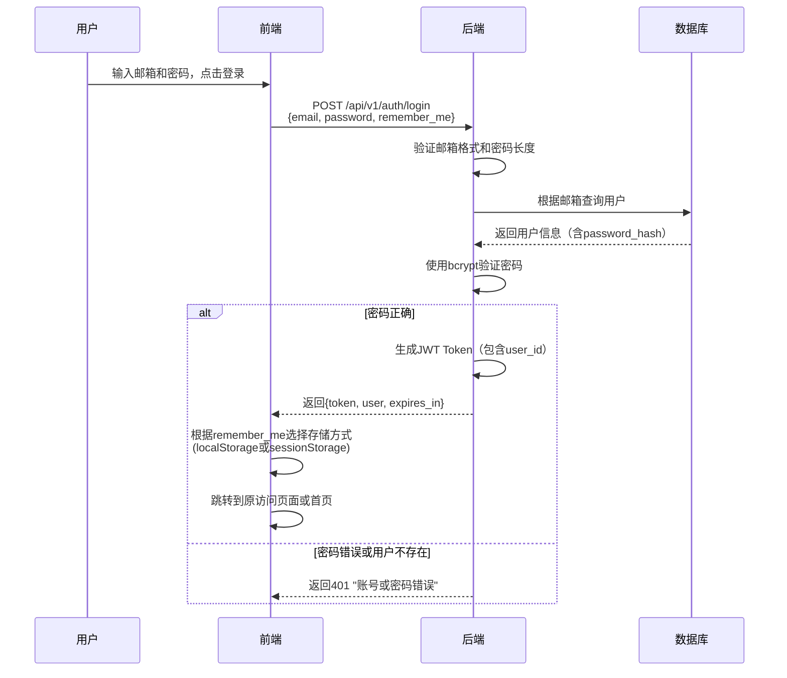
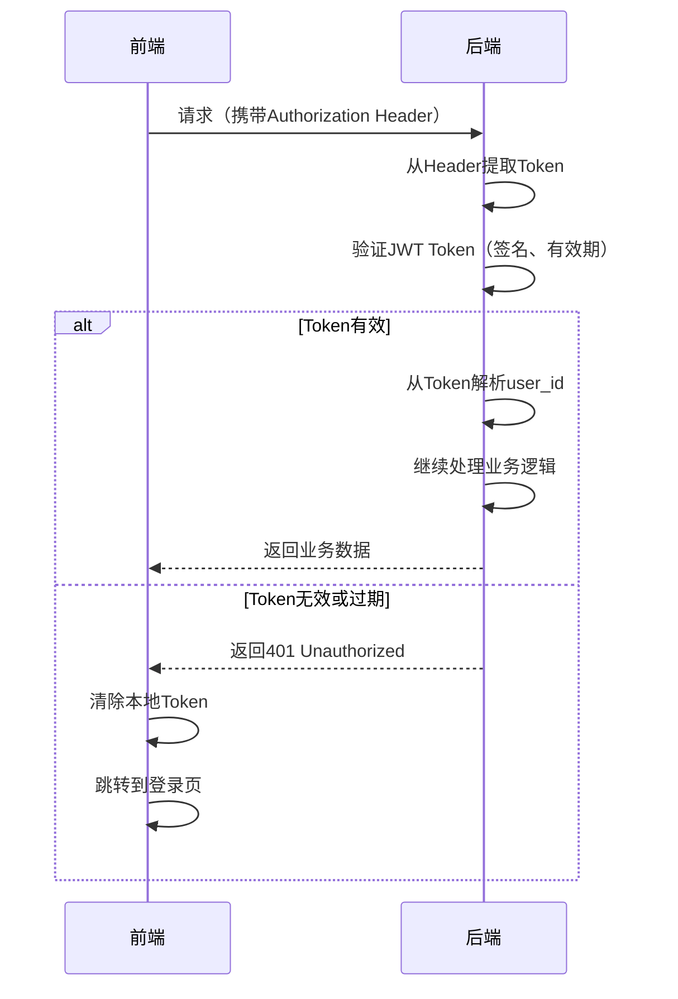
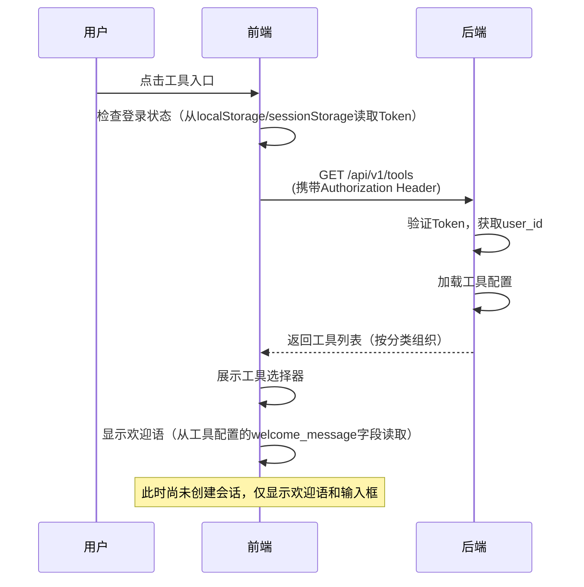
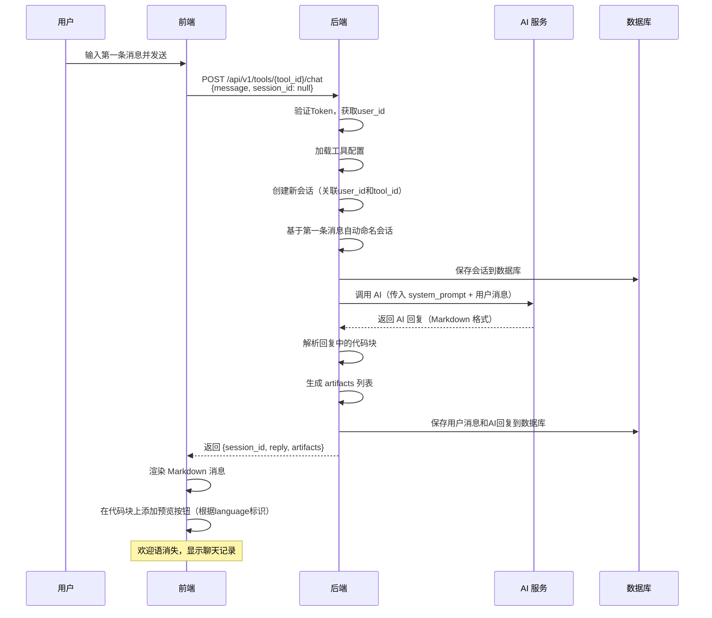
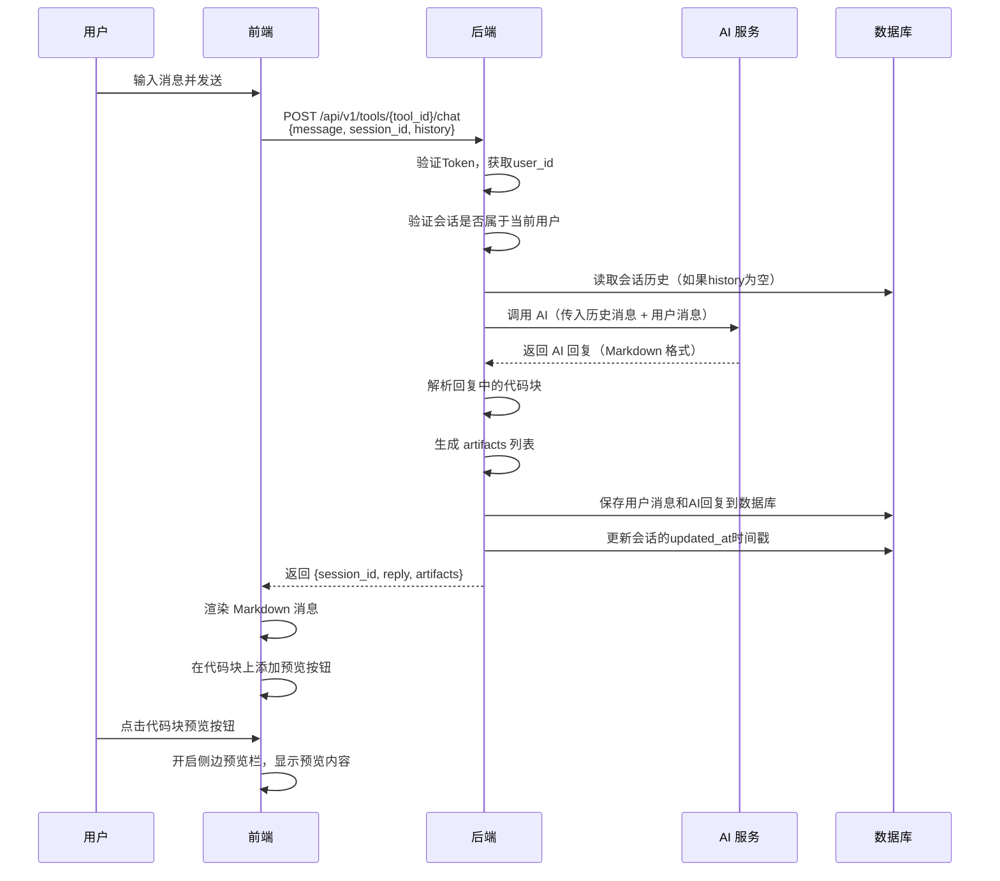
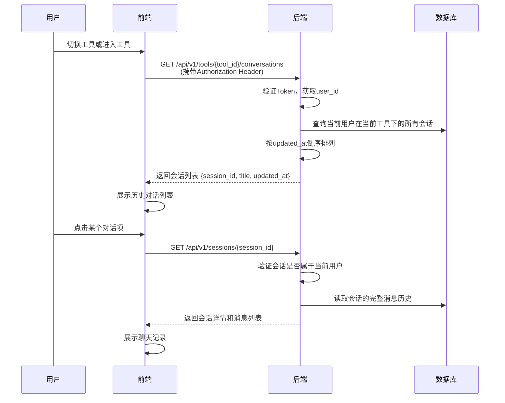

# 通用工具交互协议 (API Interface)

> **设计哲学**: 插件化架构。后端提供宿主环境，业务逻辑由工具配置（System Prompt）定义。

---

## 1. 基础信息
- **Base Path**: `/api/v1`
- **API 前缀**: 所有接口统一使用 `/api` 前缀
- **协议标准**: RESTful API，JSON 格式
- **认证方式**: JWT Token 认证（Bearer Token）
  - Token 通过 HTTP Header 传递：`Authorization: Bearer <token>`
  - Token 有效期：
    - 勾选"记住我"：7 天（604800 秒）
    - 未勾选"记住我"：24 小时（86400 秒）
  - Token Payload 结构：
    ```python
    {
      "user_id": str,  # 用户唯一标识（UUID）
      "exp": int,      # Token过期时间戳（Unix timestamp）
      "iat": int       # Token签发时间戳（Unix timestamp）
    }
    ```
  - Token 签名算法：HS256（使用后端配置的密钥）
  - 认证失败返回：`401 Unauthorized`

---

## 2. 用户认证接口

### 2.1 用户登录
用户通过用户名、邮箱或手机号和密码登录平台，获取访问 Token。

- **Endpoint**: `POST /api/v1/auth/login`
- **Description**: 验证用户账号（用户名、邮箱或手机号）和密码，返回 JWT Token 和用户信息。
- **认证要求**: 无需认证（公开接口）

- **Request Body**:
```python
class LoginRequest(BaseModel):
    account: str = Field(..., description="用户账号（用户名、邮箱或手机号）")
    password: str = Field(..., description="用户密码", min_length=6)
    remember_me: bool = Field(default=False, description="是否记住我（影响Token有效期）")
```

**账号格式说明**：
- **用户名格式**：1-50个字符，字母、数字、下划线、中文字符（如：zhangsan、张三）
- **邮箱格式**：`^[^@]+@[^@]+\.[^@]+$`（如：user@example.com）
- **手机号格式**：`^1[3-9]\d{9}$`（11位数字，以1开头，如：13800138000）
- 系统根据输入格式自动判断是用户名、邮箱还是手机号（优先级：手机号 > 邮箱 > 用户名）

- **Response Structure**:
```python
class LoginResponse(BaseModel):
    token: str = Field(..., description="JWT Token，用于后续请求的身份验证")
    user: UserInfo = Field(..., description="用户基本信息")
    expires_in: int = Field(..., description="Token有效期（秒），如：604800（7天）或86400（24小时）")

class UserInfo(BaseModel):
    user_id: str = Field(..., description="用户唯一标识（UUID）")
    username: str = Field(..., description="用户名（用于登录）")
    nickname: Optional[str] = Field(None, description="用户昵称（可选，用于显示，如未填写则使用用户名）")
    email: Optional[str] = Field(None, description="用户邮箱（可选，用于登录）")
    phone: Optional[str] = Field(None, description="用户手机号（可选，用于登录）")
    avatar: Optional[str] = Field(None, description="用户头像URL（可选，默认头像）")
```

**业务规则**：
- 账号格式验证：
  - 用户名格式：1-50个字符，字母、数字、下划线、中文字符
  - 邮箱格式：`^[^@]+@[^@]+\.[^@]+$`
  - 手机号格式：`^1[3-9]\d{9}$`
  - 系统根据输入格式自动判断是用户名、邮箱还是手机号（优先级：手机号 > 邮箱 > 用户名）
- 密码验证：最小长度6位
- 登录验证失败时，统一返回错误提示"账号或密码错误"（不区分具体错误原因，安全考虑）
- Token 有效期根据 `remember_me` 参数决定：
  - `remember_me=True`：7 天（604800 秒）
  - `remember_me=False`：24 小时（86400 秒）
- 密码使用 bcrypt 加密存储，验证时使用 bcrypt 比对

**Example Request** (用户名登录):
```json
{
  "account": "zhangsan",
  "password": "password123",
  "remember_me": true
}
```

**Example Request** (邮箱登录):
```json
{
  "account": "user@example.com",
  "password": "password123",
  "remember_me": true
}
```

**Example Request** (手机号登录):
```json
{
  "account": "13800138000",
  "password": "password123",
  "remember_me": true
}
```

**Example Response**:
```json
{
  "token": "eyJhbGciOiJIUzI1NiIsInR5cCI6IkpXVCJ9...",
  "user": {
    "user_id": "550e8400-e29b-41d4-a716-446655440000",
    "username": "张三",
    "email": "user@example.com",
    "phone": "13800138000",
    "avatar": null
  },
  "expires_in": 604800
}
```

**错误响应**：
- `400 Bad Request`: 账号格式错误（既不是用户名、邮箱也不是手机号）、密码长度不足
- `401 Unauthorized`: 账号或密码错误（统一提示，不区分具体错误）

---

### 2.2 获取当前用户信息
获取当前登录用户的基本信息。

- **Endpoint**: `GET /api/v1/auth/me`
- **Description**: 根据 Token 获取当前登录用户的信息。
- **认证要求**: 需要认证（Bearer Token）

- **Response Structure**:
```python
class UserInfoResponse(BaseModel):
    user: UserInfo = Field(..., description="用户基本信息")
```

**业务规则**：
- 从 JWT Token 中解析用户ID，查询用户信息
- 如果 Token 无效或过期，返回 `401 Unauthorized`
- 如果用户不存在，返回 `404 Not Found`

**Example Response**:
```json
{
  "user": {
    "user_id": "550e8400-e29b-41d4-a716-446655440000",
    "username": "张三",
    "email": "user@example.com",
    "avatar": null
  }
}
```

**错误响应**：
- `401 Unauthorized`: Token 无效或过期
- `404 Not Found`: 用户不存在

**前端使用说明**：
- 前端可以通过调用此接口验证 Token 是否有效
- 页面加载时，如果存在 Token，可以调用此接口验证登录状态
- 如果返回 `401`，说明 Token 已过期，前端应清除 Token 并跳转到登录页
- 如果返回 `200`，说明用户已登录，可以继续访问平台功能

---

### 2.3 退出登录（当前迭代说明）

**当前迭代处理方式**：
- 当前迭代不需要后端退出登录 API
- 前端直接清除 Token 存储（localStorage 或 sessionStorage）即可
- 清除后跳转到登录页

**后续迭代**：
- 后续迭代可添加 `POST /api/v1/auth/logout` 接口
- 用于服务端 Token 黑名单管理（如需要）

---

## 3. 临时用户管理接口

### 3.1 获取用户列表
获取所有用户列表（临时管理功能，内部使用）。

- **Endpoint**: `GET /api/v1/admin/users`
- **Description**: 返回所有用户列表，用于临时管理页面。
- **认证要求**: 需要认证（Bearer Token）

- **Query Parameters**:
  - `page` (int, optional): 页码，默认 1
  - `page_size` (int, optional): 每页数量，默认 20

- **Response Structure**:
```python
class UserListItem(BaseModel):
    user_id: str = Field(..., description="用户唯一标识（UUID）")
    username: str = Field(..., description="用户名")
    email: str = Field(..., description="用户邮箱")
    phone: Optional[str] = Field(None, description="用户手机号（可选）")
    avatar: Optional[str] = Field(None, description="用户头像URL")
    created_at: datetime = Field(..., description="用户创建时间")

class UserListResponse(BaseModel):
    users: List[UserListItem] = Field(..., description="用户列表")
    total: int = Field(..., description="用户总数")
    page: int = Field(..., description="当前页码")
    page_size: int = Field(..., description="每页数量")
```

**业务规则**：
- 需要登录后才能访问
- 当前迭代：所有登录用户都可以访问（后续迭代可添加权限控制）
- 按创建时间倒序排列

**Example Response**:
```json
{
  "users": [
    {
      "user_id": "550e8400-e29b-41d4-a716-446655440000",
      "username": "张三",
      "email": "user@example.com",
      "phone": "13800138000",
      "avatar": null,
      "created_at": "2026-01-02T10:00:00Z"
    }
  ],
  "total": 1,
  "page": 1,
  "page_size": 20
}
```

**错误响应**：
- `401 Unauthorized`: 未登录或 Token 无效

---

### 3.2 创建用户
创建新用户（临时管理功能，内部使用）。

- **Endpoint**: `POST /api/v1/admin/users`
- **Description**: 创建新用户，用于临时管理页面。
- **认证要求**: 需要认证（Bearer Token）

- **Request Body**:
```python
class CreateUserRequest(BaseModel):
    username: str = Field(..., description="用户名", min_length=1, max_length=50)
    email: str = Field(..., description="用户邮箱", regex=r'^[^@]+@[^@]+\.[^@]+$')
    password: str = Field(..., description="用户密码", min_length=6)
    avatar: Optional[str] = Field(None, description="用户头像URL（可选，默认使用系统默认头像）")
```

- **Response Structure**:
```python
class CreateUserResponse(BaseModel):
    user: UserInfo = Field(..., description="新创建的用户信息")
```

**业务规则**：
- 需要登录后才能访问
- 用户名必须唯一，如果已存在返回错误
- 邮箱必须唯一（如果提供），如果已存在返回错误
- 手机号必须唯一（如果提供），如果已存在返回错误
- 用户名、邮箱、手机号至少填写一个（用于登录）
- 密码使用 bcrypt 加密存储
- 如果未提供头像，使用系统默认头像
- 如果未提供昵称，使用用户名作为显示名称
- 用户ID使用UUID生成

**Example Request**:
```json
{
  "username": "lisi",
  "nickname": "李四",
  "email": "lisi@example.com",
  "phone": "13800138000",
  "password": "password123",
  "avatar": null
}
```

**Example Response**:
```json
{
  "user": {
    "user_id": "660e8400-e29b-41d4-a716-446655440001",
    "username": "李四",
    "email": "lisi@example.com",
    "avatar": null
  }
}
```

**错误响应**：
- `400 Bad Request`: 邮箱格式错误、密码长度不足、用户名格式错误
- `409 Conflict`: 邮箱已存在
- `401 Unauthorized`: 未登录或 Token 无效

---

## 4. 导航与工具相关接口（需要认证）

### 4.1 获取导航配置
获取顶部导航模块配置列表，用于前端渲染导航栏和配置路由。

- **Endpoint**: `GET /api/v1/navigation`
- **Description**: 返回所有导航模块配置，包括工具集模块和独立页面模块。
- **认证要求**: 需要认证（Bearer Token）

- **Response Structure**:
```python
class NavigationModule(BaseModel):
    module_id: str = Field(..., description="模块唯一标识符")
    name: str = Field(..., description="模块显示名称")
    type: Literal["toolset", "page"] = Field(..., description="模块类型：toolset（工具集）或 page（独立页面）")
    route_path: str = Field(..., description="前端路由路径")
    icon: Optional[str] = Field(None, description="图标标识")
    order: int = Field(..., description="显示顺序")
    config_source: Optional[str] = Field(None, description="工具配置目录路径（toolset类型专用）")
    page_component: Optional[str] = Field(None, description="页面组件名称（page类型专用）")

class NavigationResponse(BaseModel):
    modules: List[NavigationModule] = Field(..., description="导航模块列表")
```

**业务规则**：
- 按 `order` 字段升序排列
- 只返回配置正确的模块（验证通过的）
- `toolset` 类型模块必须有 `config_source` 字段
- `page` 类型模块必须有 `page_component` 字段

**Example Response**:
```json
{
  "modules": [
    {
      "module_id": "ai_tools",
      "name": "AI工具",
      "type": "toolset",
      "route_path": "/ai-tools",
      "config_source": "configs/tools/ai_tools/",
      "icon": "sparkles",
      "order": 1
    },
    {
      "module_id": "teaching_researcher",
      "name": "教研员",
      "type": "toolset",
      "route_path": "/teaching-researcher",
      "config_source": "configs/tools/teaching_researcher/",
      "icon": "user-group",
      "order": 2
    },
    {
      "module_id": "utility_tools",
      "name": "常用工具",
      "type": "page",
      "route_path": "/utility-tools",
      "page_component": "UtilityToolsPage",
      "icon": "wrench",
      "order": 3
    }
  ]
}
```

---

### 4.2 获取工具集的工具列表
获取指定工具集的所有工具列表，按分类组织，用于前端工具选择器展示。

- **Endpoint**: `GET /api/v1/toolsets/{toolset_id}/tools`
- **Description**: 返回指定工具集的所有工具列表，按分类组织。
- **认证要求**: 需要认证（Bearer Token）

- **Path Parameters**:
  - `toolset_id` (str, required): 工具集ID（与导航配置的 `module_id` 对应）

- **Response Structure**:
```python
class ToolListItem(BaseModel):
    tool_id: str = Field(..., description="工具唯一标识符")
    toolset_id: str = Field(..., description="所属工具集ID")
    name: str = Field(..., description="工具名称")
    description: Optional[str] = Field(None, description="工具描述")
    icon: Optional[str] = Field(None, description="图标标识（可选）")
    category: str = Field(..., description="分类名称")
    visible: bool = Field(True, description="是否在工具选择器中显示")
    type: Literal["normal", "placeholder"] = Field("normal", description="工具类型")
    order: int = Field(0, description="排序")

class CategoryGroup(BaseModel):
    name: str = Field(..., description="分类名称")
    icon: Optional[str] = Field(None, description="分类图标（可选）")
    tools: List[ToolListItem] = Field(..., description="该分类下的工具列表")

class ToolsetToolsResponse(BaseModel):
    toolset_id: str = Field(..., description="工具集ID")
    toolset_name: str = Field(..., description="工具集名称")
    categories: List[CategoryGroup] = Field(..., description="按分类组织的工具列表")
```

**业务规则**：
- 只返回该工具集下的工具（`toolset_id` 匹配）
- 只返回 `visible=true` 的工具
- 只返回成功加载的工具
- 按 `category` 字段聚合，生成分类结构
- 每个分类内的工具按 `order` 升序排列

**Example Response**:
```json
{
  "toolset_id": "teaching_researcher",
  "toolset_name": "教研员",
  "categories": [
    {
      "name": "语文",
      "icon": "book-open",
      "tools": [
        {
          "tool_id": "chinese_researcher_1",
          "toolset_id": "teaching_researcher",
          "name": "王老师 - 小学语文教研员",
          "description": "专注于小学语文阅读与写作教学",
          "icon": "book-open",
          "category": "语文",
          "visible": true,
          "type": "normal",
          "order": 1
        }
      ]
    },
    {
      "name": "数学",
      "icon": "calculator",
      "tools": [
        {
          "tool_id": "math_researcher_1",
          "toolset_id": "teaching_researcher",
          "name": "李老师 - 小学数学教研员",
          "description": "专注于小学数学思维培养",
          "icon": "calculator",
          "category": "数学",
          "visible": true,
          "type": "normal",
          "order": 1
        }
      ]
    }
  ]
}
```

**错误响应**：
- `404 Not Found`: 工具集不存在

---

### 4.3 获取所有工具列表（兼容接口）
获取所有已配置的工具列表，按分类组织。保留此接口用于向后兼容和某些需要获取所有工具的场景（如搜索、管理后台）。

- **Endpoint**: `GET /api/v1/tools`
- **Description**: 返回所有工具集的所有工具列表，按分类组织。
- **认证要求**: 需要认证（Bearer Token）

- **Response Structure**:
```python
class ToolListItem(BaseModel):
    tool_id: str = Field(..., description="工具唯一标识符")
    toolset_id: str = Field(..., description="所属工具集ID")  # 🆕 新增字段
    name: str = Field(..., description="工具名称")
    description: Optional[str] = Field(None, description="工具描述")
    icon: Optional[str] = Field(None, description="图标标识（可选）")
    category: str = Field(..., description="分类名称")
    visible: bool = Field(True, description="是否在工具选择器中显示")
    type: Literal["normal", "placeholder"] = Field("normal", description="工具类型")

class CategoryGroup(BaseModel):
    name: str = Field(..., description="分类名称")
    icon: Optional[str] = Field(None, description="分类图标（可选）")
    tools: List[ToolListItem] = Field(..., description="该分类下的工具列表")

class ToolListResponse(BaseModel):
    categories: List[CategoryGroup] = Field(..., description="按分类组织的工具列表")
```

**业务规则**：
- 只返回 `visible=true` 的工具
- 只返回成功加载的工具，配置加载失败的工具不包含在列表中
- 如果所有工具配置都加载失败，返回空列表 `[]`
- 工具按 `category` 字段聚合，生成分类结构
- 如果多个工具使用相同的 `category` 名称，自动归为一类

**Example Response**:
```json
{
  "categories": [
    {
      "name": "智能体",
      "icon": "command-line",
      "tools": [
        {
          "tool_id": "prompt_wizard",
      "name": "AI 提示词向导",
      "description": "通过六步引导法，帮助您打造专家级提示词",
          "icon": "command-line",
          "category": "智能体",
          "visible": true,
          "type": "normal"
        }
      ]
    }
  ]
}
```

---

### 4.4 通用对话交互
这是系统最核心的接口，负责发送用户消息，获取 AI 回复，并解析成果物。首次调用时自动创建会话。

- **Endpoint**: `POST /api/v1/tools/{tool_id}/chat`
- **Description**: 向指定工具发送消息，获取 AI 回复。如果 `session_id` 不存在，自动创建新会话。
- **Path Parameters**:
  - `tool_id` (str, required): 工具唯一标识符

- **Request Body**:
```python
class Message(BaseModel):
    role: Literal["user", "assistant"] = Field(..., description="消息角色")
    content: str = Field(..., description="消息内容")

class ChatRequest(BaseModel):
    message: str = Field(..., description="用户输入的消息", min_length=1)
    session_id: Optional[str] = Field(None, description="会话 UUID（可选）。如果有则继续会话，没有则创建新会话")
    history: Optional[List[Message]] = Field(
        None,
        description="历史消息列表（可选）。如果提供，后端使用该历史；如果不提供，后端从数据库读取"
    )
```

**认证要求**: 需要认证（Bearer Token）

**业务规则**：
- **会话创建时机**：用户发送第一条消息时，如果 `session_id` 不存在，自动创建新会话
- **会话命名**：会话创建时，基于第一条用户消息的前 N 个字符自动命名（具体长度由 UI 决定，保证美观）
- **历史消息处理**：
  - 如果提供 `history`，后端使用该历史消息
  - 如果不提供 `history`，后端从数据库读取会话历史
- **用户验证**：后端从 JWT Token 中获取用户ID，验证会话是否属于当前用户
- **成果物解析**：后端解析 `reply` 中的 Markdown 代码块，生成 `artifacts` 列表
- **预览按钮显示**：代码块的语言标识为 `markdown`、`html`、`svg` 时，前端自动显示预览按钮
- **错误处理**：
  - 如果工具不存在，返回 404 错误
- 如果会话不属于当前用户，返回 403 Forbidden
- 如果未认证，返回 401 错误

**响应方式**：
- **MVP 阶段**：一次性返回完整回复（简化实现，快速验证架构）
- **后续迭代**：可扩展支持流式响应（Server-Sent Events），提供实时打字效果

- **Response Structure**:
```python
class ChatResponse(BaseModel):
    session_id: str = Field(..., description="会话 UUID。首次调用返回新创建的session_id，后续调用返回原session_id")
    reply: str = Field(..., description="AI 的文本回复内容（完整 Markdown 文本）")
    artifacts: List[Artifact] = Field(
        default_factory=list, 
        description="从回复中解析出的成果物列表（代码块内容）"
    )
```

**Example Request** (首次调用，创建新会话):
```json
{
  "message": "我想让 AI 帮我写小红书美妆文案",
  "session_id": null
}
```

**Example Request** (后续调用，继续会话):
```json
{
  "message": "继续优化这个提示词",
  "session_id": "550e8400-e29b-41d4-a716-446655440000",
  "history": [
    {
      "role": "user",
      "content": "我想让 AI 帮我写小红书美妆文案"
    },
    {
      "role": "assistant",
      "content": "好的，我来帮你打造一个专业的小红书美妆文案提示词..."
    }
  ]
}
```

**Example Response**:
```json
{
  "session_id": "550e8400-e29b-41d4-a716-446655440000",
  "reply": "好的，我来帮你打造一个专业的小红书美妆文案提示词。\n\n```markdown\n## [角色设定]\n你是一位拥有5年经验的小红书美妆文案专家...\n```\n\n让我们开始第一步：角色定义...",
  "artifacts": [
    {
      "type": "markdown",
      "content": "## [角色设定]\n你是一位拥有5年经验的小红书美妆文案专家...",
      "language": "markdown",
      "timestamp": "2026-01-03T10:00:00Z"
    }
  ]
}
```

---

### 4.5 获取历史对话列表
获取当前用户在当前工具下的所有历史对话列表。

- **Endpoint**: `GET /api/v1/tools/{tool_id}/conversations`
- **Description**: 返回当前用户在当前工具下的所有历史对话列表，按更新时间倒序排列。
- **Path Parameters**:
  - `tool_id` (str, required): 工具唯一标识符
- **认证要求**: 需要认证（Bearer Token）

- **Response Structure**:
```python
class ConversationListItem(BaseModel):
    session_id: str = Field(..., description="会话 UUID")
    title: str = Field(..., description="会话标题")
    updated_at: datetime = Field(..., description="最后更新时间")

class ConversationListResponse(BaseModel):
    conversations: List[ConversationListItem] = Field(..., description="对话列表")
```

**业务规则**：
- 只返回当前用户在当前工具下的会话
- 按 `updated_at` 倒序排列（最新的在最前面）
- 如果用户在该工具下没有会话，返回空列表 `[]`

**Example Response**:
```json
{
  "conversations": [
    {
      "session_id": "550e8400-e29b-41d4-a716-446655440000",
      "title": "我想让 AI 帮我写小红书美妆文案",
      "updated_at": "2026-01-03T10:30:00Z"
    },
    {
      "session_id": "660e8400-e29b-41d4-a716-446655440001",
      "title": "如何优化提示词效果",
      "updated_at": "2026-01-03T09:00:00Z"
    }
  ]
}
```

**错误响应**：
- `401 Unauthorized`: 未登录或 Token 无效
- `404 Not Found`: 工具不存在

---

### 4.6 获取会话详情
获取指定会话的完整消息历史。

- **Endpoint**: `GET /api/v1/sessions/{session_id}`
- **Description**: 返回指定会话的完整消息历史，用于恢复会话。
- **Path Parameters**:
  - `session_id` (str, required): 会话 UUID
- **认证要求**: 需要认证（Bearer Token）

- **Response Structure**:
```python
class SessionDetailResponse(BaseModel):
    session_id: str = Field(..., description="会话 UUID")
    tool_id: str = Field(..., description="工具唯一标识符")
    title: str = Field(..., description="会话标题")
    created_at: datetime = Field(..., description="创建时间")
    updated_at: datetime = Field(..., description="最后更新时间")
    messages: List[Message] = Field(..., description="消息列表")
```

**业务规则**：
- 验证会话是否属于当前用户
- 如果会话不属于当前用户，返回 403 Forbidden
- 消息按 `created_at` 正序排列（最早的在最前面）

**Example Response**:
```json
{
  "session_id": "550e8400-e29b-41d4-a716-446655440000",
  "tool_id": "prompt_wizard",
  "title": "我想让 AI 帮我写小红书美妆文案",
  "created_at": "2026-01-03T10:00:00Z",
  "updated_at": "2026-01-03T10:30:00Z",
  "messages": [
    {
      "role": "user",
      "content": "我想让 AI 帮我写小红书美妆文案"
    },
    {
      "role": "assistant",
      "content": "好的，我来帮你打造一个专业的小红书美妆文案提示词..."
    }
  ]
}
```

**错误响应**：
- `401 Unauthorized`: 未登录或 Token 无效
- `403 Forbidden`: 会话不属于当前用户
- `404 Not Found`: 会话不存在

---

### 4.7 编辑会话标题
更新指定会话的标题。

- **Endpoint**: `PATCH /api/v1/sessions/{session_id}`
- **Description**: 更新指定会话的标题。
- **Path Parameters**:
  - `session_id` (str, required): 会话 UUID
- **认证要求**: 需要认证（Bearer Token）

- **Request Body**:
```python
class UpdateSessionRequest(BaseModel):
    title: str = Field(..., description="新的会话标题", min_length=1, max_length=200)
```

- **Response Structure**:
```python
class UpdateSessionResponse(BaseModel):
    session_id: str = Field(..., description="会话 UUID")
    title: str = Field(..., description="更新后的会话标题")
```

**业务规则**：
- 验证会话是否属于当前用户
- 如果会话不属于当前用户，返回 403 Forbidden
- 标题长度限制：1-200 个字符

**Example Request**:
```json
{
  "title": "优化后的提示词讨论"
}
```

**Example Response**:
```json
{
  "session_id": "550e8400-e29b-41d4-a716-446655440000",
  "title": "优化后的提示词讨论"
}
```

**错误响应**：
- `400 Bad Request`: 标题长度不符合要求
- `401 Unauthorized`: 未登录或 Token 无效
- `403 Forbidden`: 会话不属于当前用户
- `404 Not Found`: 会话不存在

---

### 4.8 删除会话
删除指定会话及其所有消息。

- **Endpoint**: `DELETE /api/v1/sessions/{session_id}`
- **Description**: 删除指定会话及其所有消息（级联删除）。
- **Path Parameters**:
  - `session_id` (str, required): 会话 UUID
- **认证要求**: 需要认证（Bearer Token）

**业务规则**：
- 验证会话是否属于当前用户
- 如果会话不属于当前用户，返回 403 Forbidden
- 删除会话时，级联删除该会话下的所有消息和成果物
- 删除操作不可恢复

**响应**：
- `204 No Content`: 删除成功

**错误响应**：
- `401 Unauthorized`: 未登录或 Token 无效
- `403 Forbidden`: 会话不属于当前用户
- `404 Not Found`: 会话不存在

---

## 5. 成果物解析协议 (Artifacts Protocol)

### 5.1 代码块识别规则
系统从 AI 的 Markdown 回复中识别代码块，只有代码块中的内容才被视为可预览的成果物。

**识别规则**：
- 标准 Markdown 代码块格式：`` ```language\ncontent\n``` ``
- 代码块的语言标识（language）决定是否显示预览按钮：
  - `markdown` → 显示预览按钮，支持 Markdown 文本预览
  - `html` → 显示预览按钮，支持 HTML 页面预览
  - `svg` → 显示预览按钮，支持 SVG 图形预览
  - 其他语言（如 `javascript`、`python` 等）→ 不显示预览按钮，仅作为代码展示
- 预览按钮的显示逻辑由前端根据代码块的语言标识自动判断，无需后端配置

**成果物数据结构**：
```python
class Artifact(BaseModel):
    type: str = Field(..., description="成果物类型，由代码块语言标识决定（如 'markdown', 'html', 'svg'）")
    content: str = Field(..., description="代码块中的原始内容")
    language: str = Field(..., description="代码块的语言标识（如 'markdown', 'html', 'svg'）")
    timestamp: datetime = Field(..., description="成果物生成时间")
```

### 5.2 成果物提取逻辑
- 后端解析 AI 回复的 Markdown 文本，提取所有代码块
- 每个代码块生成一个 `Artifact` 对象
- 如果 AI 回复中没有代码块，`artifacts` 列表为空
- 前端根据 `artifacts` 列表，在聊天窗口中为每个代码块提供预览按钮
- 用户点击预览按钮后，开启侧边预览栏，显示预览内容

---

## 6. 错误处理

### 4.1 标准错误响应
所有接口在发生错误时，应返回统一的错误格式：

```python
class ErrorResponse(BaseModel):
    error_code: str = Field(..., description="错误代码")
    error_message: str = Field(..., description="错误描述")
    details: Optional[dict] = Field(None, description="错误详情（可选）")
```

### 4.2 常见错误场景

**标准错误码**：
- `401 Unauthorized`: 未登录、Token 无效或过期
- `403 Forbidden`: 权限不足（如访问其他用户的会话）
- `404 Not Found`: Agent 不存在、会话不存在、用户不存在
- `400 Bad Request`: 请求参数错误
- `409 Conflict`: 资源冲突（如邮箱已存在）
- `500 Internal Server Error`: 服务器内部错误
- `503 Service Unavailable`: AI 服务暂时不可用

**具体错误处理**：

1. **AI 服务超时或不可用**
   - 状态码：`503 Service Unavailable`
   - 错误信息：`"AI 服务暂时不可用，请稍后重试"`
   - 处理方式：前端显示友好提示，提供重试按钮

2. **工具配置加载失败**
   - 状态码：`500 Internal Server Error`
   - 处理方式：启动时检测，加载失败的工具不显示在 `GET /api/v1/tools` 列表中，记录错误日志
   - 用户影响：该工具不可用，但其他工具正常使用

3. **代码块解析失败**
   - 状态码：`200 OK`（不中断对话）
   - 处理方式：静默处理，`artifacts` 列表为空，对话正常继续
   - 用户影响：该消息不显示预览按钮，但不影响对话流程

---

## 7. 认证流程设计

### 5.1 用户登录流程


### 5.2 认证Token验证流程


---

## 8. 数据流设计

### 8.1 工具进入流程（显示欢迎语）


### 8.2 首次对话流程（创建会话）


### 8.3 后续对话流程（继续会话）


### 8.4 历史对话列表流程


---

---

**文档版本**: v3.0  
**最后更新**: 2026-01-09  
**更新说明**:
- v3.0:
  - 多工具集架构支持：新增导航配置接口、工具集工具列表接口
  - 新增 `GET /api/v1/navigation` 接口，提供导航模块配置
  - 新增 `GET /api/v1/toolsets/{toolset_id}/tools` 接口，按工具集获取工具列表
  - 扩展 `ToolListItem` 模型，增加 `toolset_id` 字段
  - 更新接口编号（原 4.2-4.6 调整为 4.4-4.8）
- v2.0: 
  - 术语统一：将"Agent"统一为"工具（Tool）"
  - 接口重构：采用一个接口方案，`session_id` 作为可选参数
  - 会话创建机制：从"自动创建"改为"延迟创建"（用户发送第一条消息后创建）
  - 欢迎语机制：从"AI自动触发"改为"配置化展示"（工具配置中的 `welcome_message` 字段）
  - 删除工具配置中的 `ui_config` 和 `capabilities` 字段
  - 新增历史对话列表、会话详情、编辑会话、删除会话接口
  - 更新数据流设计，反映新的接口和流程

**设计依据**: 
- `docs/requirements/product_spec.md` (v4.0)
- `docs/requirements/ai_prompt_wizard_spec.md`
- `docs/requirements/ui_interaction_guide.md`
- `docs/requirements/acceptance_scenarios.md`

