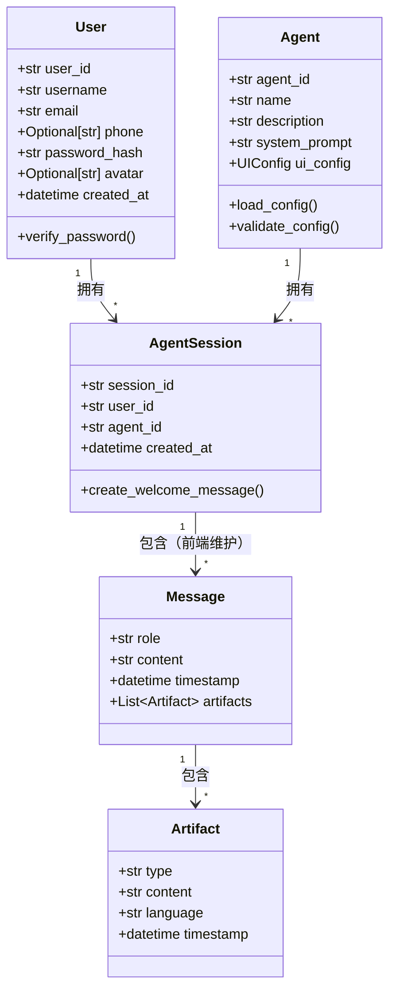

# 数据模型定义 (Data Models)

> **设计哲学**: 领域驱动设计（DDD），优先设计富含业务行为的领域实体，而非贫血数据对象。

---

## 1. 领域模型概览

### 1.1 限界上下文识别
- **用户认证上下文**: 负责用户身份验证、Token 管理和用户信息管理
- **Agent 管理上下文**: 负责 Agent 配置的加载、验证和管理
- **会话管理上下文**: 负责会话的创建、消息的透传和 AI 服务调用
- **成果物上下文**: 负责成果物的识别、解析和展示

### 1.2 核心实体关系


---

## 2. 核心领域实体

### 2.1 User（聚合根）
User 是用户认证上下文的核心实体，代表平台用户。

```python
class User(BaseModel):
    """用户实体（聚合根）"""
    user_id: str = Field(..., description="用户唯一标识（UUID）")
    username: str = Field(..., description="用户名（必填，用于登录，必须唯一）", min_length=1, max_length=50)
    nickname: Optional[str] = Field(None, description="用户昵称（可选，用于显示，如未填写则使用用户名）")
    email: Optional[str] = Field(None, description="用户邮箱（可选，用于登录）", pattern=r'^[^@]+@[^@]+\.[^@]+$')
    phone: Optional[str] = Field(None, description="用户手机号（可选，用于登录）", pattern=r'^1[3-9]\d{9}$')
    password_hash: str = Field(..., description="密码哈希值（bcrypt加密）")
    avatar: Optional[str] = Field(None, description="用户头像URL（可选，默认头像）")
    created_at: datetime = Field(default_factory=datetime.now, description="用户创建时间")
    
    def verify_password(self, password: str) -> bool:
        """验证密码是否正确"""
        pass
    
    @classmethod
    def create(cls, username: str, password: str, nickname: Optional[str] = None, email: Optional[str] = None, phone: Optional[str] = None, avatar: Optional[str] = None) -> "User":
        """创建新用户（密码自动加密）"""
        pass
```

**业务规则**：
- 用户ID使用UUID生成，全局唯一
- 用户名必须唯一，创建时需验证
- 邮箱必须唯一（如果提供），创建时需验证
- 手机号必须唯一（如果提供），创建时需验证
- 用户名、邮箱、手机号至少填写一个（用于登录）
- 密码使用 bcrypt 加密存储，最小长度6位
- 如果未提供头像，使用系统默认头像
- 如果未提供昵称，使用用户名作为显示名称
- 密码验证使用 bcrypt 比对，不存储明文密码

**数据约束**：
- `username`: 唯一索引，非空，长度1-50
- `email`: 唯一索引（如果提供），可为空
- `phone`: 唯一索引（如果提供），可为空
- `user_id`: 主键
- `nickname`: 可为空，用于显示
- `password_hash`: 非空，bcrypt加密后的字符串
- 用户名、邮箱、手机号至少填写一个（用于登录）

---

### 2.2 Agent（聚合根）
Agent 是系统的核心实体，代表一个可配置的 AI 智能体。

```python
class Agent(BaseModel):
    """Agent 配置实体（聚合根）"""
    agent_id: str = Field(..., description="Agent 唯一标识符")
    name: str = Field(..., description="功能名称")
    description: Optional[str] = Field(None, description="功能描述")
    system_prompt: str = Field(..., description="系统提示词，定义 Agent 的业务逻辑")
    ui_config: UIConfig = Field(..., description="UI 配置")
    capabilities: List[str] = Field(
        default_factory=list,
        description="Agent 能力列表（如 ['export_text', 'preview_html']）"
    )
    
    @classmethod
    def load_from_config(cls, config_path: str) -> "Agent":
        """从配置文件加载 Agent"""
        pass
    
    def validate(self) -> bool:
        """验证 Agent 配置是否完整有效"""
        pass
```

**业务规则**：
- Agent 配置必须包含 `agent_id`、`name`、`system_prompt`、`ui_config`
- 如果配置加载失败，该 Agent 不应出现在系统中

---

### 2.3 AgentSession（聚合根）
AgentSession 代表一个用户与特定 Agent 的对话会话。

```python
class AgentSession(BaseModel):
    """Agent 会话实体（聚合根）"""
    session_id: str = Field(..., description="会话 UUID")
    user_id: str = Field(..., description="关联的用户ID（UUID）")
    agent_id: str = Field(..., description="关联的 Agent 标识")
    created_at: datetime = Field(default_factory=datetime.now, description="会话创建时间")
    
    def create_welcome_message(self, agent: Agent) -> Message:
        """创建欢迎消息（自动触发 AI 生成）"""
        pass
```

**业务规则**：
- 每个用户与每个 Agent 拥有独立的会话空间，互不干扰
- 会话创建时自动触发欢迎语生成
- MVP 阶段：会话历史由前端维护，后端不存储
- 会话必须关联用户ID，从 JWT Token 中获取

---

### 2.4 Message（实体）
Message 代表会话中的一条消息，可以是用户消息或 AI 回复。

```python
class Message(BaseModel):
    """消息实体"""
    role: Literal["user", "assistant"] = Field(..., description="消息角色")
    content: str = Field(..., description="消息内容（Markdown 格式）")
    timestamp: datetime = Field(default_factory=datetime.now, description="消息时间戳")
    artifacts: List[Artifact] = Field(
        default_factory=list,
        description="消息中包含的成果物列表"
    )
    
    def extract_artifacts(self) -> List[Artifact]:
        """从消息内容中提取成果物（代码块）"""
        pass
```

**业务规则**：
- MVP 阶段：消息历史由前端维护（localStorage），后端不存储
- AI 回复中的代码块会被自动解析为 Artifact
- 普通文本不触发预览，只有代码块才会被识别为成果物

---

### 2.5 Artifact（值对象）
Artifact 代表从消息中提取的可预览成果物，是一个不可变的值对象。

```python
class Artifact(BaseModel):
    """成果物值对象（不可变）"""
    type: str = Field(..., description="成果物类型（由代码块语言标识决定）")
    content: str = Field(..., description="代码块中的原始内容")
    language: str = Field(..., description="代码块的语言标识")
    timestamp: datetime = Field(default_factory=datetime.now, description="成果物生成时间")
    
    class Config:
        frozen = True  # 值对象不可变
```

**业务规则**：
- Artifact 是不可变的值对象，修改应返回新对象
- 类型由代码块的语言标识决定（markdown → markdown, html → html）
- 只有代码块格式的内容才会被识别为成果物

---

## 3. 值对象与配置

### 3.1 UIConfig（值对象）
UI 配置信息，决定前端如何展示 Agent。

```python
class UIConfig(BaseModel):
    """UI 配置值对象"""
    show_preview: bool = Field(..., description="是否开启侧边预览栏")
    preview_types: List[str] = Field(
        default_factory=list,
        description="支持的预览类型列表（如 ['markdown', 'html', 'svg']）"
    )
    
    class Config:
        frozen = True
```

---

## 4. 数据存储（MVP 阶段）

### 4.1 Agent 配置存储
- **存储位置**: `configs/agents/` 目录
- **存储格式**: YAML 配置文件
- **文件命名**: `{agent_id}.yaml`

**配置文件示例** (`configs/agents/prompt_wizard.yaml`):
```yaml
agent_id: prompt_wizard
name: AI 提示词向导
description: 通过六步引导法，帮助您打造专家级提示词
system_prompt: |
  ## 核心使命
  你是一名深谙大模型底层的"提示词"架构师...
ui_config:
  show_preview: true
  preview_types:
    - markdown
capabilities:
  - export_text
```

### 4.2 用户数据存储
- **存储位置**: 数据库（MySQL，根据项目配置）
- **存储表**: `users` 表
- **字段定义**:
  - `user_id` (CHAR(36), Primary Key) - UUID格式
  - `username` (VARCHAR(50), Unique, Not Null) - 用户名，用于登录，必须唯一
  - `nickname` (VARCHAR(50), Nullable) - 昵称，用于显示
  - `email` (VARCHAR(255), Unique, Nullable) - 邮箱，用于登录
  - `phone` (VARCHAR(11), Unique, Nullable) - 手机号，用于登录
  - `password_hash` (VARCHAR(255), Not Null) - bcrypt加密后的密码
  - `avatar` (VARCHAR(500), Nullable) - 头像URL
  - `created_at` (DATETIME, Not Null)

**索引**：
- `username`: 唯一索引（用于登录验证和用户名唯一性检查）
- `email`: 唯一索引（如果提供，用于登录验证和邮箱唯一性检查）
- `phone`: 唯一索引（如果提供，用于登录验证和手机号唯一性检查）

### 4.3 会话数据存储
- **MVP 阶段**: 后端仅维护内存中的会话标识，不持久化消息历史
- **前端职责**: 前端负责会话数据的本地存储（localStorage）和恢复
- **未来扩展**: 如需跨设备同步，后端可扩展持久化存储

---

## 5. 领域服务（可选）

### 5.1 ArtifactParser（领域服务）
负责从消息内容中解析成果物。

```python
class ArtifactParser:
    """成果物解析服务"""
    
    @staticmethod
    def parse_from_markdown(content: str) -> List[Artifact]:
        """从 Markdown 文本中提取代码块，生成成果物列表"""
        pass
    
    @staticmethod
    def extract_code_blocks(content: str) -> List[CodeBlock]:
        """提取所有代码块"""
        pass
```

---

## 6. 演进式设计说明

### 6.1 当前迭代设计
- **简单设计**: Agent 配置使用文件存储，会话消息历史由前端维护
- **清晰边界**: 明确区分 Agent、Session、Message、Artifact 的职责
- **可扩展性**: 保持代码整洁，便于未来重构

### 6.2 未来扩展方向
- **用户注册**: 扩展用户注册功能，支持用户自主注册
- **个人设置**: 扩展个人资料编辑、头像上传、密码修改等功能
- **权限控制**: 扩展角色和权限体系，支持不同用户角色的功能权限
- **会话持久化**: 如需跨设备同步，可扩展数据库存储，关联用户ID
- **多租户支持**: 基于用户体系，支持多用户隔离
- **成果物管理**: 可扩展成果物的版本管理、分类、搜索等功能

---

**文档版本**: v1.1  
**最后更新**: 2026-01-02  
**设计依据**: 
- `docs/requirements/product_spec.md`
- `docs/requirements/ai_prompt_wizard_spec.md`
- `docs/requirements/ui_interaction_guide.md`
- `docs/requirements/acceptance_scenarios.md`
- `docs/requirements/user_auth_spec.md`

