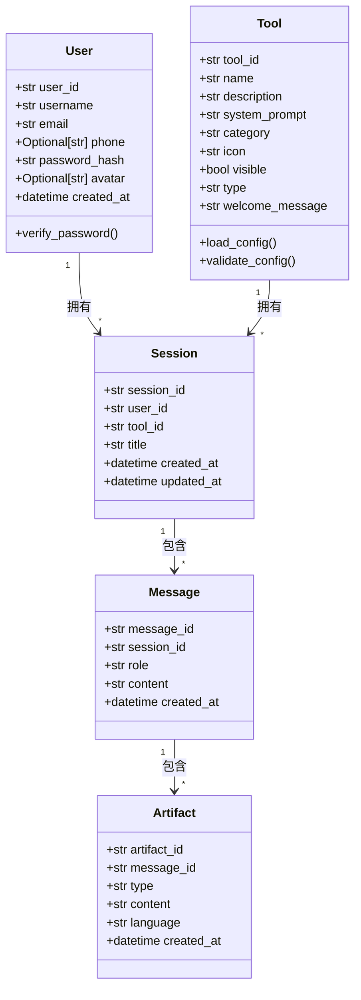

# 数据模型定义 (Data Models)

> **设计哲学**: 领域驱动设计（DDD），优先设计富含业务行为的领域实体，而非贫血数据对象。

---

## 1. 领域模型概览

### 1.1 限界上下文识别
- **用户认证上下文**: 负责用户身份验证、Token 管理和用户信息管理
- **工具管理上下文**: 负责工具配置的加载、验证和管理（AI工具、教研员工具）
- **会话管理上下文**: 负责会话的创建、消息的存储和 AI 服务调用
- **成果物上下文**: 负责成果物的识别、解析和展示
- **常用工具上下文**: 负责常用工具的管理、分类组织和工具运行（独立于会话的临时工具）
- **作品展示上下文**: 负责作品的管理、分类组织和作品展示（优秀HTML作品的集中展示平台）

### 1.2 核心实体关系


---

## 2. 核心领域实体

### 2.1 User（聚合根）
User 是用户认证上下文的核心实体，代表平台用户。

```python
class User(BaseModel):
    """用户实体（聚合根）"""
    user_id: str = Field(..., description="用户唯一标识（UUID）")
    username: str = Field(..., description="用户名（必填，用于登录，必须唯一）", min_length=1, max_length=50)
    nickname: Optional[str] = Field(None, description="用户昵称（可选，用于显示，如未填写则使用用户名）")
    email: Optional[str] = Field(None, description="用户邮箱（可选，用于登录）", pattern=r'^[^@]+@[^@]+\.[^@]+$')
    phone: Optional[str] = Field(None, description="用户手机号（可选，用于登录）", pattern=r'^1[3-9]\d{9}$')
    password_hash: str = Field(..., description="密码哈希值（bcrypt加密）")
    avatar: Optional[str] = Field(None, description="用户头像URL（可选，默认头像）")
    is_admin: bool = Field(False, description="是否为管理员（默认为false）")
    created_at: datetime = Field(default_factory=datetime.now, description="用户创建时间")
    
    def verify_password(self, password: str) -> bool:
        """验证密码是否正确"""
        pass
    
    def is_administrator(self) -> bool:
        """判断是否为管理员"""
        return self.is_admin
    
    @classmethod
    def create(cls, username: str, password: str, nickname: Optional[str] = None, email: Optional[str] = None, phone: Optional[str] = None, avatar: Optional[str] = None, is_admin: bool = False) -> "User":
        """创建新用户（密码自动加密）"""
        pass
```

**业务规则**：
- 用户ID使用UUID生成，全局唯一
- 用户名必须唯一，创建时需验证
- 邮箱必须唯一（如果提供），创建时需验证
- 手机号必须唯一（如果提供），创建时需验证
- 用户名、邮箱、手机号至少填写一个（用于登录）
- 密码使用 bcrypt 加密存储，最小长度6位
- 如果未提供头像，使用系统默认头像
- 如果未提供昵称，使用用户名作为显示名称
- 密码验证使用 bcrypt 比对，不存储明文密码
- `is_admin` 默认为 `false`，只有管理员可以设置其他用户为管理员
- 系统至少保留一个管理员（不允许删除或取消最后一个管理员的管理员权限）

**数据约束**：
- `username`: 唯一索引，非空，长度1-50
- `email`: 唯一索引（如果提供），可为空
- `phone`: 唯一索引（如果提供），可为空
- `user_id`: 主键
- `nickname`: 可为空，用于显示
- `password_hash`: 非空，bcrypt加密后的字符串
- `is_admin`: 非空，默认 `false`
- 用户名、邮箱、手机号至少填写一个（用于登录）

---

### 2.2 Tool（聚合根）
Tool 是系统的核心实体，代表一个可配置的 AI 工具。

```python
class Tool(BaseModel):
    """工具配置实体（聚合根）"""
    tool_id: str = Field(..., description="工具唯一标识符")
    toolset_id: str = Field(..., description="所属工具集ID")  # 🆕 v3.0 新增
    name: str = Field(..., description="工具名称")
    description: Optional[str] = Field(None, description="工具描述")
    system_prompt: Optional[str] = Field(None, description="系统提示词（定义工具的业务逻辑）")
    system_prompt_file: Optional[str] = Field(None, description="系统提示词文件路径（相对于工具集目录）")  # 🆕 v3.0 新增
    category: str = Field(..., description="分类名称")
    icon: Optional[str] = Field(None, description="图标标识（可选）")
    visible: bool = Field(True, description="是否在工具选择器中显示")
    type: Literal["normal", "placeholder"] = Field("normal", description="工具类型")
    welcome_message: str = Field(..., description="欢迎语（配置化展示）")
    order: int = Field(0, description="排序")  # 🆕 v3.0 新增
    
    @classmethod
    def load_from_config(cls, config_path: str, config_source: str) -> "Tool":
        """从配置文件加载工具"""
        pass
    
    def load_system_prompt(self, config_source: str) -> str:
        """加载系统提示词（从文件或配置）"""  # 🆕 v3.0 新增
        pass
    
    def validate(self) -> bool:
        """验证工具配置是否完整有效"""
        pass
```

**字段说明（v3.0 新增）**：
- `toolset_id`：标识工具所属的工具集，与导航配置中的 `module_id` 对应
- `system_prompt_file`：系统提示词文件路径（相对于工具集目录），与 `system_prompt` 二选一，优先使用 `system_prompt_file`
- `order`：工具在分类内的排序

**业务规则**：
- 工具配置必须包含 `tool_id`、`toolset_id`、`name`、`welcome_message`、`category`
- 系统提示词必须配置（`system_prompt` 或 `system_prompt_file` 二选一）
- 如果配置了 `system_prompt_file`，加载时从文件读取内容并设置为 `system_prompt`
- 如果配置加载失败，该工具不应出现在系统中
- `visible` 字段默认为 `true`，如果未指定则显示
- `type` 字段默认为 `"normal"`，占位工具标记为 `"placeholder"`

---

### 2.3 NavigationModule（值对象）
NavigationModule 是导航配置的核心实体，代表顶部导航的一个模块入口。

```python
class NavigationModule(BaseModel):
    """导航模块配置（值对象）"""
    module_id: str = Field(..., description="模块唯一标识符")
    name: str = Field(..., description="模块显示名称")
    type: Literal["toolset", "page"] = Field(..., description="模块类型")
    route_path: str = Field(..., description="前端路由路径")
    icon: Optional[str] = Field(None, description="图标标识")
    order: int = Field(..., description="显示顺序")
    
    # 工具集类型专用字段
    config_source: Optional[str] = Field(None, description="工具配置目录路径（toolset类型必填）")
    
    # 独立页面类型专用字段
    page_component: Optional[str] = Field(None, description="页面组件名称（page类型必填）")
    
    @classmethod
    def load_all_from_config(cls, config_path: str) -> List["NavigationModule"]:
        """从配置文件加载所有导航模块"""
        pass
    
    def validate(self) -> bool:
        """验证配置完整性"""
        pass
```

**业务规则**：
- `type` 字段区分模块类型：`toolset`（工具集）或 `page`（独立页面）
- `toolset` 类型模块必须配置 `config_source`
- `page` 类型模块必须配置 `page_component`
- 导航模块按 `order` 字段排序显示
- `module_id` 必须唯一
- `route_path` 必须以 `/` 开头

---

### 2.4 Session（聚合根）
Session 代表一个用户与特定工具的对话会话。

```python
class Session(BaseModel):
    """会话实体（聚合根）"""
    session_id: str = Field(..., description="会话 UUID")
    user_id: str = Field(..., description="关联的用户ID（UUID）")
    tool_id: str = Field(..., description="关联的工具标识")
    title: str = Field(..., description="会话标题（自动生成）")
    created_at: datetime = Field(default_factory=datetime.now, description="会话创建时间")
    updated_at: datetime = Field(default_factory=datetime.now, description="最后更新时间")
    
    def generate_title(self, first_message: str) -> str:
        """基于第一条用户消息生成会话标题"""
        pass
```

**业务规则**：
- 每个用户与每个工具拥有独立的会话空间，互不干扰
- 会话创建时机：用户发送第一条消息时自动创建
- 会话命名：基于第一条用户消息的前 N 个字符自动命名（具体长度由 UI 决定，保证美观）
- 会话必须关联用户ID，从 JWT Token 中获取
- 每次有新消息时，更新 `updated_at` 时间戳

---

### 2.5 Message（实体）
Message 代表会话中的一条消息，可以是用户消息或 AI 回复。

```python
class Message(BaseModel):
    """消息实体"""
    message_id: str = Field(..., description="消息 UUID")
    session_id: str = Field(..., description="关联的会话ID")
    role: Literal["user", "assistant"] = Field(..., description="消息角色")
    content: str = Field(..., description="消息内容（Markdown 格式）")
    created_at: datetime = Field(default_factory=datetime.now, description="消息创建时间")
    
    def extract_artifacts(self) -> List[Artifact]:
        """从消息内容中提取成果物（代码块）"""
        pass
```

**业务规则**：
- 消息存储在数据库中，关联到会话
- AI 回复中的代码块会被自动解析为 Artifact，存储在独立的 artifacts 表中
- 普通文本不触发预览，只有代码块才会被识别为成果物
- 消息按 `created_at` 正序排列（最早的在最前面）

---

### 2.6 Artifact（实体）
Artifact 代表从消息中提取的可预览成果物。

```python
class Artifact(BaseModel):
    """成果物实体"""
    artifact_id: str = Field(..., description="成果物 UUID")
    message_id: str = Field(..., description="关联的消息ID")
    type: str = Field(..., description="成果物类型（由代码块语言标识决定，如 'markdown', 'html', 'svg'）")
    content: str = Field(..., description="代码块中的原始内容")
    language: str = Field(..., description="代码块的语言标识（如 'markdown', 'html', 'svg'）")
    created_at: datetime = Field(default_factory=datetime.now, description="成果物生成时间")
```

**业务规则**：
- Artifact 存储在独立的表中，关联到消息
- 类型由代码块的语言标识决定（markdown → markdown, html → html, svg → svg）
- 只有代码块格式的内容才会被识别为成果物
- 预览按钮的显示逻辑：代码块的语言标识为 `markdown`、`html`、`svg` 时，前端自动显示预览按钮
- 大文本内容不支持查询，未来可能不使用数据库存储

---

### 2.7 CommonTool（聚合根）
CommonTool 是常用工具上下文的核心实体，代表一个独立的实用工具（内置工具或HTML工具）。

```python
class CommonTool(BaseModel):
    """常用工具实体（聚合根）"""
    id: str = Field(..., description="工具唯一标识（UUID）")
    name: str = Field(..., description="工具名称（如：Markdown编辑器）", min_length=1, max_length=100)
    description: str = Field(..., description="工具描述（一句话说明工具功能）", min_length=1, max_length=200)
    category_id: str = Field(..., description="所属分类ID（关联ToolCategory）")
    type: str = Field(..., description="工具类型：'built-in'（内置工具）或 'html'（HTML工具）", pattern="^(built-in|html)$")
    icon: Optional[str] = Field(None, description="图标标识（heroicons名称，如：'document-text'）")
    html_path: Optional[str] = Field(None, description="HTML文件路径（仅type='html'时必填，相对于static目录）")
    order: int = Field(default=0, description="排序顺序（数字越小越靠前）")
    visible: bool = Field(default=True, description="是否可见（用于后台控制工具上下线）")
    created_at: datetime = Field(default_factory=datetime.now, description="创建时间")
    updated_at: datetime = Field(default_factory=datetime.now, description="更新时间")
    
    def is_html_tool(self) -> bool:
        """判断是否为HTML工具"""
        return self.type == "html"
    
    def is_built_in_tool(self) -> bool:
        """判断是否为内置工具"""
        return self.type == "built-in"
    
    def get_frontend_route(self) -> str:
        """获取前端路由路径（用于内置工具跳转）"""
        # 内置工具的路由由前端根据tool_id定义，如：/common-tools/tool/markdown-editor
        return f"/common-tools/tool/{self.id}"
```

**业务约束**：
- `type='html'` 时，`html_path` 必填
- `type='built-in'` 时，`html_path` 必须为 `None`
- `html_path` 格式示例：`common_tools/html/json-formatter/index.html`
- 内置工具的路由由前端定义，后端不存储路由路径
- `icon` 使用 heroicons 的图标名称，与AI工具保持一致

**典型工具示例**：
```python
# 内置工具示例：Markdown编辑器
CommonTool(
    id="markdown-editor",
    name="Markdown编辑器",
    description="在线编辑Markdown文档，实时预览，支持导出Word/PDF",
    category_id="document-tools",
    type="built-in",
    icon="document-text",
    html_path=None,
    order=1,
    visible=True
)

# HTML工具示例：JSON格式化
CommonTool(
    id="json-formatter",
    name="JSON格式化工具",
    description="格式化和验证JSON字符串，语法高亮显示",
    category_id="data-tools",
    type="html",
    icon="code-bracket",
    html_path="common_tools/html/json-formatter/index.html",
    order=2,
    visible=True
)
```

---

### 2.8 ToolCategory（聚合根）
ToolCategory 是常用工具的分类实体，用于组织和管理工具。

```python
class ToolCategory(BaseModel):
    """工具分类实体（聚合根）"""
    id: str = Field(..., description="分类唯一标识（UUID）")
    name: str = Field(..., description="分类名称（如：文档工具）", min_length=1, max_length=50)
    icon: Optional[str] = Field(None, description="分类图标（heroicons名称，可选）")
    order: int = Field(default=0, description="排序顺序（数字越小越靠前）")
    created_at: datetime = Field(default_factory=datetime.now, description="创建时间")
    updated_at: datetime = Field(default_factory=datetime.now, description="更新时间")
```

**业务约束**：
- 分类名称必须唯一
- 删除分类前需检查是否有关联的工具
- 分类按 `order` 字段排序展示

**典型分类示例**：
```python
ToolCategory(
    id="document-tools",
    name="文档工具",
    icon="document-text",
    order=1
)

ToolCategory(
    id="data-tools",
    name="数据工具",
    icon="chart-bar",
    order=2
)
```

---

## 3. 数据存储

### 3.1 工具配置存储
- **存储位置**: `configs/tools/` 目录
- **存储格式**: YAML 配置文件
- **文件命名**: `{tool_id}.yaml`

**配置文件示例** (`configs/tools/prompt_wizard.yaml`):
```yaml
tool_id: prompt_wizard
name: AI 提示词向导
description: 通过六步引导法，帮助您打造专家级提示词
category: "智能体"
icon: "command-line"
visible: true
type: "normal"
system_prompt: |
  ## 核心使命
  你是一名深谙大模型底层的"提示词"架构师...
welcome_message: "你好！我是你的提示词向导。请告诉我你想让 AI 帮你完成什么任务，我将引导你打造一个专家级的提示词。"
```

**配置加载逻辑**：
- 后端启动时加载所有工具配置文件
- 按 `category` 字段聚合，生成分类结构
- 如果多个工具使用相同的 `category` 名称，自动归为一类
- 只返回 `visible=true` 的工具

### 3.2 用户数据存储
- **存储位置**: 数据库（MySQL，根据项目配置）
- **存储表**: `users` 表
- **字段定义**:
  - `user_id` (CHAR(36), Primary Key) - UUID格式
  - `username` (VARCHAR(50), Unique, Not Null) - 用户名，用于登录，必须唯一
  - `nickname` (VARCHAR(50), Nullable) - 昵称，用于显示
  - `email` (VARCHAR(255), Unique, Nullable) - 邮箱，用于登录
  - `phone` (VARCHAR(11), Unique, Nullable) - 手机号，用于登录
  - `password_hash` (VARCHAR(255), Not Null) - bcrypt加密后的密码
  - `avatar` (VARCHAR(500), Nullable) - 头像URL
  - `is_admin` (BOOLEAN, Not Null, Default: false) - 是否为管理员
  - `created_at` (DATETIME, Not Null)

**索引**：
- `username`: 唯一索引（用于登录验证和用户名唯一性检查）
- `email`: 唯一索引（如果提供，用于登录验证和邮箱唯一性检查）
- `phone`: 唯一索引（如果提供，用于登录验证和手机号唯一性检查）
- `is_admin`: 索引（用于快速查询管理员列表）

### 3.3 会话数据存储
- **存储位置**: 数据库（MySQL）
- **存储表**: `sessions` 表
- **字段定义**:
  - `session_id` (CHAR(36), Primary Key) - UUID格式
  - `user_id` (CHAR(36), Not Null) - 用户ID，外键关联 users 表
  - `tool_id` (VARCHAR(50), Not Null) - 工具ID
  - `title` (VARCHAR(200), Not Null) - 会话标题（自动生成）
  - `created_at` (DATETIME, Not Null) - 创建时间
  - `updated_at` (DATETIME, Not Null) - 最后更新时间

**索引**：
- `user_id`: 索引（用于查询用户的所有会话）
- `tool_id`: 索引（用于查询工具的所有会话）
- `(user_id, tool_id)`: 联合索引（用于查询用户在某工具下的所有会话）
- `updated_at`: 索引（用于排序）

**SQL 建表语句**：
```sql
CREATE TABLE sessions (
    session_id CHAR(36) PRIMARY KEY,
    user_id CHAR(36) NOT NULL,
    tool_id VARCHAR(50) NOT NULL,
    title VARCHAR(200) NOT NULL,
    created_at DATETIME NOT NULL,
    updated_at DATETIME NOT NULL,
    INDEX idx_user_tool (user_id, tool_id),
    INDEX idx_updated_at (updated_at),
    FOREIGN KEY (user_id) REFERENCES users(user_id) ON DELETE CASCADE
);
```

### 3.4 消息数据存储
- **存储位置**: 数据库（MySQL）
- **存储表**: `messages` 表
- **字段定义**:
  - `message_id` (CHAR(36), Primary Key) - UUID格式
  - `session_id` (CHAR(36), Not Null) - 会话ID，外键关联 sessions 表
  - `role` (ENUM('user', 'assistant'), Not Null) - 消息角色
  - `content` (TEXT, Not Null) - 消息内容（Markdown 格式）
  - `created_at` (DATETIME, Not Null) - 创建时间

**索引**：
- `session_id`: 索引（用于查询会话的所有消息）
- `created_at`: 索引（用于排序）

**SQL 建表语句**：
```sql
CREATE TABLE messages (
    message_id CHAR(36) PRIMARY KEY,
    session_id CHAR(36) NOT NULL,
    role ENUM('user', 'assistant') NOT NULL,
    content TEXT NOT NULL,
    created_at DATETIME NOT NULL,
    INDEX idx_session (session_id),
    INDEX idx_created_at (created_at),
    FOREIGN KEY (session_id) REFERENCES sessions(session_id) ON DELETE CASCADE
);
```

### 3.5 成果物数据存储
- **存储位置**: 数据库（MySQL）
- **存储表**: `artifacts` 表
- **字段定义**:
  - `artifact_id` (CHAR(36), Primary Key) - UUID格式
  - `message_id` (CHAR(36), Not Null) - 消息ID，外键关联 messages 表
  - `type` (VARCHAR(50), Not Null) - 成果物类型（如 'markdown', 'html', 'svg'）
  - `content` (TEXT, Not Null) - 代码块中的原始内容
  - `language` (VARCHAR(50), Not Null) - 代码块的语言标识
  - `created_at` (DATETIME, Not Null) - 创建时间

**索引**：
- `message_id`: 索引（用于查询消息的所有成果物）

**SQL 建表语句**：
```sql
CREATE TABLE artifacts (
    artifact_id CHAR(36) PRIMARY KEY,
    message_id CHAR(36) NOT NULL,
    type VARCHAR(50) NOT NULL,
    content TEXT NOT NULL,
    language VARCHAR(50) NOT NULL,
    created_at DATETIME NOT NULL,
    INDEX idx_message (message_id),
    FOREIGN KEY (message_id) REFERENCES messages(message_id) ON DELETE CASCADE
);
```

**注意**：
- 大文本内容不支持查询，未来可能不使用数据库存储
- 当前阶段使用数据库存储，便于关联查询和展示

---

### 3.6 常用工具数据存储

#### 3.6.1 工具分类表（tool_categories）
```sql
CREATE TABLE tool_categories (
    id VARCHAR(36) PRIMARY KEY COMMENT '分类ID（UUID）',
    name VARCHAR(50) NOT NULL UNIQUE COMMENT '分类名称',
    icon VARCHAR(50) COMMENT '分类图标（heroicons名称）',
    `order` INT NOT NULL DEFAULT 0 COMMENT '排序顺序',
    created_at TIMESTAMP NOT NULL DEFAULT CURRENT_TIMESTAMP COMMENT '创建时间',
    updated_at TIMESTAMP NOT NULL DEFAULT CURRENT_TIMESTAMP ON UPDATE CURRENT_TIMESTAMP COMMENT '更新时间',
    INDEX idx_order (`order`)
) ENGINE=InnoDB DEFAULT CHARSET=utf8mb4 COLLATE=utf8mb4_unicode_ci COMMENT='常用工具分类表';
```

#### 3.6.2 常用工具表（common_tools）
```sql
CREATE TABLE common_tools (
    id VARCHAR(36) PRIMARY KEY COMMENT '工具ID（UUID）',
    name VARCHAR(100) NOT NULL COMMENT '工具名称',
    description VARCHAR(200) NOT NULL COMMENT '工具描述',
    category_id VARCHAR(36) NOT NULL COMMENT '所属分类ID',
    type ENUM('built-in', 'html') NOT NULL COMMENT '工具类型',
    icon VARCHAR(50) COMMENT '图标标识（heroicons名称）',
    html_path VARCHAR(255) COMMENT 'HTML文件路径（相对于static目录）',
    `order` INT NOT NULL DEFAULT 0 COMMENT '排序顺序',
    visible BOOLEAN NOT NULL DEFAULT TRUE COMMENT '是否可见',
    created_at TIMESTAMP NOT NULL DEFAULT CURRENT_TIMESTAMP COMMENT '创建时间',
    updated_at TIMESTAMP NOT NULL DEFAULT CURRENT_TIMESTAMP ON UPDATE CURRENT_TIMESTAMP COMMENT '更新时间',
    FOREIGN KEY (category_id) REFERENCES tool_categories(id) ON DELETE RESTRICT,
    INDEX idx_category_order (category_id, `order`),
    INDEX idx_visible (visible)
) ENGINE=InnoDB DEFAULT CHARSET=utf8mb4 COLLATE=utf8mb4_unicode_ci COMMENT='常用工具表';
```

**约束说明**：
- `category_id` 外键约束：删除分类前必须先删除或移动该分类下的所有工具
- `type='html'` 时，`html_path` 必填；`type='built-in'` 时，`html_path` 必须为 NULL
- 通过应用层验证确保数据一致性

**HTML文件存储规范**：
- **存储目录**：`static/common_tools/html/{tool_id}/`
- **主文件名**：`index.html`
- **完整路径示例**：`static/common_tools/html/json-formatter/index.html`
- **访问URL**：`/static/common_tools/html/json-formatter/index.html`
- **支持资源**：可在同目录下放置CSS、JS、图片等资源文件

**初始数据示例**：
```sql
-- 插入分类
INSERT INTO tool_categories (id, name, icon, `order`) VALUES
('doc-tools', '文档工具', 'document-text', 1),
('data-tools', '数据工具', 'chart-bar', 2);

-- 插入工具
INSERT INTO common_tools (id, name, description, category_id, type, icon, html_path, `order`, visible) VALUES
('markdown-editor', 'Markdown编辑器', '在线编辑Markdown文档，实时预览，支持导出Word/PDF', 'doc-tools', 'built-in', 'document-text', NULL, 1, TRUE),
('json-formatter', 'JSON格式化工具', '格式化和验证JSON字符串，语法高亮显示', 'data-tools', 'html', 'code-bracket', 'common_tools/html/json-formatter/index.html', 2, TRUE);
```

---

### 2.9 Work（聚合根）
Work 是作品展示上下文的核心实体，代表一个HTML作品。

```python
class Work(BaseModel):
    """作品实体（聚合根）"""
    id: str = Field(..., description="作品唯一标识（UUID）")
    name: str = Field(..., description="作品名称", min_length=1, max_length=100)
    description: str = Field(..., description="作品描述", min_length=1, max_length=200)
    category_id: str = Field(..., description="所属分类ID（关联WorkCategory）")
    icon: Optional[str] = Field(None, description="图标标识（heroicons名称）")
    html_path: str = Field(..., description="HTML文件路径（相对于static目录，必填）")
    order: int = Field(default=0, description="排序顺序（数字越小越靠前）")
    visible: bool = Field(default=True, description="是否可见（用于后台控制作品上下线）")
    created_at: datetime = Field(default_factory=datetime.now, description="创建时间")
    updated_at: datetime = Field(default_factory=datetime.now, description="更新时间")
    
    def get_html_url(self) -> str:
        """获取HTML文件访问URL"""
        # HTML文件的完整访问URL
        return f"/static/{self.html_path}"
```

**业务约束**：
- `html_path` 必填，格式示例：`works/html/{work_id}/index.html`
- `icon` 使用 heroicons 的图标名称，与常用工具保持一致
- 作品均为HTML类型，不区分内置和外部（与常用工具不同）

**典型作品示例**：
```python
Work(
    id="interactive-card",
    name="交互式卡片",
    description="一个精美的交互式卡片效果展示",
    category_id="creative-design",
    icon="star",
    html_path="works/html/interactive-card/index.html",
    order=1,
    visible=True
)
```

---

### 2.10 WorkCategory（聚合根）
WorkCategory 是作品分类实体，用于组织和管理作品。

```python
class WorkCategory(BaseModel):
    """作品分类实体（聚合根）"""
    id: str = Field(..., description="分类唯一标识（UUID）")
    name: str = Field(..., description="分类名称", min_length=1, max_length=50)
    icon: Optional[str] = Field(None, description="分类图标（heroicons名称，可选）")
    order: int = Field(default=0, description="排序顺序（数字越小越靠前）")
    created_at: datetime = Field(default_factory=datetime.now, description="创建时间")
    updated_at: datetime = Field(default_factory=datetime.now, description="更新时间")
```

**业务约束**：
- 分类名称必须唯一
- 删除分类前需检查是否有关联的作品
- 分类按 `order` 字段排序展示

**典型分类示例**：
```python
WorkCategory(
    id="creative-design",
    name="创意设计",
    icon="sparkles",
    order=1
)

WorkCategory(
    id="data-visualization",
    name="数据可视化",
    icon="chart-bar",
    order=2
)
```

---

### 3.7 作品展示数据存储

#### 3.7.1 作品分类表（work_categories）
```sql
CREATE TABLE work_categories (
    id VARCHAR(36) PRIMARY KEY COMMENT '分类ID（UUID）',
    name VARCHAR(50) NOT NULL UNIQUE COMMENT '分类名称',
    icon VARCHAR(50) COMMENT '分类图标（heroicons名称）',
    `order` INT NOT NULL DEFAULT 0 COMMENT '排序顺序',
    created_at TIMESTAMP NOT NULL DEFAULT CURRENT_TIMESTAMP COMMENT '创建时间',
    updated_at TIMESTAMP NOT NULL DEFAULT CURRENT_TIMESTAMP ON UPDATE CURRENT_TIMESTAMP COMMENT '更新时间',
    INDEX idx_order (`order`)
) ENGINE=InnoDB DEFAULT CHARSET=utf8mb4 COLLATE=utf8mb4_unicode_ci COMMENT='作品分类表';
```

#### 3.7.2 作品表（works）
```sql
CREATE TABLE works (
    id VARCHAR(36) PRIMARY KEY COMMENT '作品ID（UUID）',
    name VARCHAR(100) NOT NULL COMMENT '作品名称',
    description VARCHAR(200) NOT NULL COMMENT '作品描述',
    category_id VARCHAR(36) NOT NULL COMMENT '所属分类ID',
    icon VARCHAR(50) COMMENT '图标标识（heroicons名称）',
    html_path VARCHAR(255) NOT NULL COMMENT 'HTML文件路径（相对于static目录）',
    `order` INT NOT NULL DEFAULT 0 COMMENT '排序顺序',
    visible BOOLEAN NOT NULL DEFAULT TRUE COMMENT '是否可见',
    created_at TIMESTAMP NOT NULL DEFAULT CURRENT_TIMESTAMP COMMENT '创建时间',
    updated_at TIMESTAMP NOT NULL DEFAULT CURRENT_TIMESTAMP ON UPDATE CURRENT_TIMESTAMP COMMENT '更新时间',
    FOREIGN KEY (category_id) REFERENCES work_categories(id) ON DELETE RESTRICT,
    INDEX idx_category_order (category_id, `order`),
    INDEX idx_visible (visible)
) ENGINE=InnoDB DEFAULT CHARSET=utf8mb4 COLLATE=utf8mb4_unicode_ci COMMENT='作品表';
```

**约束说明**：
- `category_id` 外键约束：删除分类前必须先删除或移动该分类下的所有作品
- `html_path` 必填，所有作品均为HTML类型
- 通过应用层验证确保数据一致性

**HTML文件存储规范**：
- **存储目录**：`static/works/html/{work_id}/`
- **主文件名**：`index.html`
- **完整路径示例**：`static/works/html/interactive-card/index.html`
- **访问URL**：`/static/works/html/interactive-card/index.html`
- **支持资源**：可在同目录下放置CSS、JS、图片等资源文件

**沙箱安全策略**：
- 作品HTML在iframe沙箱中运行
- 沙箱属性：`sandbox="allow-scripts allow-forms allow-popups allow-same-origin"`
- 与常用工具的HTML工具沙箱策略保持一致
- 安全隔离：防止XSS攻击，无法访问主站的Cookie、LocalStorage

**初始数据示例**：
```sql
-- 插入分类
INSERT INTO work_categories (id, name, icon, `order`) VALUES
('creative-design', '创意设计', 'sparkles', 1),
('data-visualization', '数据可视化', 'chart-bar', 2),
('interactive-animation', '交互动画', 'cursor-arrow-rays', 3);

-- 插入作品
INSERT INTO works (id, name, description, category_id, icon, html_path, `order`, visible) VALUES
('interactive-card', '交互式卡片', '一个精美的交互式卡片效果展示', 'creative-design', 'star', 'works/html/interactive-card/index.html', 1, TRUE),
('animated-button', '动画按钮集合', '多种创意动画按钮效果', 'creative-design', 'cursor-arrow-rays', 'works/html/animated-button/index.html', 2, TRUE),
('chart-demo', '图表演示', '各种图表的可视化展示', 'data-visualization', 'presentation-chart-line', 'works/html/chart-demo/index.html', 1, TRUE);
```

**与常用工具的对比**：
| 特性 | 常用工具 | 作品展示 |
|------|---------|---------|
| 工具类型 | 内置工具 + HTML工具 | 仅HTML作品 |
| 表名 | `common_tools` | `works` |
| 分类表名 | `tool_categories` | `work_categories` |
| HTML存储路径 | `static/common_tools/html/` | `static/works/html/` |
| 业务定位 | 实用工具集合 | 优秀作品展示 |
| 独立性 | 完全独立 | 完全独立 |
| 后台管理 | 后续迭代共享后台 | 后续迭代共享后台 |

---

## 4. 领域服务（可选）

### 4.1 ArtifactParser（领域服务）
负责从消息内容中解析成果物。

```python
class ArtifactParser:
    """成果物解析服务"""
    
    @staticmethod
    def parse_from_markdown(content: str) -> List[Artifact]:
        """从 Markdown 文本中提取代码块，生成成果物列表"""
        pass
    
    @staticmethod
    def extract_code_blocks(content: str) -> List[CodeBlock]:
        """提取所有代码块"""
        pass
```

---

## 5. 演进式设计说明

### 5.1 当前迭代设计
- **工具配置**: 使用文件存储（YAML 配置文件）
- **会话持久化**: 使用数据库存储，支持跨设备同步
- **消息存储**: 使用数据库存储，关联到会话
- **成果物存储**: 使用数据库存储，关联到消息
- **清晰边界**: 明确区分 Tool、Session、Message、Artifact 的职责
- **可扩展性**: 保持代码整洁，便于未来重构

### 5.2 未来扩展方向
- **用户注册**: 扩展用户注册功能，支持用户自主注册
- **个人设置**: 扩展个人资料编辑、头像上传、密码修改等功能
- **权限控制**: 扩展角色和权限体系，支持不同用户角色的功能权限
- **多租户支持**: 基于用户体系，支持多用户隔离
- **成果物管理**: 可扩展成果物的版本管理、分类、搜索等功能
- **成果物存储优化**: 如果大文本内容查询需求增加，可考虑使用对象存储或文件系统

---

**文档版本**: v4.1  
**最后更新**: 2026-01-10  
**更新说明**:
- v4.1:
  - **作品展示模块**：新增 Work（作品）和 WorkCategory（作品分类）实体
  - **限界上下文扩展**：新增"作品展示上下文"
  - **数据存储扩展**：新增 `work_categories` 和 `works` 表
  - **章节调整**：新增 2.9 Work、2.10 WorkCategory、3.7 作品展示数据存储
  - **HTML文件存储规范**：定义作品HTML文件的存储路径和访问方式
  - **安全策略说明**：明确作品HTML的沙箱安全策略
- v4.0:
  - **常用工具模块**：新增 CommonTool（常用工具）和 ToolCategory（工具分类）实体
  - **限界上下文扩展**：新增"常用工具上下文"
  - **数据存储扩展**：新增 `tool_categories` 和 `common_tools` 表
  - **章节调整**：新增 2.7 CommonTool、2.8 ToolCategory、3.6 常用工具数据存储
  - **HTML文件存储规范**：定义HTML工具的文件存储路径和访问方式
- v3.0:
  - 多工具集架构支持：新增 NavigationModule 模型
  - 扩展 Tool 模型：增加 `toolset_id`、`system_prompt_file`、`order` 字段
  - 系统提示词文件化：支持从独立文件加载系统提示词
  - 更新章节编号：插入 NavigationModule 后，Message 从 2.4 调整为 2.5，Artifact 从 2.5 调整为 2.6
- v2.0: 
  - 术语统一：将"Agent"统一为"工具（Tool）"
  - 工具配置简化：删除 `ui_config` 和 `capabilities` 字段，新增 `category`、`icon`、`visible`、`type`、`welcome_message` 字段
  - 会话实体更新：添加 `title` 和 `updated_at` 字段
  - 消息实体更新：添加 `message_id` 和 `session_id` 字段，删除 `artifacts` 字段
  - 成果物实体更新：从值对象改为实体，添加 `artifact_id` 和 `message_id` 字段
  - 数据存储更新：会话、消息、成果物均使用数据库存储，提供完整的 SQL 建表语句
  - 删除 UIConfig 值对象

**设计依据**: 
- `docs/requirements/works_display_spec.md` (v1.0) - 作品展示模块需求
- `docs/requirements/common_tools_spec.md` (v1.0) - 常用工具模块需求
- `docs/requirements/teaching_researcher_spec.md` (v2.0)
- `docs/requirements/product_spec.md` (v4.0)
- `docs/requirements/ai_prompt_wizard_spec.md`
- `docs/requirements/ui_interaction_guide.md`
- `docs/requirements/acceptance_scenarios.md`

