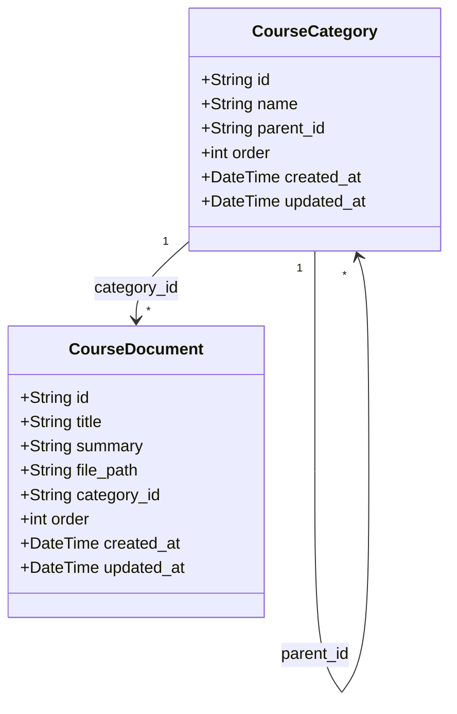
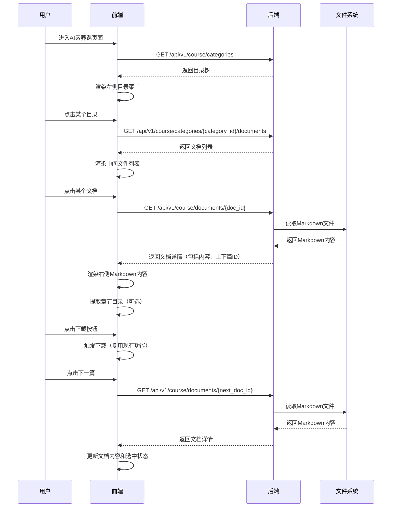
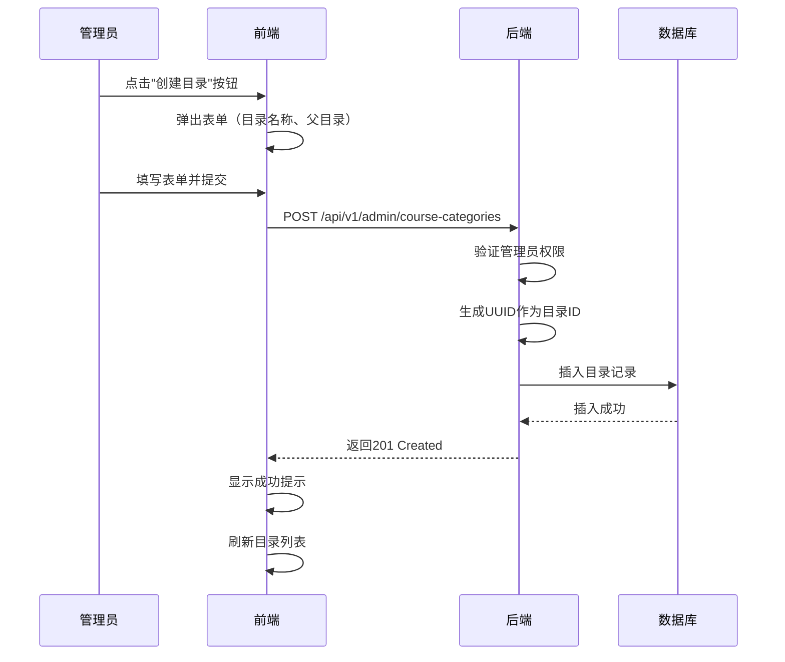
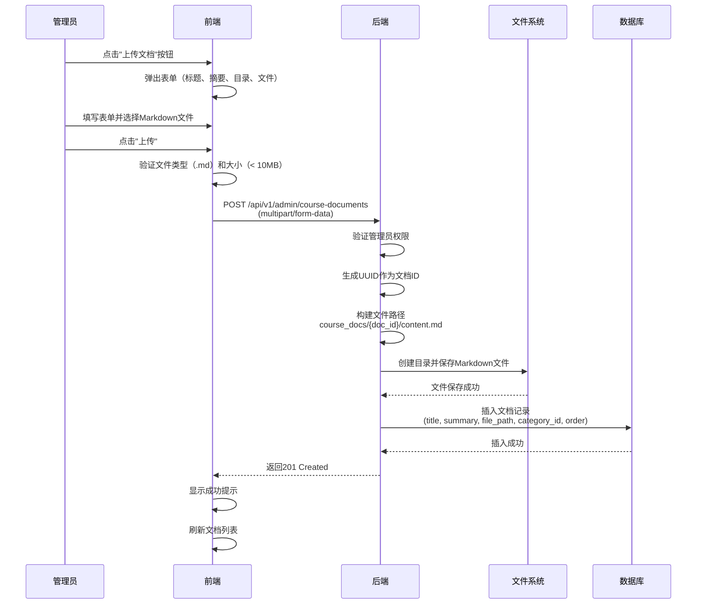
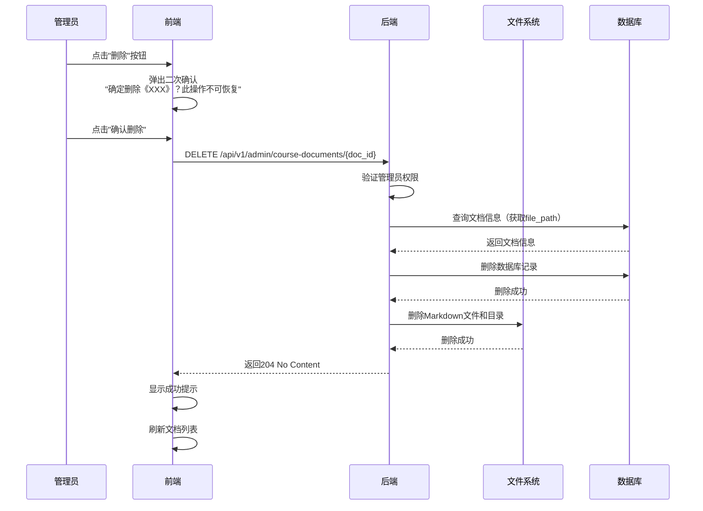

# AI素养课模块 - 架构设计文档

> **文档定位**: AI素养课模块（文档管理）的技术架构设计  
> **文档版本**: v1.0  
> **创建日期**: 2026-01-12  
> **基于需求**: `docs/requirements/ai_literacy_course_spec.md` (v1.0)

---

## 📋 目录

1. [设计目标](#1-设计目标)
2. [架构概览](#2-架构概览)
3. [数据模型设计](#3-数据模型设计)
4. [API接口设计](#4-api接口设计)
5. [前端架构设计](#5-前端架构设计)
6. [业务流程设计](#6-业务流程设计)
7. [技术实现约束](#7-技术实现约束)
8. [验收标准](#8-验收标准)

---

## 1. 设计目标

### 1.1 核心目标

- **文档展示**: 三栏布局（目录 + 文件列表 + 文档内容），清晰展示文档结构
- **在线阅读**: Markdown文档在线渲染，提供良好的阅读体验
- **文档管理**: 后台管理目录和文档的增删改查、排序
- **简洁高效**: 避免过度设计，快速实现核心功能

### 1.2 设计原则

- **简单优先**: 复杂功能（如图床、搜索、版本管理）留待后续迭代
- **复用优先**: 尽量复用现有组件和功能（如Markdown渲染、下载功能）
- **灵活扩展**: 数据模型设计支持未来扩展（如多语言、标签、权限等）
- **开发友好**: 给开发留有实现细节的决策空间（如排序方式、章节目录等）

---

## 2. 架构概览

### 2.1 模块定位

- **前台模块名称**: AI素养课
- **模块ID**: `document_management`
- **模块类型**: `page`（独立页面模块）
- **路由路径**: `/documents`
- **图标建议**: `document-text`

### 2.2 技术栈

- **后端**: Python/FastAPI
- **前端**: Vue 3 + TypeScript
- **样式**: Tailwind CSS
- **Markdown渲染**: 复用现有Markdown渲染器
- **UI组件**: Element Plus（多级菜单）

### 2.3 存储方案

| 类型 | 存储位置 | 说明 |
|------|---------|------|
| **文档元数据** | 数据库 | 标题、摘要、文件路径、排序等 |
| **文档内容** | 文件系统 | `backend/static/course_docs/{doc_id}/content.md` |
| **目录结构** | 数据库 | 多级目录，支持无限层级 |

**设计理由**：
- 文档内容存储在文件系统，减轻数据库压力，便于版本管理
- 元数据存储在数据库，便于查询和管理
- 与现有的作品管理（Works）存储方案保持一致

---

## 3. 数据模型设计

### 3.1 实体关系图



### 3.2 目录表（course_categories）

```sql
CREATE TABLE course_categories (
    id VARCHAR(36) PRIMARY KEY COMMENT '目录ID（UUID）',
    name VARCHAR(100) NOT NULL COMMENT '目录名称',
    parent_id VARCHAR(36) DEFAULT NULL COMMENT '父目录ID（NULL表示根目录）',
    `order` INT NOT NULL DEFAULT 0 COMMENT '排序顺序',
    created_at TIMESTAMP NOT NULL DEFAULT CURRENT_TIMESTAMP COMMENT '创建时间',
    updated_at TIMESTAMP NOT NULL DEFAULT CURRENT_TIMESTAMP ON UPDATE CURRENT_TIMESTAMP COMMENT '更新时间',
    FOREIGN KEY (parent_id) REFERENCES course_categories(id) ON DELETE RESTRICT,
    INDEX idx_parent_order (parent_id, `order`)
) ENGINE=InnoDB DEFAULT CHARSET=utf8mb4 COLLATE=utf8mb4_unicode_ci COMMENT='文档目录表';
```

**字段说明**：
- `parent_id`: 父目录ID，NULL表示根目录（顶级目录）
- `order`: 排序顺序，同一父目录下的子目录按此字段排序
- 外键约束：删除目录时，如果有子目录或文档，则阻止删除（`ON DELETE RESTRICT`）

**业务约束**：
- 目录层级不限制（数据库设计支持无限层级）
- 删除目录前需检查：是否有子目录、是否有文档
- 同一父目录下的子目录按 `order` 升序排列

### 3.3 文档表（course_documents）

```sql
CREATE TABLE course_documents (
    id VARCHAR(36) PRIMARY KEY COMMENT '文档ID（UUID）',
    title VARCHAR(200) NOT NULL COMMENT '文档标题',
    summary VARCHAR(500) NOT NULL COMMENT '文档摘要',
    file_path VARCHAR(255) NOT NULL COMMENT 'Markdown文件路径（相对于static目录）',
    category_id VARCHAR(36) NOT NULL COMMENT '所属目录ID',
    `order` INT NOT NULL DEFAULT 0 COMMENT '排序顺序',
    created_at TIMESTAMP NOT NULL DEFAULT CURRENT_TIMESTAMP COMMENT '创建时间',
    updated_at TIMESTAMP NOT NULL DEFAULT CURRENT_TIMESTAMP ON UPDATE CURRENT_TIMESTAMP COMMENT '更新时间',
    FOREIGN KEY (category_id) REFERENCES course_categories(id) ON DELETE RESTRICT,
    INDEX idx_category_order (category_id, `order`)
) ENGINE=InnoDB DEFAULT CHARSET=utf8mb4 COLLATE=utf8mb4_unicode_ci COMMENT='文档表';
```

**字段说明**：
- `file_path`: Markdown文件路径（相对于static目录），格式：`course_docs/{doc_id}/content.md`
- `category_id`: 所属目录ID，不允许为NULL（每个文档必须属于某个目录）
- `order`: 排序顺序，同一目录下的文档按此字段排序

**业务约束**：
- 文档必须属于某个目录
- 删除文档时，同时删除文件系统中的Markdown文件
- 同一目录下的文档按 `order` 升序排列

### 3.4 文件存储规范

**Markdown文件存储路径**：
```
backend/static/course_docs/{doc_id}/content.md
```

**示例**：
- 文档ID：`a1b2c3d4-e5f6-7890-abcd-ef1234567890`
- 文件路径：`backend/static/course_docs/a1b2c3d4-e5f6-7890-abcd-ef1234567890/content.md`
- 数据库存储：`course_docs/a1b2c3d4-e5f6-7890-abcd-ef1234567890/content.md`（相对路径）
- 访问URL：`/static/course_docs/a1b2c3d4-e5f6-7890-abcd-ef1234567890/content.md`

**文件管理规则**：
- 上传文档时，自动创建目录并保存文件
- 删除文档时，同时删除文件和目录
- 更新文档内容时，覆盖原文件

---

## 4. API接口设计

### 4.1 前台接口（需要认证）

#### 4.1.1 获取目录树

- **Endpoint**: `GET /api/v1/course/categories`
- **Description**: 获取所有目录树结构（递归）
- **认证要求**: 需要认证（Bearer Token）

**Response**:
```python
class CourseCategoryNode(BaseModel):
    id: str = Field(..., description="目录ID")
    name: str = Field(..., description="目录名称")
    parent_id: Optional[str] = Field(None, description="父目录ID")
    order: int = Field(..., description="排序顺序")
    children: List["CourseCategoryNode"] = Field(default_factory=list, description="子目录列表")

class CourseCategoryTreeResponse(BaseModel):
    categories: List[CourseCategoryNode] = Field(..., description="目录树（递归结构）")
```

**业务规则**：
- 返回递归的目录树结构
- 按 `order` 字段升序排列
- 如果没有目录，返回空列表

**Example Response**:
```json
{
  "categories": [
    {
      "id": "cat-001",
      "name": "第一章：AI基础",
      "parent_id": null,
      "order": 1,
      "children": [
        {
          "id": "cat-002",
          "name": "1.1 什么是AI",
          "parent_id": "cat-001",
          "order": 1,
          "children": []
        }
      ]
    }
  ]
}
```

---

#### 4.1.2 获取目录下的文档列表

- **Endpoint**: `GET /api/v1/course/categories/{category_id}/documents`
- **Description**: 获取指定目录下的所有文档列表（不包括子目录的文档）
- **认证要求**: 需要认证（Bearer Token）

**Path Parameters**:
- `category_id` (string, required): 目录ID

**Response**:
```python
class CourseDocumentListItem(BaseModel):
    id: str = Field(..., description="文档ID")
    title: str = Field(..., description="文档标题")
    summary: str = Field(..., description="文档摘要")
    order: int = Field(..., description="排序顺序")

class CourseDocumentListResponse(BaseModel):
    documents: List[CourseDocumentListItem] = Field(..., description="文档列表")
```

**业务规则**：
- 只返回当前目录下的文档（不包括子目录的文档）
- 按 `order` 字段升序排列
- 如果目录下没有文档，返回空列表

**Example Response**:
```json
{
  "documents": [
    {
      "id": "doc-001",
      "title": "AI的定义",
      "summary": "本节介绍人工智能的基本定义和发展历史",
      "order": 1
    },
    {
      "id": "doc-002",
      "title": "AI的应用领域",
      "summary": "介绍AI在各个行业的应用场景",
      "order": 2
    }
  ]
}
```

---

#### 4.1.3 获取文档详情

- **Endpoint**: `GET /api/v1/course/documents/{doc_id}`
- **Description**: 获取文档详情，包括标题、摘要、Markdown内容
- **认证要求**: 需要认证（Bearer Token）

**Path Parameters**:
- `doc_id` (string, required): 文档ID

**Response**:
```python
class CourseDocumentDetail(BaseModel):
    id: str = Field(..., description="文档ID")
    title: str = Field(..., description="文档标题")
    summary: str = Field(..., description="文档摘要")
    content: str = Field(..., description="Markdown内容")
    category_id: str = Field(..., description="所属目录ID")
    order: int = Field(..., description="排序顺序")
    prev_doc_id: Optional[str] = Field(None, description="上一篇文档ID（如果有）")
    next_doc_id: Optional[str] = Field(None, description="下一篇文档ID（如果有）")
    created_at: datetime = Field(..., description="创建时间")
```

**业务规则**：
- 从文件系统读取Markdown内容
- 计算上一篇和下一篇文档（同一目录下，按 `order` 排序）
- 如果文件不存在，返回 `404 Not Found`

**Example Response**:
```json
{
  "id": "doc-001",
  "title": "AI的定义",
  "summary": "本节介绍人工智能的基本定义和发展历史",
  "content": "# AI的定义\n\n人工智能（Artificial Intelligence，简称AI）...",
  "category_id": "cat-002",
  "order": 1,
  "prev_doc_id": null,
  "next_doc_id": "doc-002",
  "created_at": "2026-01-12T10:00:00Z"
}
```

**错误响应**：
- `404 Not Found`: 文档不存在或文件已被删除

---

### 4.2 后台管理接口（需要管理员权限）

#### 4.2.1 目录管理接口

##### 4.2.1.1 获取目录列表（管理后台）

- **Endpoint**: `GET /api/v1/admin/course-categories`
- **Description**: 获取所有目录列表（扁平结构，包含父目录信息）
- **认证要求**: 需要管理员权限

**Response**:
```python
class AdminCourseCategoryListItem(BaseModel):
    id: str = Field(..., description="目录ID")
    name: str = Field(..., description="目录名称")
    parent_id: Optional[str] = Field(None, description="父目录ID")
    parent_name: Optional[str] = Field(None, description="父目录名称")
    order: int = Field(..., description="排序顺序")
    document_count: int = Field(..., description="该目录下的文档数量（不包括子目录）")
    children_count: int = Field(..., description="子目录数量")
    created_at: datetime = Field(..., description="创建时间")
    updated_at: datetime = Field(..., description="更新时间")

class AdminCourseCategoryListResponse(BaseModel):
    categories: List[AdminCourseCategoryListItem] = Field(..., description="目录列表")
```

**业务规则**：
- 返回扁平结构（便于管理后台显示）
- 按层级和 `order` 排序
- 统计每个目录的文档数和子目录数

---

##### 4.2.1.2 创建目录

- **Endpoint**: `POST /api/v1/admin/course-categories`
- **Description**: 创建新目录
- **认证要求**: 需要管理员权限

**Request Body**:
```python
class CreateCourseCategoryRequest(BaseModel):
    name: str = Field(..., description="目录名称", min_length=1, max_length=100)
    parent_id: Optional[str] = Field(None, description="父目录ID（NULL表示根目录）")
    order: int = Field(0, description="排序顺序（默认0）")
```

**Response**: `201 Created`
```python
class CreateCourseCategoryResponse(BaseModel):
    category: AdminCourseCategoryListItem = Field(..., description="新创建的目录信息")
```

**业务规则**：
- 目录ID使用UUID生成
- 如果 `parent_id` 不为空，验证父目录是否存在
- 如果未提供 `order`，默认为0

---

##### 4.2.1.3 更新目录

- **Endpoint**: `PUT /api/v1/admin/course-categories/{category_id}`
- **Description**: 更新目录信息
- **认证要求**: 需要管理员权限

**Request Body**:
```python
class UpdateCourseCategoryRequest(BaseModel):
    name: Optional[str] = Field(None, description="目录名称", min_length=1, max_length=100)
    parent_id: Optional[str] = Field(None, description="父目录ID（可以移动到其他目录下）")
```

**Response**: `200 OK`

**业务规则**：
- 只更新提供的字段
- 如果修改 `parent_id`，需验证不会形成循环引用
- 不允许将目录移动到自己的子目录下

---

##### 4.2.1.4 删除目录

- **Endpoint**: `DELETE /api/v1/admin/course-categories/{category_id}`
- **Description**: 删除目录
- **认证要求**: 需要管理员权限

**Response**: `204 No Content`

**业务规则**：
- 如果目录下有子目录，不允许删除（返回 `400 Bad Request`）
- 如果目录下有文档，不允许删除（返回 `400 Bad Request`）
- 删除操作不可恢复

**错误响应**：
- `400 Bad Request`: 目录下有子目录或文档，无法删除

---

##### 4.2.1.5 调整目录排序

- **Endpoint**: `POST /api/v1/admin/course-categories/{category_id}/move-up`
- **Endpoint**: `POST /api/v1/admin/course-categories/{category_id}/move-down`
- **Description**: 将目录向上/下移动一位（与同级相邻目录交换order值）
- **认证要求**: 需要管理员权限

**Response**: `200 OK`

**业务规则**：
- 只能在同一父目录下移动
- 与相邻目录交换 `order` 值
- 如果已经是第一个/最后一个，返回 `400 Bad Request`

**实现建议**：
- 由开发决定具体实现方式（上下箭头、拖拽、手动输入order等）
- 不强求，根据实现复杂度决定

---

#### 4.2.2 文档管理接口

##### 4.2.2.1 获取文档列表（管理后台）

- **Endpoint**: `GET /api/v1/admin/course-documents`
- **Description**: 获取所有文档列表，支持分页和筛选
- **认证要求**: 需要管理员权限

**Query Parameters**:
- `page` (int, optional): 页码，默认 1
- `page_size` (int, optional): 每页数量，默认 20，最大 100
- `category_id` (string, optional): 按目录ID筛选

**Response**: `200 OK`
```python
class AdminCourseDocumentListItem(BaseModel):
    id: str = Field(..., description="文档ID")
    title: str = Field(..., description="文档标题")
    summary: str = Field(..., description="文档摘要")
    category_id: str = Field(..., description="所属目录ID")
    category_name: str = Field(..., description="所属目录名称")
    order: int = Field(..., description="排序顺序")
    created_at: datetime = Field(..., description="创建时间")
    updated_at: datetime = Field(..., description="更新时间")

class AdminCourseDocumentListResponse(BaseModel):
    documents: List[AdminCourseDocumentListItem] = Field(..., description="文档列表")
    total: int = Field(..., description="文档总数")
    page: int = Field(..., description="当前页码")
    page_size: int = Field(..., description="每页数量")
```

---

##### 4.2.2.2 上传文档

- **Endpoint**: `POST /api/v1/admin/course-documents`
- **Description**: 上传Markdown文档
- **认证要求**: 需要管理员权限

**Request Body** (multipart/form-data):
```python
class CreateCourseDocumentRequest(BaseModel):
    title: str = Field(..., description="文档标题", min_length=1, max_length=200)
    summary: str = Field(..., description="文档摘要", min_length=1, max_length=500)
    category_id: str = Field(..., description="所属目录ID")
    markdown_file: UploadFile = Field(..., description="Markdown文件（.md格式）")
    order: int = Field(0, description="排序顺序（默认0）")
```

**Response**: `201 Created`
```python
class CreateCourseDocumentResponse(BaseModel):
    document: AdminCourseDocumentListItem = Field(..., description="新创建的文档信息")
```

**业务规则**：
- 文档ID使用UUID生成
- Markdown文件存储路径：`backend/static/course_docs/{doc_id}/content.md`
- 文件类型限制：`.md`
- 文件大小限制：< 10MB（可配置）
- 目录必须存在，否则返回 `404 Not Found`

**错误响应**：
- `400 Bad Request`: 文件类型不正确、文件大小超过限制
- `404 Not Found`: 目录不存在

---

##### 4.2.2.3 更新文档信息

- **Endpoint**: `PUT /api/v1/admin/course-documents/{doc_id}`
- **Description**: 更新文档信息（标题、摘要、所属目录）
- **认证要求**: 需要管理员权限

**Request Body**:
```python
class UpdateCourseDocumentRequest(BaseModel):
    title: Optional[str] = Field(None, description="文档标题", min_length=1, max_length=200)
    summary: Optional[str] = Field(None, description="文档摘要", min_length=1, max_length=500)
    category_id: Optional[str] = Field(None, description="所属目录ID（可以移动到其他目录）")
```

**Response**: `200 OK`

**业务规则**：
- 只更新提供的字段
- 不支持修改文档内容（如需修改，删除后重新上传）
- 如果修改 `category_id`，验证目录是否存在

---

##### 4.2.2.4 删除文档

- **Endpoint**: `DELETE /api/v1/admin/course-documents/{doc_id}`
- **Description**: 删除文档（包括Markdown文件）
- **认证要求**: 需要管理员权限

**Response**: `204 No Content`

**业务规则**：
- 删除数据库记录
- 同时删除文件系统中的Markdown文件和目录
- 删除操作不可恢复

**二次确认**：
- 前端弹出确认对话框："确定删除《XXX》？此操作不可恢复。"

---

##### 4.2.2.5 调整文档排序

- **Endpoint**: `POST /api/v1/admin/course-documents/{doc_id}/move-up`
- **Endpoint**: `POST /api/v1/admin/course-documents/{doc_id}/move-down`
- **Description**: 将文档向上/下移动一位（与同目录相邻文档交换order值）
- **认证要求**: 需要管理员权限

**Response**: `200 OK`

**业务规则**：
- 只能在同一目录下移动
- 与相邻文档交换 `order` 值
- 如果已经是第一个/最后一个，返回 `400 Bad Request`

**实现建议**：
- 由开发决定具体实现方式（上下箭头、拖拽、手动输入order等）
- 不强求，根据实现复杂度决定

---

## 5. 前端架构设计

### 5.1 页面布局

**三栏布局**：
```
┌────────────────────────────────────────────────────────────┐
│  顶部导航栏（AI工具、教研员、常用工具、作品展示、AI素养课）   │
├────────────┬──────────────┬────────────────────────────────┤
│            │              │                                │
│  目录区    │  文件列表区   │   文档内容区                    │
│  （左侧）   │  （中间）     │   （右侧）                      │
│            │              │                                │
│  多级菜单   │  - 标题1      │   [文档Markdown渲染]           │
│  ├─目录1   │    摘要...    │                                │
│  │ ├─子目录│  - 标题2      │   [下载按钮]                    │
│  │ └─子目录│    摘要...    │   [上一篇/下一篇]              │
│  └─目录2   │              │   [章节目录（可选）]            │
│            │              │                                │
└────────────┴──────────────┴────────────────────────────────┘
```

**布局说明**：
- **目录区（左侧）**：使用 Element Plus 的 `el-menu` 组件，支持多级展开
- **文件列表区（中间）**：列表展示，显示标题和摘要
- **文档内容区（右侧）**：Markdown渲染，复用现有Markdown预览组件

### 5.2 组件结构

```
DocumentManagementPage.vue (主页面)
├── CategoryMenu.vue (目录菜单，左侧)
├── DocumentList.vue (文档列表，中间)
└── DocumentViewer.vue (文档查看器，右侧)
    ├── MarkdownRenderer (复用现有组件)
    ├── DownloadButton (复用现有组件)
    ├── NavigationButtons (上一篇/下一篇)
    └── ChapterTOC (章节目录，可选)
```

### 5.3 状态管理

**Pinia Store**:
```typescript
// stores/documentManagementStore.ts
export const useDocumentManagementStore = defineStore('documentManagement', () => {
  // 目录树
  const categoryTree = ref<CategoryNode[]>([])
  
  // 当前选中的目录ID
  const currentCategoryId = ref<string | null>(null)
  
  // 当前目录下的文档列表
  const documentList = ref<DocumentListItem[]>([])
  
  // 当前查看的文档
  const currentDocument = ref<DocumentDetail | null>(null)
  
  // Actions
  function loadCategoryTree() { ... }
  function loadDocumentList(categoryId: string) { ... }
  function loadDocument(docId: string) { ... }
  
  return {
    categoryTree,
    currentCategoryId,
    documentList,
    currentDocument,
    loadCategoryTree,
    loadDocumentList,
    loadDocument
  }
})
```

### 5.4 技术实现细节

#### 5.4.1 目录展示（多级菜单）

**实现方案**：使用 Element Plus 的 `el-menu` 组件

```vue
<template>
  <el-menu :default-active="currentCategoryId" @select="handleCategorySelect">
    <template v-for="category in categoryTree" :key="category.id">
      <el-sub-menu v-if="category.children.length > 0" :index="category.id">
        <template #title>{{ category.name }}</template>
        <!-- 递归渲染子目录 -->
        <CategoryMenuItem v-for="child in category.children" :key="child.id" :category="child" />
      </el-sub-menu>
      <el-menu-item v-else :index="category.id">{{ category.name }}</el-menu-item>
    </template>
  </el-menu>
</template>
```

**优点**：
- 支持无限层级
- 自动展开/折叠
- 样式美观

---

#### 5.4.2 Markdown渲染

**实现方案**：复用现有Markdown渲染器

```vue
<template>
  <div class="markdown-viewer">
    <!-- 复用现有的MarkdownRenderer组件 -->
    <MarkdownRenderer :content="currentDocument.content" />
  </div>
</template>
```

**如果现有组件不能直接复用**，使用 `marked` 库：
```typescript
import { marked } from 'marked'

const htmlContent = computed(() => {
  return marked(currentDocument.value?.content || '')
})
```

---

#### 5.4.3 下载功能

**实现方案**：复用现有Markdown工具的下载功能

**开发决策**：
- 优先复用现有代码（如 Composable、组件等）
- 如果复用难度大，可以简单实现（只支持Markdown下载）
- 不要大改原有功能，避免破坏现有系统

**最简实现**（如果复用不可行）：
```typescript
function downloadMarkdown() {
  const blob = new Blob([currentDocument.value.content], { type: 'text/markdown' })
  const url = URL.createObjectURL(blob)
  const a = document.createElement('a')
  a.href = url
  a.download = `${currentDocument.value.title}.md`
  a.click()
  URL.revokeObjectURL(url)
}
```

---

#### 5.4.4 章节目录提取（可选功能）

**实现方案**：前端渲染时从Markdown提取标题

**技术方案**：
```typescript
import { marked } from 'marked'

interface HeadingNode {
  level: number
  text: string
  id: string
}

function extractHeadings(markdown: string): HeadingNode[] {
  const tokens = marked.lexer(markdown)
  const headings: HeadingNode[] = []
  
  tokens.forEach(token => {
    if (token.type === 'heading') {
      headings.push({
        level: token.depth,
        text: token.text,
        id: `heading-${headings.length}`
      })
    }
  })
  
  return headings
}
```

**开发决策**：
- 如果实现简单（< 30分钟），就加上这个功能
- 如果实现复杂，就跳过，直接展示文档内容即可

---

#### 5.4.5 上一篇/下一篇导航

**实现方案**：后端返回 `prev_doc_id` 和 `next_doc_id`

```vue
<template>
  <div class="navigation-buttons">
    <button 
      v-if="currentDocument.prev_doc_id" 
      @click="navigateToDoc(currentDocument.prev_doc_id)"
    >
      上一篇
    </button>
    <button 
      v-if="currentDocument.next_doc_id" 
      @click="navigateToDoc(currentDocument.next_doc_id)"
    >
      下一篇
    </button>
  </div>
</template>
```

**交互效果**：
- 点击后，右侧文档内容区更新
- 中间文件列表的选中状态自动更新

---

## 6. 业务流程设计

### 6.1 前台浏览流程



---

### 6.2 后台管理流程

#### 6.2.1 创建目录流程



---

#### 6.2.2 上传文档流程



---

#### 6.2.3 删除文档流程



---

## 7. 技术实现约束

### 7.1 开发决策权

以下实现细节由开发自主决定，不强求：

1. **排序操作实现方式**：
   - 上下箭头（推荐，实现简单）
   - 拖拽排序（体验更好，实现复杂）
   - 手动输入order（最简单）

2. **下载功能实现**：
   - 优先复用现有Markdown工具的下载功能
   - 如果复用难度大，可以简化（只支持Markdown下载）
   - 不要大改原有功能

3. **章节目录提取**：
   - 如果实现简单（< 30分钟），就加上
   - 如果实现复杂，就跳过

### 7.2 实现原则

- **简单优先**：避免过度设计，快速实现核心功能
- **复用优先**：尽量复用现有组件和代码
- **灵活调整**：如果遇到实现困难，可以找产品经理讨论调整方案

### 7.3 边界约束

#### 图片处理
- **当前迭代**：不实现图床功能
- **Markdown中的图片**：使用外部链接（CDN）或相对路径（手动上传到static目录）
- **如果图片显示有问题**：修改Markdown文档，而非修改系统

#### 文档大小限制
- **文件大小限制**：< 10MB（可配置）
- **暂不限制文档长度**：如果文档过长，正常渲染和滚动显示

#### 层级深度
- **数据库设计**：支持无限层级
- **UI建议**：建议不超过3-4级（但不强制）

---

## 8. 验收标准

### 8.1 前台展示

- [ ] 用户点击顶部导航"AI素养课"，进入模块主页面
- [ ] 页面布局：左侧目录 + 中间文件列表 + 右侧文档内容
- [ ] 初始状态：只显示目录，文件列表和内容区为空
- [ ] 目录支持多级展开和折叠，样式美观（类似Element Plus多级菜单）
- [ ] 点击目录后，中间文件列表显示该目录下的文档
- [ ] 文件列表显示标题和摘要
- [ ] 点击文档后，右侧显示Markdown渲染内容
- [ ] 文档内容区提供下载按钮（Markdown/Word/PDF），功能正常
- [ ] 文档内容区提供上一篇/下一篇导航，切换后自动更新文件列表选中状态
- [ ] 文档内章节目录（如果实现）

### 8.2 后台管理

- [ ] 系统后台新增"文档管理"菜单
- [ ] 管理员可以创建、编辑、删除目录
- [ ] 管理员可以创建多级目录
- [ ] 删除目录时检查是否有内容，有内容则阻止删除
- [ ] 管理员可以调整目录顺序（实现方式不限）
- [ ] 管理员可以上传文档（填写标题、摘要、选择目录、上传.md文件）
- [ ] 管理员可以编辑文档信息（标题、摘要、所属目录）
- [ ] 管理员可以删除文档（二次确认）
- [ ] 管理员可以调整文档顺序（实现方式不限）

### 8.3 边界情况

- [ ] 目录为空时显示合理（空白或提示）
- [ ] 文件列表为空时显示合理（空白）
- [ ] 没有选中文档时内容区为空
- [ ] Markdown文件不存在时显示错误提示
- [ ] 文件上传失败时显示错误提示

---

## 9. P1 假设与处理方式

| ID | 问题 | 当前处理方式 | 备注 |
|:---|:---|:---|:---|
| P1-007 | 文档内容存储方式 | 文件系统存储（类似作品管理），路径：`backend/static/course_docs/{doc_id}/content.md` | 与作品管理保持一致 |
| P1-008 | 目录层级深度 | 数据库设计支持无限层级，UI层不限制，使用时自己注意 | 通过 `parent_id` 自引用实现 |
| P1-009 | 章节目录提取 | 前端渲染时提取（可选功能），如果实现复杂就跳过 | 由开发决定是否实现 |
| P1-010 | 下载功能复用 | 优先复用现有Markdown工具的下载功能，如果难度大可以简化 | 不要大改原有功能 |
| P1-011 | 排序操作实现 | 由开发决定（上下箭头/拖拽/手动输入），不强求 | 根据实现复杂度决定 |
| P1-012 | 图片处理 | 暂不实现图床，使用外部链接或手动上传到static目录，有问题就改文档 | 后续迭代再考虑 |

---

**文档版本**: v1.0  
**最后更新**: 2026-01-12  
**设计依据**: `docs/requirements/ai_literacy_course_spec.md` (v1.0)

---

## 附录：导航配置示例

在 `backend/configs/navigation.yaml` 中添加：

```yaml
- module_id: document_management
  name: AI素养课
  type: page
  route_path: /documents
  page_component: DocumentManagementPage
  icon: document-text
  order: 5
```

**说明**：
- `module_id`: 模块唯一标识，建议使用 `document_management`（文档管理）
- `name`: 前台显示名称，使用"AI素养课"
- `type`: 模块类型，使用 `page`（独立页面）
- `order`: 显示顺序，根据实际情况调整

