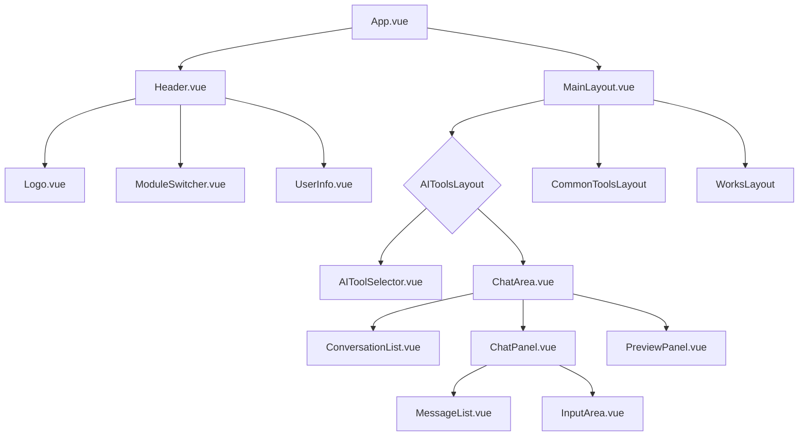
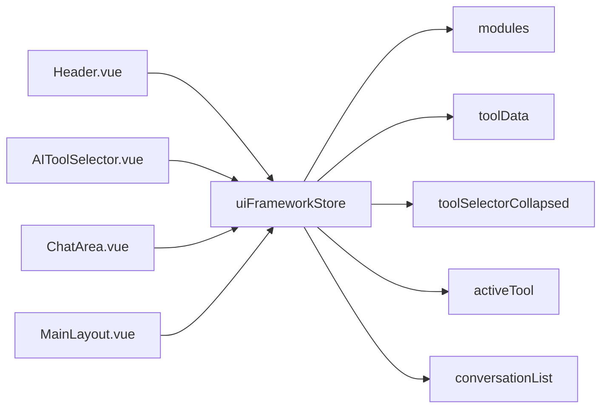

# 前端架构设计文档 (Frontend Architecture Design)

> **文档定位**: 定义平台UI框架的前端技术架构，确保扩展性和可维护性  
> **文档版本**: v1.0  
> **创建日期**: 2026-01-02  
> **基于需求**: `docs/requirements/ui_framework_spec.md`

---

## 📋 目录
- [1. 设计目标](#1-设计目标)
- [2. 技术栈](#2-技术栈)
- [3. 组件架构设计](#3-组件架构设计)
- [4. 状态管理设计](#4-状态管理设计)
- [5. 路由设计](#5-路由设计)
- [6. 扩展性技术方案](#6-扩展性技术方案)
- [7. 响应式实现方案](#7-响应式实现方案)
- [8. 数据契约](#8-数据契约)
- [9. 实现约束](#9-实现约束)

---

## 1. 设计目标

### 1.1 核心目标
- **模块化**: 布局结构模块化，各区域独立，便于扩展
- **可配置**: 导航体系可配置，支持动态添加新模块、新工具分类和工具
- **响应式**: 支持桌面端、平板端、移动端适配
- **扩展性**: UI框架定下来后，后续功能迭代不应推倒重来

### 1.2 设计原则
- **单一职责**: 每个组件只负责一个明确的职责
- **高内聚低耦合**: 组件之间通过明确的接口通信
- **配置驱动**: 布局和导航通过配置驱动，而非硬编码
- **渐进增强**: 当前迭代数据写死，但代码结构支持后续配置化

---

## 2. 技术栈

### 2.1 核心技术
- **框架**: Vue 3 (Composition API, `<script setup>`)
- **状态管理**: Pinia
- **路由**: Vue Router
- **样式**: Tailwind CSS v3
- **语言**: TypeScript

### 2.2 技术约束
- 所有组件必须使用 Composition API
- 状态管理必须使用 Pinia Store
- 路由必须使用 Vue Router
- 样式必须使用 Tailwind CSS（可配合 CSS 变量）

---

## 3. 组件架构设计

### 3.1 组件层级结构

```
App.vue (根组件)
├── Header.vue (顶部导航栏)
│   ├── Logo.vue (Logo组件)
│   ├── ModuleSwitcher.vue (大模块切换组件)
│   └── UserInfo.vue (用户信息组件)
└── MainLayout.vue (主内容区容器)
    ├── AIToolsLayout.vue (AI工具模块布局)
    │   ├── AIToolSelector.vue (左侧工具选择器)
    │   └── ChatArea.vue (右侧聊天区域)
    │       ├── ConversationList.vue (历史对话列表)
    │       ├── ChatPanel.vue (当前对话区域)
    │       │   ├── WelcomeMessage.vue (欢迎语组件)
    │       │   ├── MessageList.vue (消息列表)
    │       │   ├── MessageItem.vue (消息项组件)
    │       │   └── InputArea.vue (输入框组件)
    │       └── PreviewPanel.vue (预览面板，可选)
    ├── CommonToolsLayout.vue (常用工具模块布局)
    │   ├── CategoryNav.vue (分类导航)
    │   └── ToolCardGrid.vue (工具卡片网格)
    └── WorksLayout.vue (作品展示模块布局)
        ├── CategoryNav.vue (分类导航)
        └── WorkCardGrid.vue (作品卡片网格)
```

### 3.2 组件职责说明

#### 3.2.1 顶层组件

**App.vue**
- **职责**: 应用根组件，提供全局布局容器
- **子组件**: Header, MainLayout
- **状态**: 无业务状态，仅提供布局容器

**Header.vue**
- **职责**: 顶部导航栏，包含Logo、大模块切换、用户信息
- **子组件**: Logo, ModuleSwitcher, UserInfo
- **状态**: 从 `uiFrameworkStore` 获取当前激活模块
- **事件**: 模块切换事件

**MainLayout.vue**
- **职责**: 主内容区容器，根据当前模块动态加载对应布局组件
- **子组件**: AIToolsLayout, CommonToolsLayout, WorksLayout (动态加载)
- **状态**: 从 `uiFrameworkStore` 获取当前模块，决定加载哪个布局组件

#### 3.2.2 AI工具模块组件

**AIToolsLayout.vue**
- **职责**: AI工具模块的整体布局（左侧工具选择器 + 右侧聊天区域）
- **子组件**: AIToolSelector, ChatArea
- **状态**: 从 `uiFrameworkStore` 获取工具选择器状态、收起状态

**AIToolSelector.vue**
- **职责**: 左侧工具选择器，展示工具分类和工具卡片
- **设计**: 分类+卡片式设计，每个分类下有工具卡片（带图标）
- **状态**: 从 `uiFrameworkStore` 获取工具数据、当前激活工具
- **事件**: 工具切换事件、工具选择器收起/展开事件

**ChatArea.vue**
- **职责**: 右侧聊天区域，包含历史对话列表和当前对话区域
- **子组件**: ConversationList, ChatPanel, PreviewPanel
- **状态**: 从 `uiFrameworkStore` 获取对话列表、当前对话、预览状态

#### 3.2.3 其他模块组件

**CommonToolsLayout.vue / WorksLayout.vue**
- **职责**: 常用工具/作品展示模块的整体布局
- **子组件**: CategoryNav, ToolCardGrid / WorkCardGrid
- **状态**: 从 `uiFrameworkStore` 获取分类数据、卡片数据（当前写死）

### 3.3 组件通信规范

**父子组件通信**:
- **Props**: 父组件向子组件传递数据（只读）
- **Events**: 子组件向父组件发送事件（使用 `defineEmits`）

**跨组件通信**:
- **Pinia Store**: 所有跨组件状态通过 Pinia Store 管理
- **禁止**: 禁止使用 `provide/inject` 传递业务状态（仅用于配置、主题等非业务状态）

---

## 4. 状态管理设计

### 4.1 Store 架构

```
stores/
├── uiFrameworkStore.ts (UI框架状态 - 新建)
│   ├── 当前激活模块 (currentModule)
  │   ├── 工具数据 (toolData)
  │   ├── 工具选择器收起状态 (toolSelectorCollapsed)
  │   ├── 当前激活工具 (activeTool)
│   └── 对话列表 (conversationList)
└── sessionStore.ts (会话状态 - 现有，保持不变)
    └── (现有会话相关状态)
```

### 4.2 UI框架Store设计

**文件路径**: `frontend/src/stores/uiFrameworkStore.ts`

**状态定义**:

```typescript
interface ModuleConfig {
  id: string              // 模块ID，如 'ai-tools', 'common-tools', 'works'
  name: string            // 模块名称，如 'AI工具', '常用工具', '作品展示'
  icon?: string           // 图标（可选）
}

interface ToolCategory {
  id: string              // 分类ID
  label: string           // 分类名称
  icon?: string           // 分类图标（可选）
  children?: ToolItem[]   // 工具列表（可选）
}

interface ToolItem {
  id: string              // 工具ID
  label: string           // 工具名称
  icon?: string           // 工具图标（可选）
  route?: string          // 路由路径（可选，当前迭代不涉及）
}

interface ConversationItem {
  id: string              // 对话ID
  title: string          // 对话标题
  preview?: string        // 首条消息预览（可选）
  timestamp?: number      // 时间戳（可选）
}

export const useUIFrameworkStore = defineStore('uiFramework', () => {
  // 当前激活模块
  const currentModule = ref<string>('ai-tools')
  
  // 模块列表（当前写死，后续可配置化）
  const modules = ref<ModuleConfig[]>([
    { id: 'ai-tools', name: 'AI工具' },
    { id: 'common-tools', name: '常用工具' },
    { id: 'works', name: '作品展示' }
  ])
  
  // 工具数据（当前写死，后续可配置化）
  const toolData = ref<ToolCategory[]>([])
  
  // 工具选择器收起状态
  const toolSelectorCollapsed = ref<boolean>(false)
  
  // 当前激活工具
  const activeTool = ref<string | null>(null)
  
  // 对话列表（当前写死）
  const conversationList = ref<ConversationItem[]>([])
  
  // 当前对话ID
  const currentConversationId = ref<string | null>(null)
  
  // Actions
  function setCurrentModule(moduleId: string) {
    currentModule.value = moduleId
  }
  
  function toggleToolSelector() {
    toolSelectorCollapsed.value = !toolSelectorCollapsed.value
  }
  
  function setActiveTool(toolId: string) {
    activeTool.value = toolId
  }
  
  function setCurrentConversation(conversationId: string) {
    currentConversationId.value = conversationId
  }
  
  return {
    // State
    currentModule,
    modules,
    toolData,
    toolSelectorCollapsed,
    activeTool,
    conversationList,
    currentConversationId,
    // Actions
    setCurrentModule,
    toggleToolSelector,
    setActiveTool,
    setCurrentConversation
  }
})
```

### 4.3 状态管理原则

**单一数据源**:
- 所有UI框架相关状态统一在 `uiFrameworkStore` 管理
- 禁止在组件内部维护与UI框架相关的业务状态

**响应式更新**:
- 组件通过 `computed` 或直接访问 Store 状态获取数据
- 状态变更自动触发组件更新

**状态持久化**:
- 当前迭代：状态不持久化（刷新后恢复默认）
- 后续迭代：可考虑将工具选择器收起状态、当前模块等持久化到 localStorage

---

## 5. 路由设计

### 5.1 路由结构

```
/ (根路径)
├── /modules/:moduleId (动态模块路由)
│   ├── /modules/ai-tools (AI工具模块)
│   ├── /modules/common-tools (常用工具模块)
│   └── /modules/works (作品展示模块)
└── /modules/ai-tools/:toolId? (AI工具模块 + 工具ID，可选)
```

### 5.2 路由配置

**文件路径**: `frontend/src/router/index.ts`

```typescript
const routes: RouteRecordRaw[] = [
  {
    path: '/',
    name: 'home',
    redirect: '/modules/ai-tools'
  },
  {
    path: '/modules/:moduleId',
    name: 'module',
    component: () => import('../views/MainLayout.vue'),
    props: true,
    children: [
      {
        path: '',
        name: 'module-default',
        component: () => import('../layouts/AIToolsLayout.vue') // 默认布局，根据moduleId动态加载
      },
      {
        path: ':toolId?',
        name: 'module-tool',
        component: () => import('../layouts/AIToolsLayout.vue'),
        props: true
      }
    ]
  }
]
```

### 5.3 动态布局加载

**MainLayout.vue 实现逻辑**:

```typescript
<script setup lang="ts">
import { computed } from 'vue'
import { useRoute } from 'vue-router'
import { useUIFrameworkStore } from '../stores/uiFrameworkStore'

const route = useRoute()
const uiFrameworkStore = useUIFrameworkStore()

const moduleId = computed(() => route.params.moduleId as string)

// 根据 moduleId 动态加载对应布局组件
const layoutComponent = computed(() => {
  switch (moduleId.value) {
    case 'ai-tools':
      return () => import('../layouts/AIToolsLayout.vue')
    case 'common-tools':
      return () => import('../layouts/CommonToolsLayout.vue')
    case 'works':
      return () => import('../layouts/WorksLayout.vue')
    default:
      return () => import('../layouts/AIToolsLayout.vue') // 默认
  }
})

// 路由变化时更新 Store
watch(moduleId, (newModuleId) => {
  uiFrameworkStore.setCurrentModule(newModuleId)
}, { immediate: true })
</script>
```

### 5.4 路由扩展性

**支持动态添加模块**:
- 路由配置支持动态注册新模块路由
- 布局组件通过 `moduleId` 动态加载，新增模块只需添加新的布局组件和路由配置

**路由守卫** (后续迭代):
- 可添加路由守卫验证模块是否存在
- 可添加权限控制（如需要）

---

## 6. 扩展性技术方案

### 6.1 配置驱动架构

**目标**: 支持动态添加新模块、新工具分类和工具，无需修改核心代码

**实现方案**:

**步骤1: 定义配置数据结构**

```typescript
// frontend/src/config/moduleConfig.ts
export interface ModuleConfig {
  id: string
  name: string
  icon?: string
  layout: 'ai-tools' | 'common-tools' | 'works' | string  // 布局类型
  toolCategories?: ToolCategory[]  // 工具分类（仅AI工具模块需要）
}

export interface ToolCategory {
  id: string
  label: string
  icon?: string
  children?: ToolItem[]
}

export interface ToolItem {
  id: string
  label: string
  icon?: string
}
```

**步骤2: 配置文件（当前写死，后续可从后端获取）**

```typescript
// frontend/src/config/modules.ts
export const moduleConfigs: ModuleConfig[] = [
  {
    id: 'ai-tools',
    name: 'AI工具',
    layout: 'ai-tools',
    toolCategories: [
      {
        id: 'content-gen',
        label: '内容生成',
        children: [
          { id: 'text-gen', label: '文生文' },
          { id: 'image-gen', label: '文生图' },
          { id: 'video-gen', label: '文生视频' }
        ]
      },
      {
        id: 'agents',
        label: '智能体',
        children: [
          { id: 'prompt-wizard', label: '提示词向导' },
          { id: 'lyar', label: 'Lyar' }
        ]
      }
    ]
  },
  {
    id: 'common-tools',
    name: '常用工具',
    layout: 'common-tools'
  },
  {
    id: 'works',
    name: '作品展示',
    layout: 'works'
  }
]
```

**步骤3: Store 初始化时加载配置**

```typescript
// uiFrameworkStore.ts
import { moduleConfigs } from '../config/modules'

export const useUIFrameworkStore = defineStore('uiFramework', () => {
  // 从配置初始化模块列表
  const modules = ref<ModuleConfig[]>(moduleConfigs)
  
  // 从配置初始化工具数据（仅AI工具模块）
  const toolData = computed(() => {
    const aiToolsModule = modules.value.find(m => m.id === 'ai-tools')
    return aiToolsModule?.toolCategories || []
  })
  
  // ...
})
```

**步骤4: 动态路由注册（后续迭代）**

```typescript
// router/index.ts
import { moduleConfigs } from '../config/modules'

// 根据配置动态生成路由
const dynamicRoutes = moduleConfigs.map(module => ({
  path: `/modules/${module.id}`,
  name: `module-${module.id}`,
  component: () => import(`../layouts/${module.layout}Layout.vue`),
  props: true
}))

const routes = [
  { path: '/', redirect: '/modules/ai-tools' },
  ...dynamicRoutes
]
```

### 6.2 布局模块化

**目标**: 每个模块的布局独立，互不干扰

**实现方案**:
- 每个模块有独立的布局组件（`AIToolsLayout.vue`, `CommonToolsLayout.vue`, `WorksLayout.vue`）
- 布局组件通过 `MainLayout.vue` 动态加载
- 新增模块只需：
  1. 创建新的布局组件
  2. 在配置文件中添加模块配置
  3. 在路由配置中添加路由（或使用动态路由）

### 6.3 组件复用

**目标**: 通用组件可在不同模块复用

**实现方案**:
- **CategoryNav.vue**: 分类导航组件，可在常用工具和作品展示模块复用
- **CardGrid.vue**: 卡片网格组件，可在常用工具和作品展示模块复用
- **ConversationList.vue**: 历史对话列表，可在AI工具模块使用

---

## 7. 响应式实现方案

### 7.1 断点定义

**Tailwind CSS 断点**:
- `sm`: 640px
- `md`: 768px
- `lg`: 1024px
- `xl`: 1280px
- `2xl`: 1536px

**项目自定义断点**:
- **桌面端**: `≥1024px` (lg)
- **平板端**: `768px - 1023px` (md)
- **移动端**: `<768px` (< md)

### 7.2 响应式实现策略

**方案1: Tailwind CSS 响应式类（推荐）**

```vue
<template>
  <!-- 桌面端显示，移动端隐藏 -->
  <div class="hidden md:block">
    <AIToolSelector />
  </div>
  
  <!-- 移动端显示，桌面端隐藏 -->
  <button class="md:hidden" @click="toggleMobileMenu">
    工具选择器
  </button>
</template>
```

**方案2: Vue 组合式函数（复杂逻辑）**

```typescript
// composables/useMediaQuery.ts
import { ref, onMounted, onUnmounted } from 'vue'

export function useMediaQuery(query: string) {
  const matches = ref(false)
  
  const mediaQuery = window.matchMedia(query)
  matches.value = mediaQuery.matches
  
  const handler = (event: MediaQueryListEvent) => {
    matches.value = event.matches
  }
  
  onMounted(() => {
    mediaQuery.addEventListener('change', handler)
  })
  
  onUnmounted(() => {
    mediaQuery.removeEventListener('change', handler)
  })
  
  return matches
}

// 使用示例
const isMobile = useMediaQuery('(max-width: 767px)')
const isTablet = useMediaQuery('(min-width: 768px) and (max-width: 1023px)')
const isDesktop = useMediaQuery('(min-width: 1024px)')
```

### 7.3 响应式布局实现

**Header.vue**:
- 桌面端：完整显示 Logo、大模块切换、用户信息
- 移动端：Logo + 汉堡菜单按钮（大模块切换收起）+ 用户信息

**AIToolSelector.vue**:
- 桌面端：固定宽度260px，支持收起/展开
- 平板端：自动收起为抽屉式
- 移动端：完全收起为抽屉式，通过按钮触发

**ChatArea.vue**:
- 桌面端：历史对话列表 + 当前对话区域（可预览分屏）
- 移动端：单栏布局，历史对话列表通过抽屉式访问

---

## 8. 数据契约

### 8.1 模块配置数据契约

```typescript
interface ModuleConfig {
  id: string                    // 必填，模块唯一标识
  name: string                  // 必填，模块显示名称
  icon?: string                 // 可选，图标标识
  layout: string                // 必填，布局类型
  toolCategories?: ToolCategory[]  // 可选，工具分类列表（仅AI工具模块）
}

interface ToolCategory {
  id: string                    // 必填，分类唯一标识
  label: string                 // 必填，分类显示名称
  icon?: string                 // 可选，分类图标标识
  children?: ToolItem[]          // 可选，工具列表
}

interface ToolItem {
  id: string                    // 必填，工具唯一标识
  label: string                 // 必填，工具显示名称
  icon?: string                 // 可选，工具图标标识
  route?: string                // 可选，路由路径（当前迭代不使用）
}
```

### 8.2 对话列表数据契约

```typescript
interface ConversationItem {
  id: string                    // 必填，对话唯一标识
  title: string                 // 必填，对话标题
  preview?: string              // 可选，首条消息预览
  timestamp?: number             // 可选，时间戳（毫秒）
}
```

### 8.3 用户信息数据契约

```typescript
interface UserInfo {
  avatar?: string                // 可选，用户头像URL
  name: string                   // 必填，用户名
}
```

---

## 9. 实现约束

### 9.1 代码规范

**组件命名**:
- 组件文件名使用 PascalCase: `Header.vue`, `AIToolSelector.vue`
- 组件名与文件名保持一致

**Store 命名**:
- Store 文件名使用 camelCase + `Store` 后缀: `uiFrameworkStore.ts`
- Store ID 使用 kebab-case: `'ui-framework'`

**路由命名**:
- 路由 name 使用 kebab-case: `'module'`, `'module-default'`
- 路由 path 使用 kebab-case: `'/modules/ai-tools'`

### 9.2 文件组织

```
frontend/src/
├── components/          # 通用组件
│   ├── Header/
│   │   ├── Header.vue
│   │   ├── Logo.vue
│   │   ├── ModuleSwitcher.vue
│   │   └── UserInfo.vue
│   ├── AIToolSelector/
│   │   └── AIToolSelector.vue
│   └── ...
├── layouts/             # 布局组件（新建）
│   ├── MainLayout.vue
│   ├── AIToolsLayout.vue
│   ├── CommonToolsLayout.vue
│   └── WorksLayout.vue
├── views/              # 页面组件（现有）
├── stores/            # 状态管理
│   ├── uiFrameworkStore.ts (新建)
│   └── sessionStore.ts (现有)
├── router/             # 路由配置
│   └── index.ts
├── config/             # 配置文件（新建）
│   ├── modules.ts
│   └── moduleConfig.ts
└── composables/         # 组合式函数（新建，如需要）
    └── useMediaQuery.ts
```

### 9.3 当前迭代约束（重要：快速Demo优先）

**核心原则**:
- **快速Demo优先**: 当前目标是快速出界面Demo，看视觉效果
- **简化实现**: 代码结构要简单直接，不要过度设计
- **灵活调整**: 如果界面效果不好，可能全推重来，所以不要过度投入

**实现建议**:
- 数据全部写死在组件内或简单的配置文件
- 不需要复杂的配置驱动架构（当前迭代）
- 路由结构简单，能展示界面即可
- Store 状态管理可以简化，甚至暂时不用（用组件内部状态也可以）

**开发路径**:
1. 先实现静态布局（HTML + Tailwind CSS）
2. 添加基本的交互（点击切换、展开收起）
3. 数据写死在组件内
4. 看效果，再决定是否需要优化架构

**不要过度设计**:
- 不要一开始就设计复杂的配置系统
- 不要一开始就设计复杂的Store结构
- 先出界面，再看是否需要重构

**后续迭代扩展点**:
- 配置文件可从后端获取
- Store 状态可持久化到 localStorage
- 路由可支持动态注册
- 工具可支持实际路由跳转

---

## 10. 架构图

### 10.1 组件架构图



### 10.2 状态管理架构图



### 10.3 路由架构图

```mermaid
graph TD
    A[/] --> B[/modules/ai-tools]
    A --> C[/modules/common-tools]
    A --> D[/modules/works]
    
    B --> E[AIToolsLayout]
    C --> F[CommonToolsLayout]
    D --> G[WorksLayout]
    
    E --> H[AIToolSelector + ChatArea]
    F --> I[CategoryNav + CardGrid]
    G --> J[CategoryNav + CardGrid]
```

---

## 11. 验收标准

### 11.1 架构验收

- [ ] 组件层级结构清晰，职责单一
- [ ] Store 状态管理规范，无状态冗余
- [ ] 路由结构支持扩展，动态加载布局
- [ ] 配置文件结构清晰，易于扩展

### 11.2 扩展性验收

- [ ] 新增模块只需添加布局组件和配置，无需修改核心代码
- [ ] 新增工具分类和工具只需更新配置，无需修改组件代码
- [ ] 布局结构模块化，各区域独立

### 11.3 响应式验收

- [ ] 桌面端（≥1024px）完整布局正常
- [ ] 平板端（768px - 1023px）布局适配
- [ ] 移动端（<768px）核心功能可用

---

**文档维护者**: Architecture Team  
**下一步**: 交付前端开发进行界面实现

