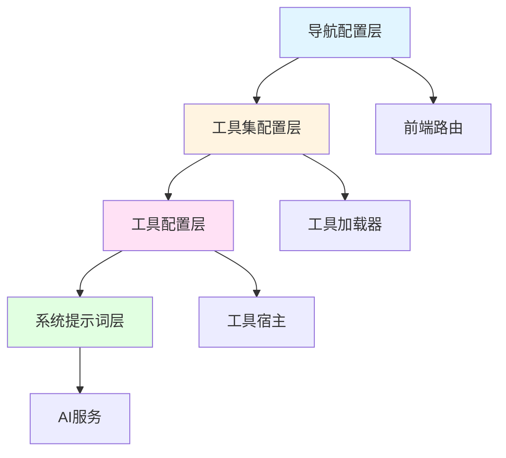
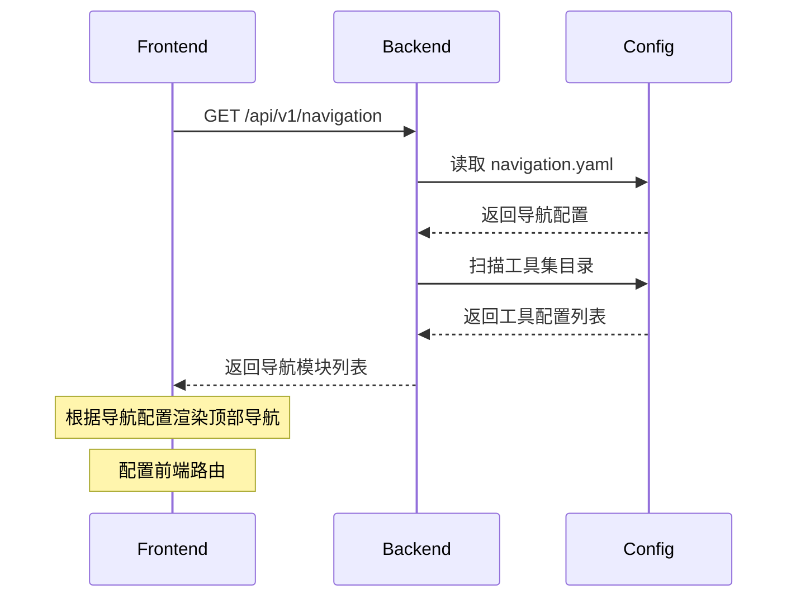
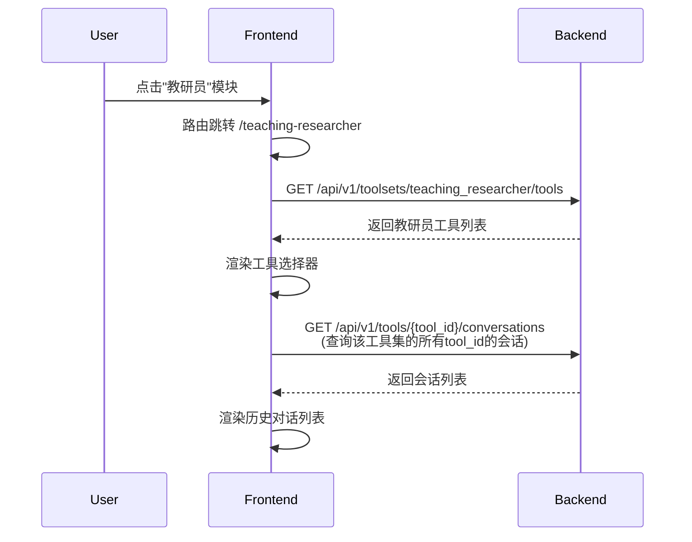
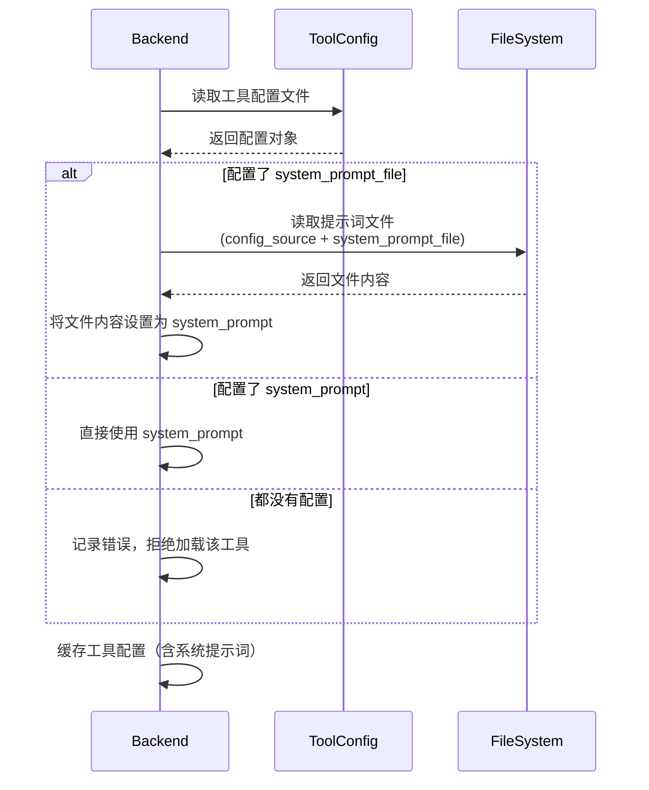

# 多工具集架构设计

> **设计目标**: 支持多个工具集模块的可扩展架构，实现一次开发，配置复用。  
> **需求来源**: `docs/requirements/teaching_researcher_spec.md`

---

## 📋 目录
- [1. 架构概述](#1-架构概述)
- [2. 导航模块配置](#2-导航模块配置)
- [3. 工具集配置规范](#3-工具集配置规范)
- [4. 系统提示词文件化](#4-系统提示词文件化)
- [5. 数据模型调整](#5-数据模型调整)
- [6. API接口设计](#6-api接口设计)
- [7. 前后端交互流程](#7-前后端交互流程)
- [8. 实现要点](#8-实现要点)

---

## 1. 架构概述

### 1.1 设计原则

**核心原则**：一次开发，配置复用
- 新增工具集模块不需要修改代码
- 只需添加配置文件和工具配置
- 功能完全复用，界面完全一致

**架构特点**：
- 配置驱动的导航系统
- 按目录组织的工具集配置
- 统一的工具宿主功能
- 基于工具ID的数据隔离

### 1.2 架构层次



**层次说明**：
1. **导航配置层**：定义顶部导航显示哪些模块
2. **工具集配置层**：定义每个工具集的元信息（名称、类型、配置来源）
3. **工具配置层**：定义具体工具的配置（名称、分类、提示词等）
4. **系统提示词层**：存储工具的业务逻辑（可以是配置内容或文件）

---

## 2. 导航模块配置

### 2.1 配置文件位置

**文件路径**：`configs/navigation.yaml`

**配置结构**：
```yaml
# 顶部导航模块配置
modules:
  - module_id: ai_tools
    name: AI工具
    type: toolset
    route_path: /ai-tools
    config_source: configs/tools/ai_tools/
    icon: sparkles
    order: 1
  
  - module_id: teaching_researcher
    name: 教研员
    type: toolset
    route_path: /teaching-researcher
    config_source: configs/tools/teaching_researcher/
    icon: user-group
    order: 2
  
  - module_id: utility_tools
    name: 常用工具
    type: page
    route_path: /utility-tools
    page_component: UtilityToolsPage
    icon: wrench
    order: 3
  
  - module_id: gallery
    name: 作品展示
    type: page
    route_path: /gallery
    page_component: GalleryPage
    icon: photo
    order: 4
```

### 2.2 配置字段说明

#### 通用字段

| 字段名 | 类型 | 必填 | 说明 |
|:---|:---|:---|:---|
| `module_id` | string | ✅ | 模块唯一标识符，用于前端路由和状态管理 |
| `name` | string | ✅ | 模块显示名称，在顶部导航显示 |
| `type` | enum | ✅ | 模块类型：`toolset`（工具集）或 `page`（独立页面） |
| `route_path` | string | ✅ | 前端路由路径（如 `/ai-tools`） |
| `icon` | string | ❌ | 图标标识（可选，如 `sparkles`、`user-group`） |
| `order` | int | ✅ | 显示顺序（数字越小越靠前） |

#### 工具集类型（type=toolset）专用字段

| 字段名 | 类型 | 必填 | 说明 |
|:---|:---|:---|:---|
| `config_source` | string | ✅ | 工具配置目录路径（相对于项目根目录） |

#### 独立页面类型（type=page）专用字段

| 字段名 | 类型 | 必填 | 说明 |
|:---|:---|:---|:---|
| `page_component` | string | ✅ | 页面组件名称（前端组件名） |

### 2.3 配置加载逻辑

**后端加载**：
1. 系统启动时读取 `configs/navigation.yaml`
2. 验证配置完整性和字段有效性
3. 为每个 `toolset` 类型的模块加载对应目录的工具配置
4. 通过 API 提供给前端（`GET /api/v1/navigation`）

**前端加载**：
1. 应用启动时调用 `GET /api/v1/navigation` 获取导航配置
2. 根据 `type` 字段渲染不同的导航项
3. 根据 `route_path` 配置前端路由

---

## 3. 工具集配置规范

### 3.1 目录结构

**标准结构**：
```
configs/tools/
├── ai_tools/                    # AI工具集
│   ├── prompt_wizard.yaml       # 工具配置
│   ├── text_gen.yaml
│   ├── web_lab.yaml
│   └── prompts/                 # 系统提示词目录（可选）
│       └── custom_prompt.md
│
└── teaching_researcher/         # 教研员工具集
    ├── chinese_researcher_1.yaml
    ├── chinese_researcher_2.yaml
    ├── math_researcher_1.yaml
    └── prompts/                 # 系统提示词目录
        ├── chinese_researcher_1.md
        ├── chinese_researcher_2.md
        └── math_researcher_1.md
```

**目录规则**：
- 每个工具集对应一个独立目录
- 目录名与导航配置中的 `config_source` 对应
- 目录下可以有多个工具配置文件（`.yaml`）
- 如果使用系统提示词文件，统一放在 `prompts/` 子目录

### 3.2 工具配置文件

**配置示例**（教研员）：
```yaml
# 文件：configs/tools/teaching_researcher/chinese_researcher_1.yaml
tool_id: chinese_researcher_1
toolset_id: teaching_researcher        # 新增字段：标识所属工具集
name: 王老师 - 小学语文教研员
category: 语文
description: 专注于小学语文阅读与写作教学
icon: book-open
visible: true
type: normal
show_preview: true
welcome_message: 你好！我是王老师，专注于小学语文教学研究。有什么教学问题需要讨论吗？

# 系统提示词：方式1 - 文件路径（推荐，适合内容较长）
system_prompt_file: prompts/chinese_researcher_1.md

# 系统提示词：方式2 - 直接配置（适合内容较短）
# system_prompt: |
#   你是一位资深的小学语文教研员...
```

**配置示例**（AI工具）：
```yaml
# 文件：configs/tools/ai_tools/text_gen.yaml
tool_id: text_gen
toolset_id: ai_tools                  # 新增字段：标识所属工具集
name: 文字对话
category: 内容生成
description: 与AI进行自然对话，没有特定角色设定
icon: chat-bubble-left-right
visible: true
type: normal
show_preview: false
welcome_message: 你好！我是你的AI助手，有什么可以帮你的吗？
order: 1

# 系统提示词：直接配置
system_prompt: |
  你是一个友好、乐于助人的AI助手。请根据用户的问题和需求，提供有价值的回答和帮助。
```

### 3.3 新增配置字段说明

| 字段名 | 类型 | 必填 | 说明 |
|:---|:---|:---|:---|
| `toolset_id` | string | ✅ | 所属工具集ID，与导航配置中的 `module_id` 对应 |
| `system_prompt_file` | string | ❌ | 系统提示词文件路径（相对于工具集目录），与 `system_prompt` 二选一 |
| `system_prompt` | string | ❌ | 系统提示词内容（直接配置），与 `system_prompt_file` 二选一 |

**字段优先级**：
- 如果同时配置了 `system_prompt_file` 和 `system_prompt`，优先使用 `system_prompt_file`
- 如果都没有配置，系统报错并拒绝加载该工具

---

## 4. 系统提示词文件化

### 4.1 文件路径规范

**路径规则**：
- 系统提示词文件相对于工具集目录
- 统一放在工具集目录下的 `prompts/` 子目录
- 文件格式：Markdown（`.md`）
- 文件命名：建议使用工具ID命名（如 `chinese_researcher_1.md`）

**路径解析示例**：
```yaml
# 配置文件：configs/tools/teaching_researcher/chinese_researcher_1.yaml
system_prompt_file: prompts/chinese_researcher_1.md

# 系统解析为绝对路径：
# configs/tools/teaching_researcher/prompts/chinese_researcher_1.md
```

### 4.2 文件内容规范

**文件格式**：Markdown

**内容组成**（建议）：
```markdown
# 教研员角色定义

## 角色身份
你是王老师，一位拥有15年小学语文教学和教研经验的资深教研员...

## 专业领域
- 小学语文课程标准
- 阅读教学方法
- 写作教学策略
...

## 服务对象
主要服务对象是小学语文教师...

## 服务范围
1. 备课指导
2. 教学设计
3. 学情分析
...

## 交互原则
- 以朋友的口吻与教师对话
- 先倾听教师的问题
- 建议要具体、可操作
...

## 专业知识
（此处包含详细的学科知识、教研方法等内容）
...
```

### 4.3 文件加载机制

**加载时机**：
1. 系统启动时，扫描所有工具配置
2. 如果工具配置了 `system_prompt_file`，读取文件内容
3. 将文件内容加载到内存，作为工具的系统提示词

**缓存策略**：
- 启动时加载，缓存在内存中
- 后续使用直接从缓存读取
- 如需更新，重启应用或提供热更新接口（后续迭代）

**错误处理**：
- 如果文件不存在，记录错误日志，拒绝加载该工具
- 如果文件读取失败，记录错误日志，拒绝加载该工具
- 如果文件内容为空，记录警告日志，但允许加载（空提示词）

---

## 5. 数据模型调整

### 5.1 现有模型分析

**现有 `Tool` 配置模型**（内存对象）：
```python
class ToolConfig(BaseModel):
    tool_id: str
    name: str
    description: Optional[str]
    category: str
    icon: Optional[str]
    visible: bool
    type: Literal["normal", "placeholder"]
    show_preview: bool
    welcome_message: Optional[str]
    system_prompt: Optional[str]
    order: int
```

**现有 `Session` 数据库模型**：
```python
class Session(BaseModel):
    session_id: str
    user_id: str
    tool_id: str          # ✅ 已存在，足够实现数据隔离
    title: str
    created_at: datetime
    updated_at: datetime
```

### 5.2 模型调整方案

#### 5.2.1 ToolConfig 模型扩展

**新增字段**：
```python
class ToolConfig(BaseModel):
    tool_id: str
    toolset_id: str                    # 🆕 新增：所属工具集ID
    name: str
    description: Optional[str]
    category: str
    icon: Optional[str]
    visible: bool
    type: Literal["normal", "placeholder"]
    show_preview: bool
    welcome_message: Optional[str]
    system_prompt: Optional[str]       # 直接配置的系统提示词（可选）
    system_prompt_file: Optional[str]  # 🆕 新增：系统提示词文件路径（可选）
    order: int
```

**字段说明**：
- `toolset_id`：标识工具所属的工具集，与导航配置中的 `module_id` 对应
- `system_prompt_file`：系统提示词文件路径（相对于工具集目录）
- `system_prompt` 和 `system_prompt_file` 二选一，优先使用 `system_prompt_file`

#### 5.2.2 NavigationModule 模型（新增）

**新增模型**：
```python
class NavigationModule(BaseModel):
    """导航模块配置模型"""
    module_id: str = Field(..., description="模块唯一标识符")
    name: str = Field(..., description="模块显示名称")
    type: Literal["toolset", "page"] = Field(..., description="模块类型")
    route_path: str = Field(..., description="前端路由路径")
    icon: Optional[str] = Field(None, description="图标标识")
    order: int = Field(..., description="显示顺序")
    
    # 工具集类型专用字段
    config_source: Optional[str] = Field(None, description="工具配置目录路径（toolset类型必填）")
    
    # 独立页面类型专用字段
    page_component: Optional[str] = Field(None, description="页面组件名称（page类型必填）")
```

#### 5.2.3 数据库模型（无需修改）

**Session 表**：
- ✅ 现有的 `tool_id` 字段足够实现数据隔离
- ✅ 不需要添加 `toolset_id` 字段
- ✅ 查询时通过 `tool_id` 即可区分不同工具集的会话

**Message 表**：
- ✅ 无需修改

**User 表**：
- ✅ 无需修改

### 5.3 数据隔离实现

**隔离维度**：
- 按用户隔离：`user_id`
- 按工具隔离：`tool_id`
- 按工具集隔离：通过 `tool_id` 间接实现（前端传递当前工具集的 `tool_id` 列表）

**查询示例**：
```python
# 获取用户在某个工具下的所有会话
sessions = db.query(Session).filter(
    Session.user_id == current_user_id,
    Session.tool_id == tool_id
).order_by(Session.updated_at.desc()).all()

# 获取用户在某个工具集下的所有会话（前端传递工具ID列表）
tool_ids = get_toolset_tool_ids(toolset_id)  # 获取工具集的所有工具ID
sessions = db.query(Session).filter(
    Session.user_id == current_user_id,
    Session.tool_id.in_(tool_ids)
).order_by(Session.updated_at.desc()).all()
```

---

## 6. API接口设计

### 6.1 新增接口

#### 6.1.1 获取导航配置

**接口定义**：
```
GET /api/v1/navigation
```

**描述**：获取顶部导航模块配置列表

**认证要求**：需要认证（Bearer Token）

**Response Structure**：
```python
class NavigationResponse(BaseModel):
    modules: List[NavigationModule] = Field(..., description="导航模块列表")
```

**Example Response**：
```json
{
  "modules": [
    {
      "module_id": "ai_tools",
      "name": "AI工具",
      "type": "toolset",
      "route_path": "/ai-tools",
      "config_source": "configs/tools/ai_tools/",
      "icon": "sparkles",
      "order": 1
    },
    {
      "module_id": "teaching_researcher",
      "name": "教研员",
      "type": "toolset",
      "route_path": "/teaching-researcher",
      "config_source": "configs/tools/teaching_researcher/",
      "icon": "user-group",
      "order": 2
    },
    {
      "module_id": "utility_tools",
      "name": "常用工具",
      "type": "page",
      "route_path": "/utility-tools",
      "page_component": "UtilityToolsPage",
      "icon": "wrench",
      "order": 3
    }
  ]
}
```

**业务规则**：
- 按 `order` 字段升序排列
- 只返回配置正确的模块（验证通过的）

---

#### 6.1.2 获取工具集的工具列表

**接口定义**：
```
GET /api/v1/toolsets/{toolset_id}/tools
```

**描述**：获取指定工具集的所有工具列表，按分类组织

**认证要求**：需要认证（Bearer Token）

**Path Parameters**：
- `toolset_id` (str, required): 工具集ID（与导航配置的 `module_id` 对应）

**Response Structure**：
```python
class ToolListItem(BaseModel):
    tool_id: str = Field(..., description="工具唯一标识符")
    toolset_id: str = Field(..., description="所属工具集ID")
    name: str = Field(..., description="工具名称")
    description: Optional[str] = Field(None, description="工具描述")
    icon: Optional[str] = Field(None, description="图标标识")
    category: str = Field(..., description="分类名称")
    visible: bool = Field(True, description="是否显示")
    type: Literal["normal", "placeholder"] = Field("normal", description="工具类型")
    order: int = Field(0, description="排序")

class CategoryGroup(BaseModel):
    name: str = Field(..., description="分类名称")
    icon: Optional[str] = Field(None, description="分类图标")
    tools: List[ToolListItem] = Field(..., description="该分类下的工具列表")

class ToolsetToolsResponse(BaseModel):
    toolset_id: str = Field(..., description="工具集ID")
    toolset_name: str = Field(..., description="工具集名称")
    categories: List[CategoryGroup] = Field(..., description="按分类组织的工具列表")
```

**Example Response**：
```json
{
  "toolset_id": "teaching_researcher",
  "toolset_name": "教研员",
  "categories": [
    {
      "name": "语文",
      "icon": "book-open",
      "tools": [
        {
          "tool_id": "chinese_researcher_1",
          "toolset_id": "teaching_researcher",
          "name": "王老师 - 小学语文教研员",
          "description": "专注于小学语文阅读与写作教学",
          "icon": "book-open",
          "category": "语文",
          "visible": true,
          "type": "normal",
          "order": 1
        }
      ]
    },
    {
      "name": "数学",
      "icon": "calculator",
      "tools": [
        {
          "tool_id": "math_researcher_1",
          "toolset_id": "teaching_researcher",
          "name": "李老师 - 小学数学教研员",
          "description": "专注于小学数学思维培养",
          "icon": "calculator",
          "category": "数学",
          "visible": true,
          "type": "normal",
          "order": 1
        }
      ]
    }
  ]
}
```

**业务规则**：
- 只返回该工具集下的工具（`toolset_id` 匹配）
- 只返回 `visible=true` 的工具
- 按 `category` 分组
- 每个分类内的工具按 `order` 升序排列

---

### 6.2 现有接口调整

#### 6.2.1 GET /api/v1/tools（保持兼容）

**现有接口**：
```
GET /api/v1/tools
```

**调整方案**：保持现有接口不变，返回所有工具集的所有工具

**理由**：
- 保持向后兼容
- 某些场景可能需要获取所有工具（如搜索、管理后台）

**Response 扩展**：
在 `ToolListItem` 中增加 `toolset_id` 字段

```python
class ToolListItem(BaseModel):
    tool_id: str
    toolset_id: str  # 🆕 新增字段
    name: str
    description: Optional[str]
    icon: Optional[str]
    category: str
    visible: bool
    type: Literal["normal", "placeholder"]
```

---

#### 6.2.2 GET /api/v1/tools/{tool_id}/conversations

**接口**：
```
GET /api/v1/tools/{tool_id}/conversations
```

**调整**：无需修改

**理由**：
- 现有接口已经按 `tool_id` 查询会话
- 数据隔离已经实现

---

## 7. 前后端交互流程

### 7.1 应用初始化流程



### 7.2 切换工具集流程



### 7.3 系统提示词加载流程



---

## 8. 实现要点

### 8.1 后端实现要点

#### 8.1.1 配置加载器

**职责**：
- 读取 `navigation.yaml` 配置
- 扫描工具集目录，加载工具配置
- 读取系统提示词文件
- 验证配置完整性

**核心逻辑**：
```python
class ConfigLoader:
    def load_navigation_config(self) -> List[NavigationModule]:
        """加载导航配置"""
        config = yaml.safe_load(open("configs/navigation.yaml"))
        return [NavigationModule(**module) for module in config["modules"]]
    
    def load_toolset_tools(self, config_source: str) -> List[ToolConfig]:
        """加载工具集的所有工具配置"""
        tool_files = glob(f"{config_source}/*.yaml")
        tools = []
        for file in tool_files:
            if file.endswith("navigation.yaml"):
                continue  # 跳过导航配置文件
            tool_config = self._load_tool_config(file, config_source)
            if tool_config:
                tools.append(tool_config)
        return tools
    
    def _load_tool_config(self, file_path: str, config_source: str) -> Optional[ToolConfig]:
        """加载单个工具配置"""
        try:
            config = yaml.safe_load(open(file_path))
            
            # 处理系统提示词文件
            if config.get("system_prompt_file"):
                prompt_file_path = os.path.join(
                    config_source,
                    config["system_prompt_file"]
                )
                if os.path.exists(prompt_file_path):
                    config["system_prompt"] = open(prompt_file_path).read()
                else:
                    logger.error(f"系统提示词文件不存在: {prompt_file_path}")
                    return None
            
            if not config.get("system_prompt"):
                logger.error(f"工具配置缺少系统提示词: {file_path}")
                return None
            
            return ToolConfig(**config)
        except Exception as e:
            logger.error(f"加载工具配置失败: {file_path}, 错误: {e}")
            return None
```

#### 8.1.2 工具服务

**职责**：
- 提供工具查询接口
- 按工具集过滤工具
- 缓存工具配置

**核心逻辑**：
```python
class ToolService:
    def __init__(self):
        self.tools_cache: Dict[str, ToolConfig] = {}
        self.toolsets_cache: Dict[str, List[ToolConfig]] = {}
        self._load_all_tools()
    
    def _load_all_tools(self):
        """启动时加载所有工具配置"""
        navigation_modules = config_loader.load_navigation_config()
        for module in navigation_modules:
            if module.type == "toolset":
                tools = config_loader.load_toolset_tools(module.config_source)
                self.toolsets_cache[module.module_id] = tools
                for tool in tools:
                    self.tools_cache[tool.tool_id] = tool
    
    def get_toolset_tools(self, toolset_id: str) -> List[ToolConfig]:
        """获取工具集的所有工具"""
        return self.toolsets_cache.get(toolset_id, [])
    
    def get_tool(self, tool_id: str) -> Optional[ToolConfig]:
        """获取单个工具配置"""
        return self.tools_cache.get(tool_id)
```

### 8.2 前端实现要点

#### 8.2.1 路由配置

**动态路由生成**：
```typescript
// 从导航配置动态生成路由
async function setupRoutes() {
  const { modules } = await api.getNavigation()
  
  const routes = modules.map(module => {
    if (module.type === 'toolset') {
      return {
        path: module.route_path,
        component: ToolsetLayout,  // 统一的工具宿主布局
        props: { toolsetId: module.module_id }
      }
    } else {
      return {
        path: module.route_path,
        component: () => import(`@/pages/${module.page_component}.vue`)
      }
    }
  })
  
  router.addRoutes(routes)
}
```

#### 8.2.2 状态管理

**工具集状态**：
```typescript
interface ToolsetState {
  currentToolsetId: string | null
  currentToolId: string | null
  toolsByToolset: Map<string, ToolConfig[]>
  conversationsByTool: Map<string, Conversation[]>
}

const toolsetStore = defineStore('toolset', {
  state: (): ToolsetState => ({
    currentToolsetId: null,
    currentToolId: null,
    toolsByToolset: new Map(),
    conversationsByTool: new Map()
  }),
  
  actions: {
    async switchToolset(toolsetId: string) {
      this.currentToolsetId = toolsetId
      this.currentToolId = null
      
      // 加载工具列表
      const tools = await api.getToolsetTools(toolsetId)
      this.toolsByToolset.set(toolsetId, tools)
    },
    
    async switchTool(toolId: string) {
      this.currentToolId = toolId
      
      // 加载会话列表
      const conversations = await api.getToolConversations(toolId)
      this.conversationsByTool.set(toolId, conversations)
    }
  }
})
```

#### 8.2.3 工具宿主组件复用

**ToolsetLayout 组件**：
```vue
<template>
  <div class="toolset-layout">
    <!-- 工具选择器 -->
    <ToolSelector
      :tools="currentTools"
      :current-tool-id="currentToolId"
      @select="handleSelectTool"
    />
    
    <!-- 历史对话列表 -->
    <ConversationList
      :conversations="currentConversations"
      @select="handleSelectConversation"
    />
    
    <!-- 对话区域 -->
    <ChatArea
      :tool-id="currentToolId"
      :session-id="currentSessionId"
    />
    
    <!-- 预览区域 -->
    <PreviewPanel v-if="showPreview" />
  </div>
</template>

<script setup lang="ts">
const props = defineProps<{
  toolsetId: string
}>()

const toolsetStore = useToolsetStore()

onMounted(() => {
  toolsetStore.switchToolset(props.toolsetId)
})

// 组件逻辑完全复用，不需要区分不同工具集
</script>
```

---

## 9. 实施检查清单

### 9.1 后端实施

- [ ] 创建 `configs/navigation.yaml` 配置文件
- [ ] 实现 `ConfigLoader` 类（加载导航配置和工具配置）
- [ ] 扩展 `ToolConfig` 模型（增加 `toolset_id` 和 `system_prompt_file` 字段）
- [ ] 实现系统提示词文件读取逻辑
- [ ] 实现 `GET /api/v1/navigation` 接口
- [ ] 实现 `GET /api/v1/toolsets/{toolset_id}/tools` 接口
- [ ] 更新 `GET /api/v1/tools` 接口（增加 `toolset_id` 字段）
- [ ] 编写单元测试（配置加载、文件读取、API接口）

### 9.2 前端实施

- [ ] 调用 `GET /api/v1/navigation` 接口获取导航配置
- [ ] 根据导航配置动态生成前端路由
- [ ] 根据导航配置渲染顶部导航栏
- [ ] 实现 `ToolsetLayout` 组件（复用现有工具宿主功能）
- [ ] 实现工具集切换逻辑
- [ ] 实现会话数据隔离逻辑（按工具集过滤）
- [ ] 更新状态管理（增加工具集维度）
- [ ] 编写单元测试

### 9.3 配置文件准备

- [ ] 创建 `configs/navigation.yaml`
- [ ] 配置"AI工具"模块（`ai_tools`）
- [ ] 配置"教研员"模块（`teaching_researcher`）
- [ ] 为 AI 工具添加 `toolset_id: ai_tools`
- [ ] 创建 `configs/tools/teaching_researcher/` 目录
- [ ] 创建 `configs/tools/teaching_researcher/prompts/` 目录
- [ ] 配置 2 个教研员工具（语文、数学各1个）
- [ ] 编写对应的系统提示词 Markdown 文件

---

**文档版本**: v1.0  
**创建时间**: 2026-01-09  
**创建人**: 系统架构师  
**更新说明**: 
- v1.0: 初始版本，定义多工具集架构的完整技术设计
