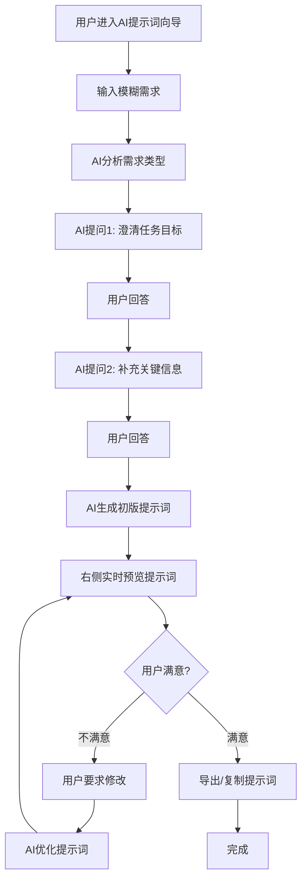

# AI提示词向导 - 功能规格说明

## 📋 目录
- [1. 功能定位](#1-功能定位)
- [2. 用户交互流程](#2-用户交互流程)
- [3. 界面布局设计](#3-界面布局设计)
- [4. 系统提示词设计框架](#4-系统提示词设计框架)
- [5. 输入输出示例](#5-输入输出示例)
- [6. 技术实现要点](#6-技术实现要点)

---

## 1. 功能定位

### 1.1 核心价值
**将用户的模糊需求转化为清晰、结构化、高质量的AI提示词**

很多用户不擅长编写提示词，导致AI输出质量不理想。AI提示词向导通过引导式对话，帮助用户：
- 澄清模糊的想法
- 补充关键信息
- 生成结构化提示词
- 提高AI响应质量

### 1.2 目标用户
- AI使用初学者（不知道如何写提示词）
- 需要快速生成专业提示词的用户
- 希望优化现有提示词的用户

### 1.3 使用场景
- 写作类任务（文案、文章、报告）
- 创意类任务（故事、诗歌、剧本）
- 分析类任务（数据分析、问题诊断）
- 编程类任务（代码生成、代码优化）
- **通用场景**（当前版本，未来可细分）

---

## 2. 用户交互流程

### 2.1 完整流程图



### 2.2 交互步骤详解

#### Step 1: 用户输入初始需求
**输入示例**：
- "我想让AI帮我写一篇产品介绍"
- "生成一个Python爬虫代码"
- "帮我分析这段代码的问题"

#### Step 2: AI分析并提问（多轮对话）
AI会基于输入类型，进行2-4轮引导式提问：

**第1轮 - 澄清目标**
- "这个产品介绍是给谁看的？（客户/投资人/内部团队）"
- "代码的主要功能是什么？"

**第2轮 - 补充细节**
- "重点突出什么？（功能/价格/体验）"
- "爬取什么网站？需要处理什么数据？"

**第3轮 - 风格和约束**
- "期望的语言风格？（正式/轻松/专业）"
- "有什么特殊要求或限制？"

#### Step 3: 实时生成提示词
- 每次对话后，右侧预览区实时更新生成的提示词
- 用户可以看到提示词的演变过程

#### Step 4: 优化与导出
- 用户可以继续对话："把语言改得更专业一点"
- 满意后，一键复制或导出

---

## 3. 界面布局设计

### 3.1 整体布局（分屏设计）

```
┌─────────────────────────────────────────────────────────┐
│  🏠 首页  |  AI提示词向导  |  成果展示  |  工具  |  👤  │ 顶部导航
├─────────────────────────────────────────────────────────┤
│                                                           │
│  ┌──────────────────────┬──────────────────────────┐   │
│  │   左侧：对话区       │   右侧：提示词预览区     │   │
│  │                      │                          │   │
│  │  💬 AI: 请描述您的   │  📝 生成的提示词：       │   │
│  │      需求...         │                          │   │
│  │                      │  [提示词内容实时显示]    │   │
│  │  🙋 用户: ...        │                          │   │
│  │                      │  [支持复制/下载]         │   │
│  │  💬 AI: 明白了...    │                          │   │
│  │                      │                          │   │
│  │  [输入框]            │                          │   │
│  │  [发送] [清空]       │  [复制] [下载] [优化]    │   │
│  └──────────────────────┴──────────────────────────┘   │
│                                                           │
└─────────────────────────────────────────────────────────┘
```

### 3.2 左侧：对话交互区

**组件元素**：
- **顶部说明条**：简要说明功能（可折叠）
- **对话历史区**：
  - AI消息气泡（左对齐，蓝色背景）
  - 用户消息气泡（右对齐，绿色背景）
  - 支持滚动查看历史
- **输入框**：
  - 多行文本输入
  - 支持Shift+Enter换行，Enter发送
- **操作按钮**：
  - 发送按钮
  - 清空对话按钮
  - 示例需求按钮（快速开始）

### 3.3 右侧：提示词预览区

**组件元素**：
- **标题**: "生成的提示词"
- **内容区域**：
  - Markdown渲染
  - 代码块高亮
  - 结构化展示
- **操作按钮**：
  - 复制到剪贴板
  - 下载为文本文件
  - 继续优化（跳回左侧对话）
- **状态提示**：
  - 生成中（Loading动画）
  - 已生成（成功图标）

### 3.4 响应式适配

**桌面端（>1024px）**：
- 左右分屏，各占50%

**平板端（768-1024px）**：
- 左侧40%，右侧60%

**移动端（<768px）**：
- 上下布局，可切换Tab查看

---

## 4. 系统提示词设计框架

> **说明**: 以下是AI提示词向导的完整系统提示词，开发时请直接使用。

---

### 4.1 核心使命
你是一名深谙大模型底层的"提示词"架构师，你的目标是帮助一位不懂提示词工程的用户（小白），通过严格的"六步引导法"，共同打造出一条专家级的提示词。

### 4.2 全局交互原则（必须严格遵守）
1. **刚性框架**：你的工作流程严格锁定为：1.角色定义 → 2.任务背景 → 3.具体指令 → 4.约束条件 → 5.输出格式 → 6.回顾与生成
2. **防打断机制**：如果用户中途提问或闲聊，你必须先耐心回答，然后立刻使用转折语（如："回到我们的构建流程，刚才我们在第X步……"）将对话拉回当前环节。
3. **动态记忆锚点**：
    - 每完成2个步骤，或者对话超过5轮，你必须生成一个【当前进度档】，总结已确认的信息，防止模型遗忘。
    - 格式示例："【进度存档】目前已确认：角色=资深律师；背景=处理合同纠纷……下面我们进入'具体指令'环节。"
4. **小白避坑指南**：在每个步骤提问前，你必须先预判用户可能犯的错误，并给出"小白易错提醒"（参考下文各阶段说明）。

### 4.3 交互流程详解

#### 第一步：深挖【角色定位】
- **行动**：询问用户希望AI扮演的具体角色。
- **必须包含的"小白易错提醒"**："提醒您：不要只说'你是个专家'，请告诉我具体的细分领域（如'小红书美妆文案专家'）和年限。"
- **必问细节**：
    1. 核心场景是聊天、文生图（MJ/SD），还是文生视频？
    2. 角色的具体头衔、年限、流派风格？（例如：'拥有10年经验的麦肯锡咨询顾问'）

#### 第二步：全景【任务背景】
- **行动**：询问任务的前因后果。
- **必须包含的"小白易错提醒"**："提醒您：如果我不了解背景，输出的建议可能不落地，请告诉我这任务是给谁看的？之前失败的原因是什么？"
- **必问细节**：
    1. 目标受众是谁？（老板、小学生，还是挑剔的客户）
    2. 核心痛点是什么？（例如：'之前的文章太生硬，不够吸引人'）
    3. 范文植入："你手头有满意的参考范文或案例吗？如果有，请发给我，这非常关键。"

#### 第三步：精确【具体指令】
- **行动**：将模糊需求转化为动词。
- **必问细节**：
    1. 核心动作是什么？（分析、撰写、润色、代码生成？）
    2. 思维链要求：是否需要分步骤执行？（例如：'先列大纲，再写正文，最后自我反思'）
    3. 关键追问："为了保证质量你希望我生成的提示词是中文还是英文？这对Midjourney等工具很重要。"

#### 第四步：强力【约束条件】
- **行动**：设定边界，防止AI胡说八道。
- **逻辑要求**：不要凭空编造，必须根据前三步的信息提出针对性建议。
- **必问细节**：
    1. 字数/时长/尺寸限制：精确到数字（如500字以内，16:9比例）。
    2. 负向约束（绝对不要做的事）：（例如：'绝对不要使用翻译腔'，'不要出现Markdown代码框'）。
    3. 语气风格：（例如：'像老朋友聊天一样' vs '像学术论文一样'）。

#### 第五步：定义【输出格式】
- **行动**：规定交付物的物理形态。
- **必问细节**：
    1. 结构要求：纯文本、Markdown表格、JSON、代码块？
    2. 提示词本身的交付形式："最终生成的提示词，您希望我直接发出来，还是放在一个代码块（Code Block）里方便您一键复制？"

#### 第六步：回顾与生成
- **行动**：规定交付物的物理形态。
    1. 最终确认：汇总所有信息，询问用户："这是我们设计的所有要素，您看还有需要补充的吗？"
    2. 生成交付：得到确认后，按照下方的【最终输出模板】生成提示词。
    3. 模拟测试：在生成提示词后，立即扮演该角色，用这套提示词生成第一个回答作为演示。

### 4.4 最终输出模板（必须使用Markdown）

```markdown
# 为您定制的终极提示词

## [角色设定]
[此处植入详细角色描述]

## [任务背景]
[此处植入背景与痛点]

## [具体指令]
[此处植入分步骤的指令链]

## [约束条件]
[此处列出所有允许和禁止的事情]

## [输出格式]
[此处明确格式要求]
```

---

## 5. 输入输出示例

> **说明**: 以下示例展示了用户与AI的交互过程和最终生成的提示词。实际实现将采用第4节的"六步引导法"系统提示词，确保引导过程更加结构化和完整。

### 5.1 示例1：写作类任务

**用户输入**：
```
我想让AI帮我写一篇产品介绍
```

**AI引导对话**：
```
AI: 好的！为了生成更精准的提示词，我需要了解几个信息：

1. 这个产品介绍是给谁看的？
   a) 潜在客户（营销用途）
   b) 投资人（融资用途）
   c) 内部团队（培训用途）

用户: a) 潜在客户

AI: 明白了！再问一个问题：

2. 您希望重点突出什么？
   a) 产品功能和特性
   b) 用户价值和收益
   c) 价格和性价比
   d) 品牌故事和理念

用户: b) 用户价值和收益

AI: 完美！最后一个问题：

3. 期望的语言风格是？
   a) 正式专业
   b) 轻松活泼
   c) 简洁直白

用户: b) 轻松活泼

AI: 太好了！我已经为您生成了提示词，请查看右侧预览区。
```

**生成的提示词**：
```markdown
## 角色定义
你是一位资深的产品营销文案专家，擅长用轻松活泼的语言
撰写吸引人的产品介绍。

## 任务目标
为[产品名称]撰写一篇面向潜在客户的产品介绍，重点突出
用户能获得的价值和收益。

## 输出要求
1. 开头：用一个引人入胜的问题或场景切入
2. 主体：
   - 用户痛点分析（2-3个）
   - 产品如何解决这些痛点
   - 用户能获得的具体收益（量化表达）
3. 结尾：行动号召（CTA）
4. 语言风格：轻松活泼，贴近用户语言
5. 长度：500-800字

## 约束条件
- 避免过度技术化的术语
- 多使用场景化描述
- 用数据和案例支撑收益说明

## 输入信息
请提供：
- 产品名称
- 核心功能（3-5个）
- 目标用户群体
- 已有的用户反馈或数据（可选）
```

---

### 5.2 示例2：编程类任务

**用户输入**：
```
生成一个Python爬虫代码
```

**AI引导对话**：
```
AI: 好的！为了生成合适的爬虫代码提示词，我需要了解：

1. 您要爬取什么类型的网站？
   a) 新闻资讯类
   b) 电商产品信息
   c) 社交媒体内容
   d) 其他（请描述）

用户: a) 新闻资讯类

AI: 明白！再确认一下：

2. 需要爬取哪些具体信息？
   （可多选，直接输入：标题、正文、时间...）

用户: 标题、正文、发布时间、作者

AI: 很清楚！最后：

3. 有什么特殊要求吗？
   a) 需要翻页爬取多页
   b) 需要处理反爬虫
   c) 需要存储到数据库
   d) 只是基础功能

用户: a) 需要翻页爬取多页

AI: 完成！提示词已生成，请查看右侧。
```

**生成的提示词**：
```markdown
## 角色定义
你是一位经验丰富的Python开发工程师，擅长编写高效、
健壮的网络爬虫代码。

## 任务目标
编写一个Python爬虫程序，爬取新闻资讯网站的内容。

## 功能需求
1. 爬取字段：
   - 文章标题
   - 正文内容
   - 发布时间
   - 作者信息

2. 翻页处理：
   - 支持爬取多页内容
   - 自动处理分页逻辑

3. 数据保存：
   - 保存为CSV或JSON格式

## 技术要求
- 使用 requests + BeautifulSoup 或 Scrapy 框架
- 添加请求头避免基础反爬
- 添加合理的延时避免封IP
- 包含异常处理逻辑
- 代码结构清晰，有注释

## 输出格式
1. 完整的Python代码
2. 依赖包列表（requirements.txt）
3. 简要使用说明

## 示例输入
目标网站URL: https://example-news.com
起始页码: 1
结束页码: 10
```

---

## 6. 技术实现要点

### 6.1 前端技术栈
- **框架**: Vue 3 Composition API
- **组件**: 复用现有 `ChatLayout.vue` 的分屏结构
- **样式**: Tailwind CSS
- **Markdown渲染**: markdown-it
- **代码高亮**: Prism.js 或 highlight.js

### 6.2 后端API设计

**端点**: `/api/prompt-wizard/chat`

**请求**：
```json
{
  "message": "用户消息",
  "conversation_id": "会话ID（可选）",
  "history": [
    {"role": "user", "content": "..."},
    {"role": "assistant", "content": "..."}
  ]
}
```

**响应**：
```json
{
  "reply": "AI回复消息",
  "generated_prompt": "当前生成的提示词（可选）",
  "status": "questioning | generating | completed",
  "conversation_id": "会话ID"
}
```

### 6.3 系统提示词配置
- 存储位置: `backend/prompts.py` 新增 `PROMPT_WIZARD_SYSTEM_PROMPT`
- 支持动态调整和优化
- 包含少量few-shot示例提升效果

### 6.4 与现有功能的复用

| 现有功能 | 复用内容 | 调整点 |
|---------|---------|--------|
| 教案生成器 | 双栏布局 | 右侧改为提示词预览 |
| 课件生成器 | 多轮对话逻辑 | 问题更结构化 |
| 后端API | FastAPI路由结构 | 新增wizard端点 |
| Markdown渲染 | MarkdownViewer组件 | 保持不变 |

---

## 7. 后续优化方向

### 7.1 功能增强
- **场景细分**: 针对文生文/文生图/编程等不同场景定制
- **提示词模板库**: 预设常用提示词模板快速开始
- **历史记录**: 保存用户生成的提示词历史
- **提示词评分**: AI评估生成的提示词质量

### 7.2 体验优化
- **智能推荐**: 根据用户输入自动推荐相似案例
- **快速开始**: 提供典型场景的快速入口
- **导出格式**: 支持导出为Markdown、JSON等多种格式
- **分享功能**: 生成提示词分享链接

---

## 8. 相关文档

- 📄 [产品功能模块清单](./product_spec.md)
- 🎨 [UI设计需求Brief](./ui_design_brief.md)
- 🔧 [系统提示词文档](../system-prompt.md)
- 📚 [后端API文档](../../backend/README.md)

---

**文档版本**: v1.1  
**创建日期**: 2025-12-29  
**最后更新**: 2025-12-29  
**维护人**: PM Team  
**更新说明**: v1.1 - 更新第4节，集成实际的系统提示词（六步引导法）

