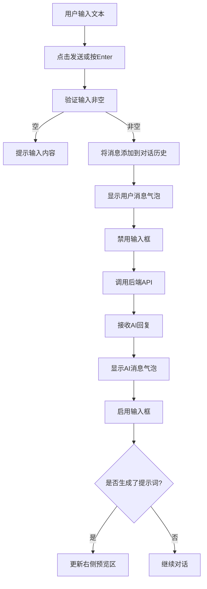

# UI交互指南（UI Interaction Guide）

> **文档定位**: 连接PRD与代码实现的桥梁，专注于页面结构、交互流程和数据流转，不涉及视觉样式。

## 📋 目录
- [1. 文档说明](#1-文档说明)
- [2. 整体导航结构](#2-整体导航结构)
- [3. 首页结构](#3-首页结构)
- [4. AI提示词向导页面](#4-ai提示词向导页面)
- [5. 成果展示页面](#5-成果展示页面)
- [6. 工具页面](#6-工具页面)
- [7. 前端路由定义](#7-前端路由定义)
- [8. 数据流转说明](#8-数据流转说明)

---

## 1. 文档说明

### 1.1 目标读者
- 前端开发工程师
- UI设计师（结构参考）
- 后端开发工程师（接口对接）

### 1.2 文档范围
**包含内容**：
- 页面结构层次
- 交互流程逻辑
- 状态管理
- 数据流转
- 路由定义

**不包含内容**：
- 视觉样式（颜色、字体、间距）
- 动效设计
- 品牌设计

### 1.3 技术栈
- **前端框架**: Vue 3 (Composition API)
- **语言**: TypeScript
- **构建工具**: Vite
- **路由**: Vue Router
- **样式**: Tailwind CSS（由UI设计师/IDX实现）

---

## 2. 整体导航结构

### 2.1 顶部导航栏（全局组件）

**组件名称**: `NavigationBar.vue`

**结构**：
```
NavigationBar
├── Logo区域（点击返回首页）
├── 主导航菜单
│   ├── AI体验（下拉菜单）
│   ├── 成果展示（链接）
│   └── 工具（链接）
└── 用户区域（占位）
    └── 用户图标（暂无功能）
```

**交互逻辑**：
- 固定在页面顶部（sticky定位）
- Logo点击：跳转至首页（`/`）
- "AI体验"悬停/点击：展开下拉菜单
  - 智能对话
  - AI绘图
  - AI编程
  - AI提示词向导
- "成果展示"点击：跳转至 `/showcase`
- "工具"点击：跳转至 `/tools`
- 用户图标：暂无功能，仅UI占位

---

## 3. 首页结构

### 3.1 页面路由
- **路径**: `/`
- **组件**: `HomePage.vue`

### 3.2 页面结构

```
HomePage
├── Hero区域（可选）
│   ├── 标语文字
│   └── CTA按钮（跳转至AI提示词向导）
│
├── AI能力体验区
│   ├── 区域标题："AI能力体验"
│   └── 功能卡片网格（4个卡片）
│       ├── 卡片1: 智能对话
│       ├── 卡片2: AI绘图
│       ├── 卡片3: AI编程
│       └── 卡片4: AI提示词向导（高亮显示，MVP）
│
├── 成果展示区
│   ├── 区域标题："成果展示"
│   └── 分类卡片（3个）
│       ├── AI编程作品
│       ├── AI图片作品
│       └── 教学案例
│
└── 实用工具区
    ├── 区域标题："实用工具"
    └── 工具卡片网格（初期可以是占位卡片）
```

### 3.3 交互逻辑

**功能卡片点击**：
- 智能对话 → 跳转 `/ai/chat`（暂未实现，显示"开发中"）
- AI绘图 → 跳转 `/ai/image`（暂未实现，显示"开发中"）
- AI编程 → 跳转 `/ai/code`（暂未实现，显示"开发中"）
- AI提示词向导 → 跳转 `/ai/wizard`（MVP功能）

**分类卡片点击**：
- AI编程作品 → 跳转 `/showcase/code`
- AI图片作品 → 跳转 `/showcase/image`
- 教学案例 → 跳转 `/showcase/teaching`

**工具卡片点击**：
- 跳转至 `/tools/:toolId`

### 3.4 组件拆分建议

```
HomePage.vue
├── HeroSection.vue（可选）
├── AICapabilitySection.vue
│   └── FeatureCard.vue (复用组件)
├── ShowcaseSection.vue
│   └── CategoryCard.vue (复用组件)
└── ToolsSection.vue
    └── ToolCard.vue (复用组件)
```

---

## 4. AI提示词向导页面

### 4.1 页面路由
- **路径**: `/ai/wizard`
- **组件**: `PromptWizardPage.vue`

### 4.2 页面结构（双栏布局）

```
PromptWizardPage
├── 左侧：对话区（50%宽度）
│   ├── 顶部说明条（可折叠）
│   │   ├── 功能说明文字
│   │   └── 操作按钮（查看示例/折叠）
│   │
│   ├── 对话历史区（滚动容器）
│   │   ├── AI消息气泡（多个）
│   │   └── 用户消息气泡（多个）
│   │
│   └── 输入区（固定在底部）
│       ├── 多行文本输入框
│       └── 操作按钮组
│           ├── 示例按钮
│           ├── 清空对话按钮
│           └── 发送按钮
│
└── 右侧：提示词预览区（50%宽度）
    ├── 标题栏
    │   ├── 标题："生成的提示词"
    │   └── 操作按钮组
    │       ├── 复制按钮
    │       └── 下载按钮
    │
    └── 内容区（滚动容器）
        ├── 空状态（初始状态）
        ├── 加载状态（生成中）
        └── 内容展示（Markdown渲染）
```

### 4.3 交互流程

#### 4.3.1 初始状态
- 左侧对话区：显示AI的欢迎消息
- 右侧预览区：显示空状态提示

#### 4.3.2 用户发送消息流程



#### 4.3.3 关键交互

**发送消息**：
- 触发条件：点击"发送"按钮 或 按Enter键（Shift+Enter换行）
- 前置检查：输入内容非空
- 操作：
  1. 在对话区添加用户消息气泡
  2. 清空输入框
  3. 禁用输入框（防止重复提交）
  4. 发送API请求
  5. 收到响应后启用输入框
  6. 在对话区添加AI消息气泡
  7. 如果返回了提示词，更新右侧预览区

**清空对话**：
- 触发条件：点击"清空对话"按钮
- 确认弹窗：显示确认对话框
- 操作：
  1. 清空对话历史
  2. 重置会话ID
  3. 清空右侧预览区
  4. 显示AI欢迎消息

**查看示例**：
- 触发条件：点击"示例"按钮
- 操作：在输入框填充示例文本，不自动发送

**复制提示词**：
- 触发条件：点击"复制"按钮
- 操作：
  1. 复制右侧预览区的文本到剪贴板
  2. 显示Toast提示："已复制到剪贴板"

**下载提示词**：
- 触发条件：点击"下载"按钮
- 操作：
  1. 生成txt文件
  2. 文件名：`prompt_generated_[时间戳].txt`
  3. 触发浏览器下载

### 4.4 状态管理

**页面级状态**：
```typescript
interface PromptWizardState {
  conversationId: string | null;      // 会话ID
  messages: Message[];                // 对话历史
  generatedPrompt: string | null;     // 生成的提示词
  isLoading: boolean;                 // 加载状态
  inputText: string;                  // 输入框文本
}

interface Message {
  role: 'user' | 'assistant';
  content: string;
  timestamp: number;
}
```

### 4.5 API接口

**端点**: `POST /api/prompt-wizard/chat`

**请求**：
```json
{
  "message": "用户输入的消息",
  "conversation_id": "会话ID（可选）",
  "history": [
    {"role": "user", "content": "..."},
    {"role": "assistant", "content": "..."}
  ]
}
```

**响应**：
```json
{
  "reply": "AI的回复消息",
  "generated_prompt": "生成的提示词（可选）",
  "status": "questioning | generating | completed",
  "conversation_id": "会话ID"
}
```

### 4.6 组件拆分建议

```
PromptWizardPage.vue
├── ChatPanel.vue（左侧对话区）
│   ├── InstructionBar.vue（顶部说明条）
│   ├── MessageList.vue（对话历史）
│   │   └── MessageBubble.vue（消息气泡）
│   └── ChatInput.vue（输入区）
│
└── PreviewPanel.vue（右侧预览区）
    ├── PreviewHeader.vue（标题栏）
    └── PreviewContent.vue（内容展示）
```

---

## 5. 成果展示页面

### 5.1 页面路由
- **主页路径**: `/showcase`
- **分类页路径**: 
  - `/showcase/code` - AI编程作品
  - `/showcase/image` - AI图片作品
  - `/showcase/teaching` - 教学案例

### 5.2 页面结构

```
ShowcasePage
├── 分类Tab栏
│   ├── AI编程作品（默认选中）
│   ├── AI图片作品
│   └── 教学案例
│
├── 搜索/筛选栏（可选，二期）
│
└── 作品网格容器
    └── 作品卡片（多个）
        ├── 缩略图/预览
        ├── 标题
        ├── 简介
        └── 操作按钮（预览/下载）
```

### 5.3 交互流程

#### 5.3.1 分类切换
- 点击Tab → 更新路由 → 加载对应分类数据 → 渲染卡片列表

#### 5.3.2 作品卡片交互
- **预览操作**：
  - HTML作品：打开Modal，iframe嵌入预览
  - 图片作品：打开Modal，大图展示
  - Markdown文档：打开Modal，渲染后展示

- **下载操作**：
  - 单文件：直接下载
  - 多文件项目：下载zip压缩包

### 5.4 数据获取

**当前阶段（MVP）**：
- 从固定目录读取文件列表
- 前端路径：`/showcase_assets/{category}/`
- 文件结构：
  ```
  showcase_assets/
  ├── code/
  │   ├── project1/
  │   │   ├── index.html
  │   │   └── meta.json（元数据）
  │   └── project2/
  ├── image/
  │   ├── image1.png
  │   └── image1.json（元数据）
  └── teaching/
  ```

**元数据格式（meta.json）**：
```json
{
  "title": "作品标题",
  "description": "作品简介",
  "preview": "preview.png",
  "tags": ["标签1", "标签2"]
}
```

### 5.5 组件拆分建议

```
ShowcasePage.vue
├── CategoryTabs.vue（分类Tab）
├── SearchBar.vue（搜索栏，二期）
└── WorkGrid.vue（作品网格）
    └── WorkCard.vue（作品卡片）

Modal组件：
├── PreviewModal.vue（预览弹窗）
```

---

## 6. 工具页面

### 6.1 页面路由
- **主页路径**: `/tools`
- **工具详情**: `/tools/:toolId`

### 6.2 工具主页结构

```
ToolsPage
├── 页面标题
├── 工具网格容器
│   └── 工具卡片（多个）
│       ├── 图标
│       ├── 工具名称
│       ├── 简介
│       └── 点击进入
```

### 6.3 工具详情页结构

```
ToolDetailPage
├── 返回按钮
├── 工具标题
├── 工具说明
└── 工具嵌入区
    └── iframe（加载工具HTML）
```

### 6.4 交互流程
- 点击工具卡片 → 跳转至 `/tools/:toolId`
- 加载对应的HTML文件到iframe
- 提供返回按钮回到工具列表

### 6.5 数据获取

**当前阶段（MVP）**：
- 工具以单HTML文件存储在 `/tools_assets/`
- 工具列表配置文件：`/tools_assets/tools.json`

```json
{
  "tools": [
    {
      "id": "markdown-to-word",
      "name": "Markdown转Word",
      "description": "将Markdown文件转换为Word文档",
      "file": "markdown-to-word.html"
    }
  ]
}
```

---

## 7. 前端路由定义

### 7.1 路由表

```typescript
const routes = [
  {
    path: '/',
    name: 'Home',
    component: HomePage
  },
  {
    path: '/ai/wizard',
    name: 'PromptWizard',
    component: PromptWizardPage
  },
  {
    path: '/ai/chat',
    name: 'AIChat',
    component: ComingSoonPage // 暂未实现
  },
  {
    path: '/ai/image',
    name: 'AIImage',
    component: ComingSoonPage // 暂未实现
  },
  {
    path: '/ai/code',
    name: 'AICode',
    component: ComingSoonPage // 暂未实现
  },
  {
    path: '/showcase',
    redirect: '/showcase/code'
  },
  {
    path: '/showcase/:category',
    name: 'Showcase',
    component: ShowcasePage,
    props: true
  },
  {
    path: '/tools',
    name: 'Tools',
    component: ToolsPage
  },
  {
    path: '/tools/:toolId',
    name: 'ToolDetail',
    component: ToolDetailPage,
    props: true
  },
  {
    path: '/:pathMatch(.*)*',
    name: 'NotFound',
    component: NotFoundPage
  }
]
```

### 7.2 路由守卫

**全局前置守卫**（可选，二期实现）：
- 用户认证检查
- 权限验证

**当前阶段**：
- 无需守卫，所有页面公开访问

---

## 8. 数据流转说明

### 8.1 AI提示词向导数据流

```
用户输入
  ↓
前端状态更新（添加用户消息）
  ↓
发送POST请求到 /api/prompt-wizard/chat
  ↓
后端处理（调用Kimi API）
  ↓
返回AI回复 + 生成的提示词（可选）
  ↓
前端状态更新
  ├→ 添加AI消息到对话历史
  └→ 更新右侧预览区（如有提示词）
```

### 8.2 成果展示数据流

```
页面加载/分类切换
  ↓
前端请求静态文件列表（从固定目录）
  ↓
解析元数据文件（meta.json）
  ↓
渲染作品卡片列表
```

### 8.3 工具数据流

```
访问/tools
  ↓
加载 tools.json 配置文件
  ↓
渲染工具卡片列表
  ↓
点击工具卡片
  ↓
跳转至 /tools/:toolId
  ↓
加载对应HTML文件到iframe
```

---

## 9. 状态管理建议

### 9.1 全局状态（可选）

**使用Pinia Store**：

```typescript
// stores/app.ts
export const useAppStore = defineStore('app', {
  state: () => ({
    isLoading: false,
    toast: {
      show: false,
      message: '',
      type: 'success' | 'error' | 'warning'
    }
  }),
  actions: {
    showToast(message: string, type: string) { ... },
    hideToast() { ... }
  }
})
```

### 9.2 页面级状态

使用Vue 3 Composition API的 `ref` 和 `reactive` 管理。

**示例**（AI提示词向导）：
```typescript
const state = reactive({
  conversationId: null,
  messages: [],
  generatedPrompt: null,
  isLoading: false
});

const inputText = ref('');
```

---

## 10. 错误处理

### 10.1 API错误处理

```typescript
try {
  const response = await fetch('/api/prompt-wizard/chat', { ... });
  if (!response.ok) {
    throw new Error('API请求失败');
  }
  const data = await response.json();
  // 处理数据
} catch (error) {
  // 显示错误Toast
  showToast('请求失败，请稍后重试', 'error');
  console.error(error);
}
```

### 10.2 用户操作错误

- 输入为空 → Toast提示："请输入内容"
- 网络错误 → Toast提示："网络连接失败，请检查网络"
- 文件加载失败 → 显示错误占位符

---

## 11. 相关文档

- 📄 [产品功能模块清单](./product_spec.md)
- 📄 [AI提示词向导功能规格](./ai_prompt_wizard_spec.md)
- 🏗️ [系统架构设计](../2_system_design.md)

---

**文档版本**: v1.0  
**创建日期**: 2025-12-29  
**最后更新**: 2025-12-29  
**维护人**: PM Team

