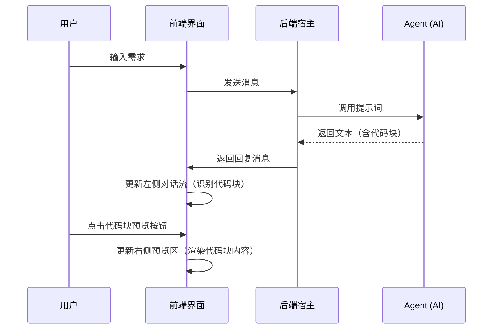

# UI 交互指南 (UI Interaction Guide)

> **文档定位**: 定义平台通用交互框架。本项目采用“通用宿主”模式，所有 Agent 共享一套交互规范。

---

## 1. 通用交互框架 (Universal Shell)

平台采用响应式的双栏布局，根据 Agent 的配置动态调整界面元素。

### 1.1 基础布局结构
```
[ 顶部导航栏 ]
--------------------------------------------------
[      |                                         ]
[ 菜单 |        主交互区 (Main Area)              ]
[      |                                         ]
--------------------------------------------------
```

### 1.2 动态侧边栏机制 (Dynamic Sidepanel)
- **纯对话模式**：当 Agent 配置为 `show_preview: false` 时，主交互区全屏展示对话框。
- **增强预览模式**：当 Agent 配置为 `show_preview: true` 时，主交互区分为“左对话、右预览”。

---

## 2. 核心交互组件

### 2.1 左侧：对话交互区 (Chat Panel)
- **对话流**：显示 AI 与用户的历史消息，AI 消息支持 Markdown 渲染。
- **代码块识别**：系统识别消息中的 Markdown 代码块，并在代码块上提供“预览”按钮（或类似的可点击入口）。
- **预览触发**：用户点击代码块上的预览按钮后，右侧预览区才会更新显示该代码块的内容。不在代码块中的内容视为普通文本，不触发预览。
- **加载状态**：AI 思考时，输入框应处于禁用状态，并显示明显的加载指示（如打字机动效）。
- **输入控制**：支持多行输入、快捷发送（Enter）和手动换行（Shift+Enter）。

### 2.2 右侧：成果预览区 (Preview Panel)
- **手动更新机制**：预览区内容仅在用户点击聊天窗口中的代码块预览按钮时更新。每次点击都视为新的预览请求，即使点击的是同一个代码块，预览区也会重新渲染。
- **内容渲染**：根据代码块的语言类型（如 markdown、html、svg 等），采用对应的渲染方式展示内容。
- **操作项（MVP 阶段暂不做）**：后续迭代中，可根据内容类型提供复制、下载、格式转换等操作按钮。

---

## 3. 业务状态转换流程

### 3.1 会话开启流程
1. 用户从导航或首页点击具体 Agent 入口。
2. 系统根据 Agent 配置初始化会话，并决定 UI 布局（是否开启预览区）。
3. 系统自动触发 AI 发出欢迎语，引导用户开始对话。每个 Agent 拥有独立的会话空间，互不干扰。

### 3.2 对话与成果生成流程


---

## 4. 异常与边界交互

- **断网/超时**：在对话流中展示"发送失败"提示，并提供"重发"按钮。
- **代码块格式异常**：如果代码块内容无法正确渲染，预览区应显示错误提示，用户可点击其他正常的代码块恢复预览。
- **清空会话**：点击清空后，需弹出二次确认，确认后同时清空对话历史和预览内容。

---
**文档版本**: v3.1  
**更新说明**: 
- v3.0: 配合"通用 Agent 宿主"架构，将特定页面设计升级为通用交互框架。
- v3.1: 明确代码块识别机制、手动预览触发模式、Agent 入口独立性，以及 MVP 阶段功能边界。
