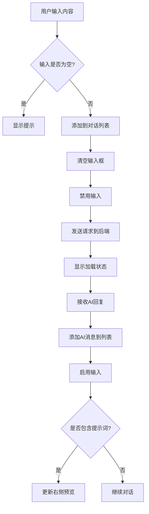
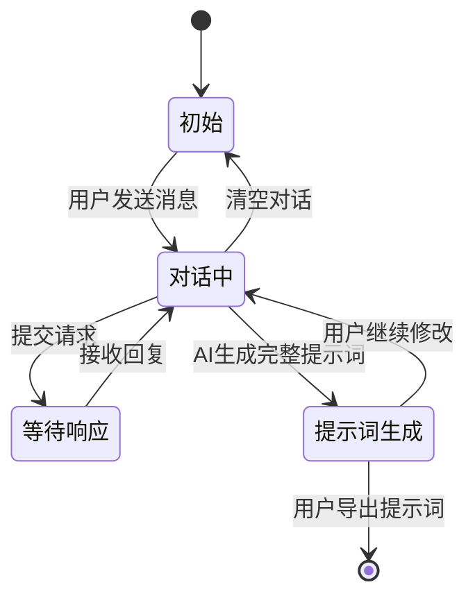

# UI交互指南（UI Interaction Guide）

> **文档定位**: 产品设计阶段文档，定义"做什么样的界面"，不涉及具体实现代码。连接PRD与开发实现的桥梁。

## 📋 目录
- [1. 文档说明](#1-文档说明)
- [2. 整体导航结构](#2-整体导航结构)
- [3. 首页结构](#3-首页结构)
- [4. AI提示词向导页面](#4-ai提示词向导页面)
- [5. 成果展示页面](#5-成果展示页面)
- [6. 工具页面](#6-工具页面)
- [7. 页面路由规划](#7-页面路由规划)
- [8. 数据交互说明](#8-数据交互说明)

---

## 1. 文档说明

### 1.1 目标读者
- UI设计师（IDX）
- 前端开发工程师
- 后端开发工程师（接口对接）

### 1.2 文档范围

**本文档包含**：
- 页面结构层次关系
- 交互流程与状态转换
- 必需的功能元素
- 数据流向说明
- 页面路由规划

**本文档不包含**：
- 具体的代码实现
- CSS类名和样式细节
- 具体的技术选型
- 详细的API定义（仅概要）

### 1.3 实现原则
- **结构优先**：先定义结构，再由设计师美化
- **功能完整**：确保所有必需功能元素都有说明
- **灵活实现**：给开发和设计留出发挥空间

---

## 2. 整体导航结构

### 2.1 顶部导航栏

**必需元素**：
- Logo/品牌标识（点击返回首页）
- 主导航菜单：
  - AI体验（可展开子菜单或直接链接）
  - 成果展示
  - 工具
- 用户区域（占位，暂无功能）

**导航交互**：
- 固定在页面顶部
- AI体验展开显示：智能对话、AI绘图、AI编程、AI提示词向导
- 点击各导航项跳转对应页面

---

## 3. 首页结构

### 3.1 页面层次

```
首页
├── Hero区域（可选）
│   └── 主标语 + CTA按钮
│
├── AI能力体验区
│   ├── 区域标题
│   └── 功能卡片网格
│       ├── 智能对话（开发中）
│       ├── AI绘图（开发中）
│       ├── AI编程（开发中）
│       └── AI提示词向导（MVP，高亮展示）
│
├── 成果展示区
│   ├── 区域标题
│   └── 分类卡片
│       ├── AI编程作品
│       ├── AI图片作品
│       └── 教学案例
│
└── 实用工具区
    ├── 区域标题
    └── 工具卡片网格（可占位）
```

### 3.2 卡片交互

**功能卡片**：
- 点击后跳转对应功能页面
- 未开发功能显示"开发中"提示
- MVP功能（AI提示词向导）需视觉上突出

**卡片必需信息**：
- 图标/标识
- 功能名称
- 一句话说明

---

## 4. AI提示词向导页面

### 4.1 页面结构

```
AI提示词向导页面
├── 左侧：对话交互区
│   ├── 功能说明条（可折叠）
│   ├── 对话消息列表（可滚动）
│   │   ├── AI消息
│   │   └── 用户消息
│   └── 输入区（底部固定）
│       ├── 文本输入框
│       └── 操作按钮组
│
└── 右侧：提示词预览区
    ├── 标题栏
    │   └── 操作按钮组
    └── 内容展示区（可滚动）
```

### 4.2 交互流程

#### 初始状态
- 左侧显示AI欢迎消息
- 右侧显示空状态提示

#### 用户发送消息



#### 关键交互说明

**发送消息**：
- 触发方式：点击发送按钮 / 按Enter键
- 操作效果：
  - 消息添加到对话列表
  - 输入框清空
  - 发送请求给后端
  - 显示AI回复

**清空对话**：
- 触发方式：点击清空按钮
- 需要确认：显示确认对话框
- 操作效果：清空所有对话历史和右侧预览

**查看示例**：
- 触发方式：点击示例按钮
- 操作效果：输入框填充示例文本

**复制提示词**：
- 触发方式：点击复制按钮
- 操作效果：内容复制到剪贴板，显示成功提示

**下载提示词**：
- 触发方式：点击下载按钮
- 操作效果：下载为文本文件

### 4.3 页面状态

**需要管理的状态**：
- 会话标识（用于多轮对话）
- 对话历史列表
- 当前生成的提示词内容
- 加载状态（是否正在请求）
- 输入框内容

**消息对象结构**：
- 角色（用户/AI）
- 内容
- 时间戳

### 4.4 后端交互

**请求内容**：
- 用户消息
- 会话标识（可选）
- 对话历史

**响应内容**：
- AI回复消息
- 生成的提示词（可选）
- 对话状态（提问中/生成中/完成）
- 会话标识

---

## 5. 成果展示页面

### 5.1 页面结构

```
成果展示页面
├── 分类标签栏
│   ├── AI编程作品
│   ├── AI图片作品
│   └── 教学案例
│
└── 作品展示区
    └── 作品卡片网格
        └── 单个作品卡片
            ├── 缩略图/预览
            ├── 标题
            ├── 简介
            └── 操作按钮
```

### 5.2 交互流程

**分类切换**：
- 点击分类标签
- 切换到对应分类内容
- URL路径同步更新

**作品预览**：
- 点击预览按钮
- 根据作品类型显示预览：
  - HTML作品：在弹窗中展示
  - 图片：大图显示
  - 文档：渲染后显示

**作品下载**：
- 点击下载按钮
- 触发文件下载

### 5.3 数据来源

**MVP阶段**：
- 从固定目录读取文件列表
- 每个作品有对应的元数据文件（包含标题、描述等）

**元数据内容**：
- 作品标题
- 作品描述
- 预览图路径
- 标签（可选）

---

## 6. 工具页面

### 6.1 页面结构

**工具列表页**：
```
工具列表
├── 页面标题
└── 工具卡片网格
    └── 单个工具卡片
        ├── 图标
        ├── 工具名称
        └── 简介
```

**工具详情页**：
```
工具详情
├── 返回按钮
├── 工具标题
├── 工具说明
└── 工具展示区（嵌入工具界面）
```

### 6.2 交互流程

- 在列表页点击工具卡片
- 跳转到工具详情页
- 工具界面嵌入展示
- 可返回列表页

### 6.3 数据来源

**MVP阶段**：
- 工具以HTML文件形式存储
- 通过配置文件管理工具列表信息

---

## 7. 页面导航关系

### 7.1 页面清单

| 页面名称 | 功能说明 | 状态 |
|---------|---------|------|
| 首页 | 平台入口，展示所有功能模块 | MVP |
| AI提示词向导 | 生成AI提示词的核心功能 | MVP |
| 智能对话 | AI对话功能 | 占位（暂未实现） |
| AI绘图 | 图片生成功能 | 占位（暂未实现） |
| AI编程 | 代码生成功能 | 占位（暂未实现） |
| 成果展示-编程作品 | 展示AI生成的编程作品 | MVP（可选） |
| 成果展示-图片作品 | 展示AI生成的图片 | MVP（可选） |
| 成果展示-教学案例 | 展示教学相关成果 | MVP（可选） |
| 工具列表 | 展示可用工具 | MVP（可选） |
| 工具详情 | 单个工具的使用界面 | MVP（可选） |

### 7.2 页面导航逻辑

**从首页出发**：
```
首页
├─→ AI提示词向导（点击对应卡片）
├─→ 智能对话（点击卡片，显示"开发中"）
├─→ AI绘图（点击卡片，显示"开发中"）
├─→ AI编程（点击卡片，显示"开发中"）
├─→ 成果展示-编程作品（点击分类卡片）
├─→ 成果展示-图片作品（点击分类卡片）
├─→ 成果展示-教学案例（点击分类卡片）
└─→ 工具列表（点击工具区）
```

**从成果展示页面**：
```
成果展示页面（任一分类）
├─→ 成果展示-其他分类（点击分类标签切换）
└─→ 首页（点击顶部导航Logo）
```

**从工具列表**：
```
工具列表
├─→ 工具详情（点击具体工具卡片）
└─→ 首页（点击顶部导航Logo）
```

**从工具详情**：
```
工具详情
├─→ 工具列表（点击返回按钮）
└─→ 首页（点击顶部导航Logo）
```

### 7.3 导航要求

**基本要求**：
- 所有页面均可通过顶部导航栏返回首页
- 页面跳转保持导航历史，支持浏览器前进/后退
- 页面刷新后保持当前位置，不返回首页

**未实现功能处理**：
- 标记为"开发中"的功能点击后显示占位页
- 占位页说明功能即将上线
- 提供返回首页的操作

---

## 8. 数据交互说明

### 8.1 AI提示词向导数据流

```
用户输入
  ↓
前端状态更新
  ↓
发送请求到后端
  ↓
后端调用AI服务
  ↓
返回AI回复和生成的提示词
  ↓
前端更新对话历史和预览区
```

**需要传递的数据**：
- 往：用户消息、会话ID、历史记录
- 返：AI回复、提示词内容、状态标识

### 8.2 成果展示数据流

```
用户访问页面
  ↓
加载对应分类的文件列表
  ↓
读取每个作品的元数据
  ↓
渲染作品卡片
```

**需要的数据**：
- 作品文件路径
- 元数据（标题、描述、预览图）

### 8.3 工具数据流

```
访问工具列表
  ↓
加载工具配置信息
  ↓
渲染工具卡片
  ↓
点击进入工具
  ↓
加载工具HTML文件
```

**需要的数据**：
- 工具列表配置
- 工具HTML文件路径

---

## 9. 状态转换说明

### 9.1 对话页面状态

**页面状态**：
- 初始状态：显示欢迎消息
- 对话中：显示对话历史
- 等待响应：显示加载指示
- 提示词已生成：右侧显示内容

**状态转换**：


### 9.2 预览区状态

**状态类型**：
- 空状态：无内容提示
- 加载状态：显示加载指示
- 内容展示：显示生成的提示词

---

## 10. 错误与异常处理

### 10.1 用户操作错误

- 输入为空：提示用户输入内容
- 网络请求失败：显示错误提示，允许重试
- 文件加载失败：显示错误占位符

### 10.2 错误提示方式

- 使用全局提示组件（Toast）
- 关键操作需要明确的错误说明
- 提供解决建议或重试按钮

---

## 11. 相关文档

- 📄 [产品功能模块清单](./product_spec.md)
- 📄 [AI提示词向导功能规格](./ai_prompt_wizard_spec.md)
- 🏗️ [系统架构设计](../2_system_design.md)

---

**文档版本**: v2.0  
**创建日期**: 2025-12-29  
**最后更新**: 2025-12-29  
**维护人**: PM Team  
**更新说明**: v2.0 - 重写为抽象化设计文档，移除所有实现代码，专注于"做什么"而非"怎么做"
