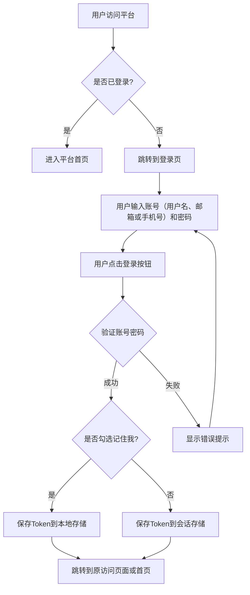

# 用户登录功能需求文档 (User Authentication Specification)

> **文档定位**: 定义用户登录、会话管理和临时用户管理功能  
> **文档版本**: v1.0  
> **创建日期**: 2026-01-02  
> **优先级**: P0（阻塞后续用户相关功能）

---

## 📋 目录
- [1. 文档说明](#1-文档说明)
- [2. 功能概述](#2-功能概述)
- [3. 用户场景](#3-用户场景)
- [4. 登录功能](#4-登录功能)
- [5. 会话管理](#5-会话管理)
- [6. 未登录处理](#6-未登录处理)
- [7. 临时用户管理](#7-临时用户管理)
- [8. 边界条件和异常处理](#8-边界条件和异常处理)
- [9. 验收标准](#9-验收标准)

---

## 1. 文档说明

### 1.1 目标
定义用户登录功能，确保：
- 用户可以通过账号密码登录平台
- 登录状态在页面刷新后保持
- 未登录用户无法访问平台功能
- 提供临时用户管理功能（内部使用）

### 1.2 当前迭代范围
- ✅ 账号密码登录（支持用户名、邮箱或手机号登录）
- ✅ 登录状态保持（Token机制）
- ✅ "记住我"功能
- ✅ 临时用户管理页面（内部使用）
- ✅ 用户信息包含手机字段
- ✅ 用户信息包含昵称字段（用于显示）
- ❌ 用户注册功能（单独需求）
- ❌ 个人设置和资料管理（后续迭代）
- ❌ 权限控制（后续迭代）
- ❌ 密码找回功能（后续迭代）

---

## 2. 功能概述

### 2.1 核心功能
1. **用户登录**：用户通过用户名、邮箱或手机号和密码登录平台
2. **会话管理**：登录后保持登录状态，支持"记住我"选项
3. **访问控制**：未登录用户自动跳转到登录页
4. **临时用户管理**：内部使用的用户列表和创建页面
5. **用户信息**：用户信息包含手机字段和昵称字段（用于显示）

### 2.2 设计原则
- **安全优先**：登录错误统一提示，不泄露具体错误信息
- **用户体验**：登录后返回原访问页面
- **简化流程**：当前迭代仅支持账号密码登录，不涉及注册

---

## 3. 用户场景

### 3.1 典型场景

**场景1：用户首次访问平台（用户名登录）**
- 用户打开平台首页
- 系统检测到未登录，自动跳转到登录页
- 用户输入用户名和密码，点击"登录"
- 系统验证通过，用户进入平台首页

**场景1-1：用户首次访问平台（邮箱登录）**
- 用户打开平台首页
- 系统检测到未登录，自动跳转到登录页
- 用户输入邮箱和密码，点击"登录"
- 系统验证通过，用户进入平台首页

**场景1-2：用户首次访问平台（手机号登录）**
- 用户打开平台首页
- 系统检测到未登录，自动跳转到登录页
- 用户输入手机号和密码，点击"登录"
- 系统验证通过，用户进入平台首页

**场景2：用户选择"记住我"**
- 用户登录时勾选"记住我"
- 关闭浏览器后重新打开平台
- 系统自动保持登录状态，无需重新登录

**场景3：用户未选择"记住我"**
- 用户登录时未勾选"记住我"
- 关闭浏览器后重新打开平台
- 系统要求用户重新登录

**场景4：管理员查看用户列表**
- 管理员访问临时管理页面
- 系统展示所有用户列表
- 管理员可以创建新用户

---

## 4. 登录功能

### 4.1 登录页面

**页面位置**：
- 独立登录页面，路径为 `/login`

**页面元素**：
- 平台Logo和名称
- 账号输入框（必填，支持用户名、邮箱或手机号）
- 密码输入框（必填，输入时隐藏）
- "记住我"复选框（可选）
- "登录"按钮
- 错误提示区域（登录失败时显示）

**页面布局**：
- 居中布局，简洁专业
- 参考平台整体设计风格

### 4.2 登录流程

### 4.3 登录验证规则

**账号规则**：
- 必填项
- 支持三种格式：
  - **用户名格式**：1-50个字符，字母、数字、下划线、中文字符（如：zhangsan、张三）
  - **邮箱格式**：符合邮箱格式规范（如：user@example.com）
  - **手机号格式**：11位数字，以1开头（如：13800138000）
- 错误提示：
  - 格式不正确时提示"请输入正确的用户名、邮箱或手机号"
  - 用户名格式：1-50个字符，字母、数字、下划线、中文字符
  - 邮箱格式：`^[^@]+@[^@]+\.[^@]+$`
  - 手机号格式：`^1[3-9]\d{9}$`

**密码规则**：
- 必填项
- 最小长度：6位
- 错误提示：长度不足时提示"密码至少需要6位"

**登录验证**：
- 系统根据输入格式判断是用户名、邮箱还是手机号
- 根据账号类型（用户名、邮箱或手机号）查询用户
- 验证账号和密码是否匹配
- 验证失败时统一提示："账号或密码错误"（不区分具体错误原因，安全考虑）

### 4.4 登录成功处理

**成功后的操作**：
1. 系统保存登录凭证（Token）
2. 根据"记住我"选项选择存储方式：
   - 勾选"记住我"：保存到本地存储（关闭浏览器后仍有效）
   - 未勾选：保存到会话存储（关闭浏览器后失效）
3. 跳转到原访问页面（如果有），否则跳转到平台首页
4. 更新顶部导航栏的用户信息显示

---

## 5. 会话管理

### 5.1 Token机制

**Token作用**：
- 标识用户登录状态
- 后续请求携带Token验证身份

**Token存储**：
- 本地存储（localStorage）：勾选"记住我"时使用
- 会话存储（sessionStorage）：未勾选"记住我"时使用

**Token有效期**：
- 由后端控制，前端不处理过期逻辑
- 当Token过期时，系统自动跳转到登录页

### 5.2 登录状态检查

**检查时机**：
- 页面加载时
- 页面刷新时
- 访问需要登录的功能时

**检查逻辑**：
1. 系统检查是否存在有效的登录凭证
2. 如果存在且有效，保持登录状态
3. 如果不存在或已过期，跳转到登录页

### 5.3 退出登录

**退出方式**：
- 用户点击顶部导航栏的"退出"按钮（后续迭代实现）
- 当前迭代：用户可以通过清除浏览器存储手动退出

**退出操作**：
- 清除登录凭证（Token）
- 跳转到登录页

---

## 6. 未登录处理

### 6.1 访问控制

**平台要求**：
- 平台所有功能都需要登录后才能使用
- 未登录用户无法访问任何功能页面

**处理流程**：
1. 用户访问平台任何页面
2. 系统检查登录状态
3. 如果未登录，自动跳转到登录页
4. 记录原访问页面地址
5. 登录成功后，跳转回原访问页面

### 6.2 登录页访问

**直接访问登录页**：
- 用户可以直接输入登录页地址访问
- 如果已登录，系统自动跳转到首页

**登录页保护**：
- 登录页本身不需要登录即可访问
- 登录成功后自动离开登录页

---

## 7. 临时用户管理

### 7.1 功能说明

**功能定位**：
- 临时管理功能，仅内部使用
- 用于查看用户列表和创建新用户
- 不对外公开，不配置到公开导航

**访问路径**：
- 路径：`/admin/users`
- 需要登录后才能访问

### 7.2 用户列表页面

**页面功能**：
- 展示所有用户列表
- 显示用户基本信息：用户名、邮箱、手机号、创建时间

**页面布局**：
- 表格形式展示用户列表
- 简洁实用，无需复杂样式

### 7.3 创建用户功能

**创建方式**：
- 在用户列表页面提供"创建用户"按钮
- 点击后弹出创建表单或跳转到创建页面

**创建表单字段**：
- 用户名（必填）
- 邮箱（必填，用于登录）
- 密码（必填，最小6位）
- 头像（可选，默认使用系统默认头像）

**创建流程**：
1. 管理员填写用户信息
2. 系统验证必填项和格式
3. 验证通过后创建用户
4. 创建成功后返回用户列表，显示新创建的用户

### 7.4 访问控制

**访问限制**：
- 需要登录后才能访问（所有登录用户都可以访问）
- 不配置到公开导航，通过直接输入路径访问
- 只要不对外泄露地址，任何环境都可以使用

**安全说明**：
- 通过登录要求提供基础保护
- 不对外泄露路径地址即可保证安全
- 后续迭代可考虑添加更细粒度的权限控制

---

## 8. 边界条件和异常处理

### 8.1 登录失败

**场景**：账号或密码错误
- **处理**：显示统一错误提示"账号或密码错误"
- **用户操作**：用户可以重新输入或联系管理员

**场景**：账号不存在
- **处理**：显示统一错误提示"账号或密码错误"（安全考虑，不区分具体错误）
- **用户操作**：用户可以重新输入或联系管理员

**场景**：密码错误
- **处理**：显示统一错误提示"账号或密码错误"
- **用户操作**：用户可以重新输入

### 8.2 网络异常

**场景**：登录请求失败（网络错误）
- **处理**：显示错误提示"网络错误，请稍后重试"
- **用户操作**：用户可以重试登录

### 8.3 Token过期

**场景**：Token已过期
- **处理**：系统自动跳转到登录页
- **用户操作**：用户需要重新登录

### 8.4 表单验证

**场景**：邮箱格式不正确
- **处理**：在输入框下方显示提示"请输入正确的邮箱格式"
- **用户操作**：用户修正邮箱格式

**场景**：密码长度不足
- **处理**：在输入框下方显示提示"密码至少需要6位"
- **用户操作**：用户输入更长的密码

**场景**：必填项为空
- **处理**：在输入框下方显示提示"此项为必填项"
- **用户操作**：用户填写必填项

### 8.5 创建用户异常

**场景**：邮箱已存在
- **处理**：显示错误提示"该邮箱已被使用"
- **用户操作**：用户使用其他邮箱

**场景**：创建用户失败（系统错误）
- **处理**：显示错误提示"创建失败，请稍后重试"
- **用户操作**：用户可以重试

---

## 9. 验收标准

### 9.1 登录功能验收

- [ ] 用户可以通过邮箱和密码登录平台
- [ ] 登录页面布局正确，包含所有必要元素
- [ ] 邮箱格式验证正确，格式错误时显示提示
- [ ] 密码长度验证正确，长度不足时显示提示
- [ ] 登录失败时显示统一错误提示"账号或密码错误"
- [ ] 登录成功后正确跳转到原访问页面或首页
- [ ] 登录成功后顶部导航栏显示用户信息

### 9.2 会话管理验收

- [ ] 勾选"记住我"后，关闭浏览器重新打开仍保持登录状态
- [ ] 未勾选"记住我"时，关闭浏览器后需要重新登录
- [ ] 页面刷新后登录状态保持
- [ ] Token过期后自动跳转到登录页

### 9.3 访问控制验收

- [ ] 未登录用户访问平台任何页面时自动跳转到登录页
- [ ] 登录成功后跳转回原访问页面
- [ ] 已登录用户访问登录页时自动跳转到首页

### 9.4 临时用户管理验收

- [ ] 管理员可以访问用户列表页面（需要登录）
- [ ] 用户列表正确显示所有用户信息
- [ ] 管理员可以创建新用户
- [ ] 创建用户时表单验证正确
- [ ] 创建成功后新用户出现在列表中
- [ ] 邮箱重复时显示错误提示
- [ ] 手机号重复时显示错误提示
- [ ] 用户列表正确显示手机号（如果有）

### 9.5 异常处理验收

- [ ] 网络错误时显示友好提示
- [ ] 表单验证错误时显示具体提示信息
- [ ] 所有错误提示清晰易懂

---

## 10. 用户信息字段定义

### 10.1 基础字段

**用户名**：
- 类型：文本
- 必填：是
- 说明：用于登录，必须唯一，1-50个字符，字母、数字、下划线、中文字符
- 约束：必须唯一

**昵称**：
- 类型：文本
- 必填：否
- 说明：用于显示，如果未填写则使用用户名显示

**邮箱**：
- 类型：邮箱
- 必填：否
- 说明：用于登录，如果填写则必须唯一
- 约束：用户名、邮箱、手机号至少填写一个（用于登录）

**手机号**：
- 类型：手机号
- 必填：否
- 说明：用于登录，如果填写则必须唯一，格式：11位数字，以1开头（如：13800138000）
- 约束：用户名、邮箱、手机号至少填写一个（用于登录）

**密码**：
- 类型：密码
- 必填：是（创建时）
- 说明：最小6位，存储时加密

**头像**：
- 类型：图片URL
- 必填：否
- 说明：默认使用系统默认头像

**创建时间**：
- 类型：时间戳
- 必填：系统自动生成
- 说明：用户创建时间

---

## 11. 后续迭代规划

### 11.1 待实现功能

**用户注册**：
- 独立的注册页面
- 注册流程和验证
- 邮箱验证（可选）

**个人设置**：
- 个人资料编辑
- 头像上传
- 密码修改

**权限控制**：
- 角色定义（普通用户、管理员等）
- 功能权限控制

**密码找回**：
- 忘记密码功能
- 密码重置流程

### 11.2 优化方向

**临时用户管理**：
- 添加密码保护
- 添加IP限制
- 用户编辑和删除功能

**登录方式扩展**：
- ✅ 手机号登录（已实现）
- 第三方登录（微信、GitHub等）

---

**文档维护者**: Product Team  
**下一步**: 交付架构师进行技术设计，或交付开发团队进行实现

